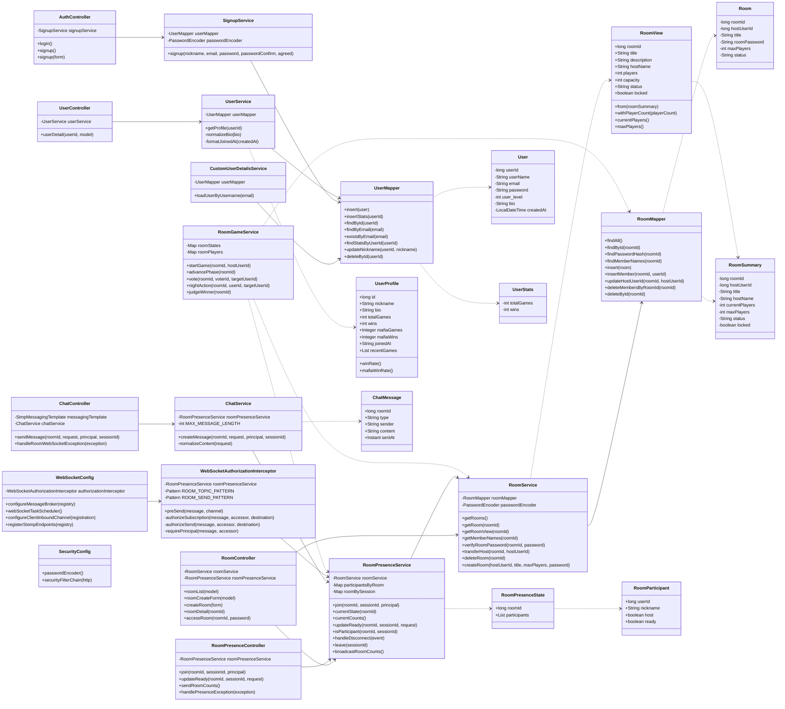
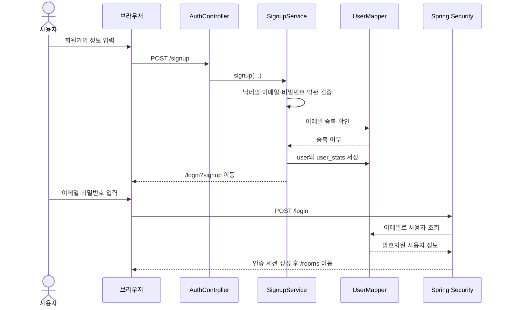
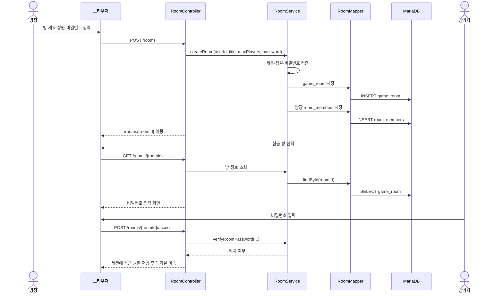
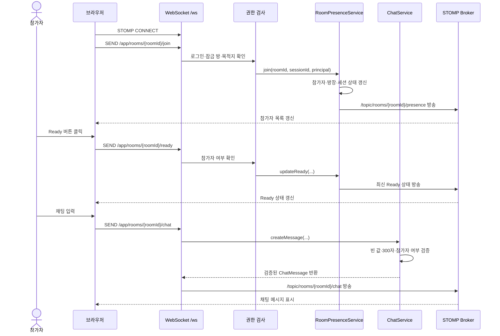
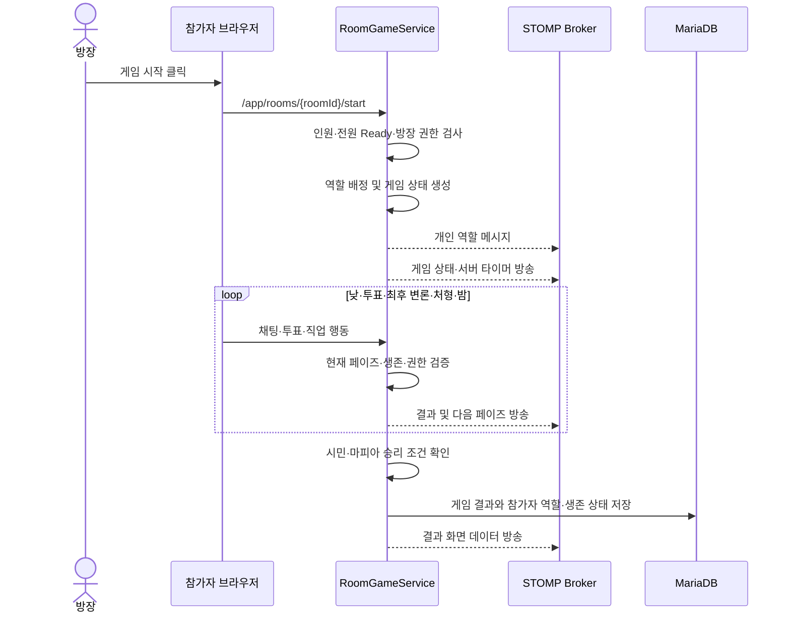
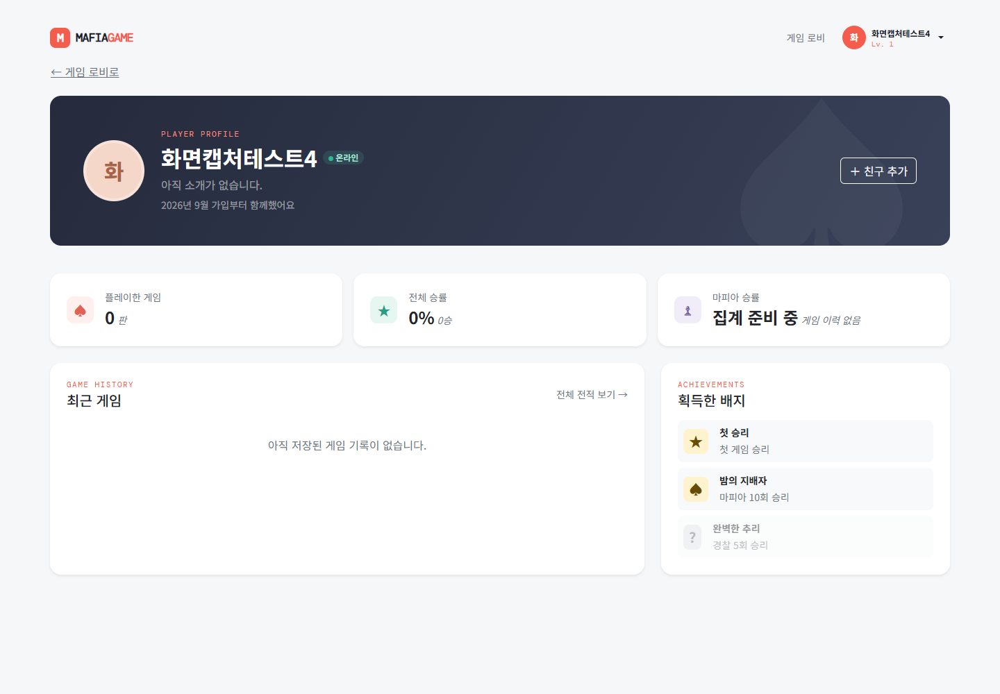
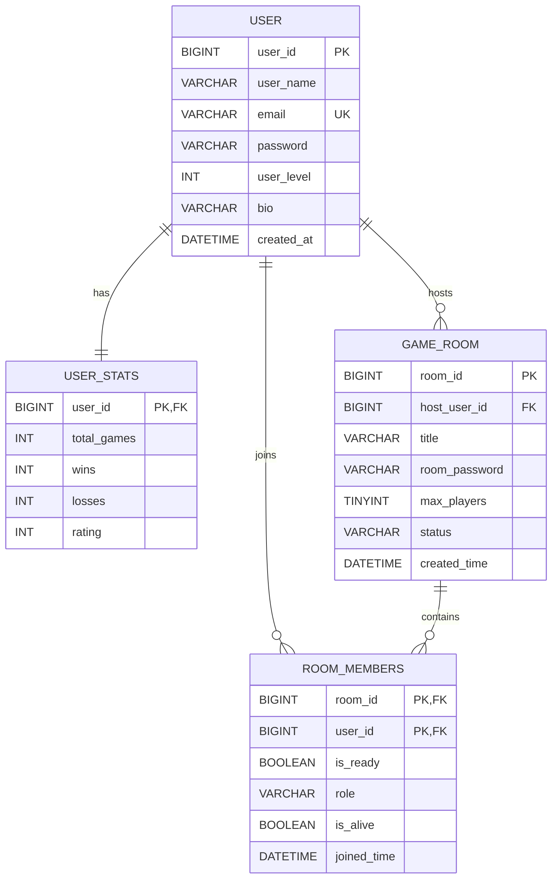
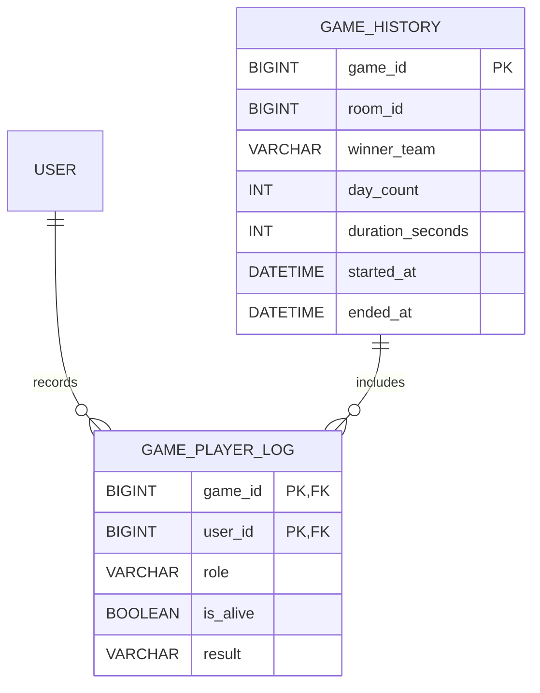

## 1. 프로젝트 개요

### 1.1 서비스 정의

MAFIAGAME은 별도 프로그램 설치 없이 브라우저에서 게임방에 입장해 실시간으로 채팅하고, 역할에 따라 행동하며, 투표로 승패를 결정하는 소셜 디덕션 게임이다.

### 1.2 핵심 가치

- 링크 또는 로비를 통해 빠르게 게임에 참여한다.
- 참가자·Ready·채팅 상태를 새로고침 없이 확인한다.
- 서버가 게임 상태와 권한을 관리해 참가자마다 같은 정보를 받는다.
- 역할 배정, 토론, 투표, 밤 행동, 승패 판정까지 한 판을 끝낸다.

### 1.3 현재 기술 스택

| 영역 | 기술 |
| --- | --- |
| Backend | Java 17, Spring Boot 3.5.16 |
| Web | Spring MVC, Thymeleaf |
| Security | Spring Security, BCrypt |
| Database | MariaDB, MyBatis 3.0.5 |
| Realtime | Spring WebSocket, STOMP |
| Frontend | HTML, CSS, JavaScript ES6 |
| Build | Gradle Wrapper 8.14.5 |

---

## 2. 사용자와 문제

### 2.1 주요 사용자

| 사용자 | 목표 |
| --- | --- |
| 플레이어 | 쉽게 입장하고 채팅·투표·역할 행동에 참여 |
| 방장 | 방을 만들고 참가자 상태를 확인한 뒤 게임 시작 |
| 관전자 | 진행 중인 게임의 공개 상태 확인 |

### 2.2 해결할 문제

- 별도 프로그램이나 음성 채널 없이 게임을 시작하기 어렵다.
- 지금 어떤 단계인지, 언제 끝나는지 알기 어렵다.
- 공개 대화와 직업별 비밀 정보가 섞일 수 있다.
- 참가자마다 다른 게임 상태를 볼 수 있다.
- 연결이 끊기면 게임에서 복귀하기 어렵다.

### 2.3 핵심 검증 가설

Spring WebSocket/STOMP와 Java In-Memory 상태를 사용하면 단일 서버에서 4~8명의 참가자 상태, 채팅, 타이머, 투표를 안정적으로 동기화할 수 있는지 검증한다.

---

## 3. MVP 범위

MVP는 기능을 많이 넣는 것이 아니라, 사용자가 게임 한 판을 경험하는 데 꼭 필요한 최소 기능으로 정의한다.

### 3.1 Must Have

| 기능 | 목적 | 현재 상태 |
| --- | --- | --- |
| 회원가입·로그인 | 참가자와 비밀 정보 수신자 식별 | 구현 |
| 게임 로비 | 방 목록 확인과 입장 | 구현 |
| 방 생성 | 게임 시작 공간 생성 | 구현 |
| 방 비밀번호·정원 검사 | 접근 권한과 인원 제한 | 구현 |
| 참가자 presence | 현재 접속자 표시 | 구현 |
| Ready 상태 | 게임 시작 조건 확인 | 구현 |
| 대기방 실시간 채팅 | 참가자 간 소통 | 구현 |
| 방장 게임 시작 | 게임 진행 진입점 | 추가 필요 |
| 역할 배정 | 마피아 게임의 핵심 규칙 | 추가 필요 |
| 페이즈·타이머 | 서버 주도 게임 진행 | 추가 필요 |
| 투표 | 낮 토론과 처형 판정 | 추가 필요 |
| 밤 행동 | 마피아·의사·경찰 행동 | 추가 필요 |
| 승패 판정 | 게임 종료 조건 | 추가 필요 |
| 결과·전적 저장 | 완료된 게임 보존 | 추가 필요 |

### 3.2 후순위 기능

- 초대 URL 또는 초대 코드
- 관전자 모드
- 방장 강퇴
- 다시 하기
- 최근 전적 상세 화면
- 친구·신고·랭킹
- 음성 채팅
- 아이템·재화·상점
- 다중 서버 게임 상태 공유

### 3.3 MVP에서 제외하는 이유

현재 핵심 검증 대상은 “사람이 모여 한 판의 게임을 끝낼 수 있는가”다. 친구, 랭킹, 음성, 아이템, 다중 서버 기능은 핵심 게임 루프가 검증된 후 추가한다.

### 3.4 요구사항 정의서

Brunch 서비스 기획 가이드의 MVP 원칙에 맞춰 전체 아이디어를 먼저 나열한 뒤, 사용자가 게임 한 판을 완료하는 데 필요한 기능을 우선 요구사항으로 선정한다. `Must`는 9월 30일 MVP 완료에 반드시 필요한 항목이고, `Should`와 `Later`는 핵심 게임 루프가 안정화된 뒤 확장한다.

#### 3.4.1 기능 요구사항

| ID | 요구사항 | 우선순위 | 현재 상태 |
| --- | --- | --- | --- |
| FR-AUTH-01 | 닉네임·이메일·비밀번호·약관 동의값을 검증하고 회원을 생성한다. | Must | 구현 |
| FR-AUTH-02 | 이메일과 비밀번호로 로그인하고 로그아웃할 수 있다. | Must | 구현 |
| FR-ROOM-01 | 로비에서 게임방 제목, 상태, 잠금 여부, 현재 인원을 확인한다. | Must | 구현 |
| FR-ROOM-02 | 방장이 제목과 4~8명 정원을 정해 게임방을 만든다. | Must | 구현 |
| FR-ROOM-03 | 잠금 방은 비밀번호를 확인한 사용자만 입장시킨다. | Must | 구현 |
| FR-ROOM-04 | 방 제목 검색과 대기 중·게임 중 상태 필터를 제공한다. | Should | 구현 |
| FR-REAL-01 | 같은 방의 참가자 목록과 방장 정보를 실시간 동기화한다. | Must | 구현 |
| FR-REAL-02 | 참가자가 Ready 상태를 변경하면 같은 방에 즉시 방송한다. | Must | 구현 |
| FR-REAL-03 | 같은 방 사용자끼리 300자 이하의 채팅을 주고받는다. | Must | 구현 |
| FR-REAL-04 | 연결 종료, 재접속, 방장 위임, 빈 방 정리를 처리한다. | Must | 구현 |
| FR-GAME-01 | 방장만 시작할 수 있고 4명 이상, 전원 Ready 조건을 검사한다. | Must | 추가 필요 |
| FR-GAME-02 | 마피아·의사·경찰·시민 역할을 배정하고 본인에게만 알려 준다. | Must | 추가 필요 |
| FR-GAME-03 | 서버 타이머로 토론·지목·변론·처형·밤 페이즈를 순서대로 진행한다. | Must | 추가 필요·시간 기준 확정 |
| FR-GAME-04 | 낮 투표와 마피아·의사·경찰의 밤 행동을 권한에 맞게 처리한다. | Must | 추가 필요 |
| FR-GAME-05 | 승패를 판정하고 게임 결과와 사용자 전적을 저장한다. | Must | 추가 필요 |

#### 3.4.2 비기능 요구사항

| ID | 요구사항 | 확인 방법 |
| --- | --- | --- |
| NFR-SEC-01 | 비밀번호는 평문으로 저장하지 않고 BCrypt로 해시한다. | 회원가입 후 DB 값 확인 |
| NFR-SEC-02 | 인증되지 않은 사용자의 보호 페이지·WebSocket 요청을 거부한다. | 로그인 전 접근 및 STOMP 권한 테스트 |
| NFR-REAL-01 | 4~8명의 참가자에게 같은 페이즈·참가자 상태를 전달한다. | 4명·6명·8명 브라우저 동시 테스트 |
| NFR-REAL-02 | 게임 시간은 클라이언트 시간이 아니라 서버 시간을 기준으로 한다. | 서버 시간과 화면 타이머 비교 |
| NFR-REC-01 | 새로고침·연결 끊김·방장 이탈 후에도 방 상태를 안전하게 정리한다. | 재접속 및 중도 이탈 시나리오 |
| NFR-UX-01 | 사용자가 현재 화면, 진행 상태, 남은 시간, 오류 원인을 이해할 수 있어야 한다. | UI 체크리스트 및 시연 점검 |

#### 3.4.3 요구사항 우선순위 기준

1. 사용자가 게임 한 판을 시작하고 끝내는 데 필요한 기능인가?
2. 서버가 같은 상태와 권한을 모든 참가자에게 보장하는가?
3. 해당 기능이 없으면 시연 또는 MVP 검증이 불가능한가?
4. 위 질문에 “아니오”라면 후순위 기능으로 분리한다.

#### 3.4.4 구현 상태 표기 기준

- `구현`: 소스코드에 해당 기능의 기본 흐름이 존재한다는 뜻이다.
- `추가 필요`: 소스코드에 아직 핵심 흐름이 없다는 뜻이다.
- 최종 제출 전에는 10장 검증 기준의 체크박스를 실제 테스트 결과에 따라 별도로 완료해야 한다.
- 현재 대기실 화면은 낮 90초·밤 45초 문구를 표시하지만, MVP 게임 룰은 밤 30초를 목표로 한다. 실제 게임 기능을 구현할 때 두 값을 하나로 확정해야 한다.

---

## 4. 핵심 기능 명세

### 4.1 로비와 방

- 방 목록에서 제목, 상태, 잠금 여부, 현재 인원/최대 인원을 표시한다.
- 방 생성 시 제목과 최대 인원 4~8명을 입력한다.
- 비밀번호 방은 HTTP에서 비밀번호를 확인한 뒤 WebSocket 입장을 허용한다.
- 참가자 목록에는 닉네임, 방장 여부, Ready 상태를 표시한다.
- 같은 사용자가 다른 방에 입장하면 기존 방 세션을 정리한다.
- 마지막 참가자 퇴장 후 일정 시간 동안 재접속을 기다린 뒤 빈 방을 정리한다.

### 4.2 게임 페이즈

```text
WAITING
  -> ROLE_ASSIGNMENT
  -> DAY_DISCUSSION (90초)
  -> NOMINATION_VOTE (30초)
  -> FINAL_DEFENSE (20초)
  -> EXECUTION_VOTE (15초)
  -> NIGHT (30초)
  -> RESULT 또는 DAY_DISCUSSION
```

| 페이즈 | 핵심 행동 |
| --- | --- |
| `WAITING` | 입장, Ready, 방장 시작 |
| `ROLE_ASSIGNMENT` | 서버가 역할 배정, 개인 메시지 전송 |
| `DAY_DISCUSSION` | 생존자 공개 채팅 |
| `NOMINATION_VOTE` | 처형 후보 지목 |
| `FINAL_DEFENSE` | 후보 최후 변론 |
| `EXECUTION_VOTE` | 후보 처형 찬반 |
| `NIGHT` | 마피아 처치, 의사 보호, 경찰 조사 |
| `RESULT` | 승패·역할·생존 결과 표시와 저장 |

페이즈와 타이머는 클라이언트가 결정하지 않고 서버가 결정한다. 클라이언트는 서버가 보낸 `phase`, `phaseEndsAt`, `serverTime`을 표시한다.

현재 대기실 템플릿의 기본 설정 문구는 `낮 90초 / 밤 45초`로 표시된다. 본 문서의 MVP 게임 규칙과 박용민 MVP 기준은 밤 30초이므로, 실제 게임 기능 구현 전에 밤 시간을 30초로 확정하거나 문서의 모든 기준을 45초로 변경해야 한다. 현재 계획은 서버 기준 밤 30초이다.

### 4.3 역할

| 역할 | 인원 예시 | 행동 |
| --- | --- | --- |
| 마피아 | 4~5명 방 1명, 6~8명 방 2명 | 밤에 처치 대상 선택, 마피아 채팅 |
| 의사 | 1명 | 밤에 한 명 보호 |
| 경찰 | 1명 | 밤에 한 명의 마피아 여부 조사 |
| 시민 | 나머지 | 토론과 투표 |

역할은 서버의 난수로 배정하며 개인 destination으로만 보낸다. 클라이언트가 보낸 역할·생존·승리 여부는 신뢰하지 않는다.

### 4.4 투표와 승패

- 한 사용자는 한 투표 단계에 유효한 표 하나만 가진다.
- 중복 투표는 마지막 표로 교체한다.
- 죽은 사용자는 투표할 수 없다.
- 현재 후보가 아닌 대상은 선택할 수 없다.
- 동률 처리 규칙은 서버에서 일관되게 적용한다.
- 마피아가 모두 사망하면 시민 승리다.
- 생존 마피아 수가 생존 시민 진영 수 이상이면 마피아 승리다.

---

## 5. 현재 구현 현황

이번 주까지 구현한 범위는 “게임을 시작하기 전 참가자들이 모이고 소통하는 단계”다.

### 5.1 이번 주 구현 범위

| 기간 | 구현 내용 |
| --- | --- |
| 2026.09.14 ~ 2026.09.18 | 회원가입·로그인·로그아웃 |
| 2026.09.14 ~ 2026.09.18 | 로비와 방 목록 |
| 2026.09.14 ~ 2026.09.18 | 방 생성, 최대 인원, 비밀번호 |
| 2026.09.14 ~ 2026.09.18 | 잠금 방 접근 확인 |
| 2026.09.14 ~ 2026.09.18 | WebSocket 방 참가자 동기화 |
| 2026.09.14 ~ 2026.09.18 | Ready 상태 실시간 변경 |
| 2026.09.14 ~ 2026.09.18 | 대기방 실시간 채팅 |
| 2026.09.14 ~ 2026.09.18 | 로비 방별 접속 인원 갱신 |
| 2026.09.14 ~ 2026.09.18 | 연결 종료, 재접속, 방장 위임 기초 처리 |

### 5.2 현재 코드 흐름

```text
로그인
  -> SecurityConfig
  -> CustomUserDetailsService
  -> UserMapper

로비
  -> RoomController
  -> RoomService
  -> RoomMapper.xml
  -> rooms/list.html

방 입장
  -> chat.js에서 WebSocket /ws 연결
  -> /app/rooms/{roomId}/join
  -> RoomPresenceController
  -> RoomPresenceService
  -> /topic/rooms/{roomId}/presence

채팅
  -> /app/rooms/{roomId}/chat
  -> ChatController
  -> ChatService
  -> /topic/rooms/{roomId}/chat
```

### 5.3 다음 구현 대상

- 방장 시작 버튼과 시작 조건
- 게임 상태 전용 `RoomGameService`
- 역할 배정과 개인 메시지
- 페이즈 상태 머신과 서버 타이머
- 공개·마피아·관전자 채널 분리
- 투표와 밤 행동
- 승패 판정과 결과 저장

### 5.4 클래스 다이어그램

현재 소스코드의 계층을 기준으로 주요 클래스와 핵심 필드·메서드를 함께 표현했다. Lombok이 자동으로 생성하는 단순 getter/setter와 생성자는 생략하고, 실제 업무 흐름에 사용되는 메서드 중심으로 정리했다. `RoomGameService`와 게임 관련 상태 객체는 9월 30일까지 추가할 예정인 클래스이므로 다이어그램에서 예정 영역으로 구분한다.



| 계층 | 주요 책임 |
| --- | --- |
| Controller | HTTP 요청과 WebSocket 메시지를 받고 적절한 서비스로 전달한다. |
| Service | 입력 검증, 권한 확인, 게임방·참가자·채팅 업무를 처리한다. |
| Mapper | MyBatis를 통해 MariaDB의 사용자·방·참가자 데이터를 조회하거나 저장한다. |
| Domain·DTO | DB 데이터와 화면·WebSocket 응답에 사용할 구조를 표현한다. |
| Config·Security | 로그인, 세션, STOMP 연결, WebSocket 목적지 권한을 설정한다. |
| `RoomGameService` 예정 | 역할, 페이즈, 타이머, 투표, 밤 행동, 승패 판정을 담당한다. |

### 5.5 주요 기능 시퀀스 다이어그램

#### 5.5.1 회원가입과 로그인



#### 5.5.2 게임방 생성과 잠금 방 입장



#### 5.5.3 대기방 실시간 참가·Ready·채팅



#### 5.5.4 실제 게임 진행 예정 흐름



---

## 6. 화면 구성 및 인터랙티브 와이어프레임

### 6.1 현재 페이지 전체 화면

#### 로그인


로그인 성공 후 사용자는 게임 로비로 이동한다. 아직 계정이 없다면 회원가입 화면으로 이동한다.

#### 회원가입


닉네임, 이메일, 비밀번호, 비밀번호 확인을 입력하여 게임에 참여할 계정을 만든다.

#### 게임 로비


게임방 목록을 확인하고 검색·상태 필터·새 게임 만들기·입장하기를 사용할 수 있다.

#### 게임방 만들기


방 제목, 최대 인원, 비밀번호 보호 여부를 설정하여 방을 만든다. 기존 규칙에 따라 방 인원은 4~8명 범위로 둔다.

#### 잠금 게임방 입장


비밀번호가 설정된 방은 비밀번호 확인 후 대기실에 입장한다.

#### 게임방 대기실


참가자 목록, 방장, Ready 상태, 대기방 채팅을 확인한다. 모든 참가자가 준비되고 방장이 시작하면 실제 게임 화면으로 전환한다.

#### 사용자 프로필



닉네임, 가입 정보, 전적, 업적을 확인한다. 게임 종료 후 저장되는 통계와 연결되는 화면이다.

### 6.2 화면 이동 흐름

```text
로그인/회원가입
      ↓
게임 로비
  ┌───┴──────────────┐
  ↓                  ↓
게임방 만들기     기존 방 입장
  └───┬──────────────┘
      ↓
게임방 대기실 ── 채팅·Ready·참가자 동기화
      ↓
게임 시작 ── 역할 배정 ── 낮/투표/밤 ── 결과
      ↓
게임 이력·사용자 전적
```

### 6.3 현재 구현 화면의 주요 동작

| 화면 요소 | 동작 |
| --- | --- |
| 방 제목 검색 | 현재 로드된 방 카드 필터링 |
| 상태 필터 | 대기 중·게임 중 방 필터링 |
| 새 게임 만들기 | `/rooms/new` 이동 |
| 입장하기 | `/rooms/{roomId}` 이동 |
| 온라인 인원 | WebSocket `/topic/rooms/presence`로 갱신 |
| 방 인원 | 방별 presence 메시지로 갱신 |

### 6.4 MVP에서 추가할 화면

1. 방 대기실: 방장 시작 버튼, Ready 조건 안내
2. 역할 안내: 내 역할만 표시하는 개인 카드
3. 게임 화면: 페이즈, 타이머, 생존자, 채팅, 행동 버튼
4. 투표 화면: 후보 선택, 투표 완료, 남은 시간
5. 결과 화면: 승리 진영, 역할 공개, 생존 결과, 다시 로비

### 6.5 인터랙션 원칙

- 사용자는 현재 페이즈와 남은 시간을 항상 확인할 수 있어야 한다.
- 행동할 수 없는 버튼은 비활성화하되, 서버에서도 요청을 다시 검사한다.
- 오류는 “요청 실패”가 아니라 원인과 해결 방법을 함께 표시한다.
- 역할, 경찰 조사 결과, 마피아 채팅은 개인 또는 권한 채널로만 보낸다.
- 연결 중·실시간·재연결 중 상태를 화면에 표시한다.

### 6.6 UI 정의서

화면 설계는 “사용자가 다음에 무엇을 해야 하는지 바로 알 수 있는가”를 기준으로 정의한다. 현재 구현 화면은 캡처 이미지와 연결하고, 실제 게임 화면·투표·결과 화면은 MVP 추가 화면으로 표시한다.

| 화면 ID | 경로 | 접근 사용자 | 화면 목적 | 주요 구성 요소 | 주요 동작·검증 |
| --- | --- | --- | --- | --- | --- |
| UI-01 | `/login` | 비로그인 | 계정으로 게임에 입장 | 이메일, 비밀번호, 로그인 버튼, 회원가입 링크 | 필수값 확인, 실패 원인 표시, 성공 시 `/rooms` 이동 |
| UI-02 | `/signup` | 비로그인 | 새 사용자 등록 | 닉네임, 이메일, 비밀번호, 확인, 약관 동의 | 닉네임 2~30자, 비밀번호 8자 이상, 중복 이메일, 약관 동의 검사 |
| UI-03 | `/rooms` | 전체 | 게임방을 찾고 입장 | 로비 헤더, 접속 인원, 방 목록, 검색, 상태 필터, 새 게임 버튼 | 방 검색, 대기·게임 중 필터, 잠금 표시, 입장 이동 |
| UI-04 | `/rooms/new` | 로그인 사용자 | 새로운 게임방 생성 | 방 제목, 최대 인원 4~8명, 비밀번호 선택, 생성·취소 | 제목 2~100자, 비밀번호 4~20자, 생성 후 대기실 이동 |
| UI-05 | `/rooms/{roomId}` 잠금 상태 | 로그인 사용자 | 잠금 방의 입장 권한 확인 | 방 제목, 비밀번호 입력, 입장하기, 목록 이동 | 비밀번호 일치 시 세션 권한 부여, 실패 메시지 표시 |
| UI-06 | `/rooms/{roomId}` 대기 상태 | 로그인 사용자 | 참가자가 모여 게임을 준비 | 참가자 카드, 방장, Ready 버튼, 채팅, 친구 초대 | WebSocket 참가, Ready 동기화, 채팅, 방장 이탈 처리 |
| UI-07 | `/users/{userId}` | 로그인 사용자 | 기본 프로필과 전적 화면 확인 | 프로필, 레벨, 게임 수, 승률, 최근 게임 영역, 업적 영역 | 기본 사용자·통계 조회는 구현, 게임 이력·마피아 통계·업적 데이터·친구 요청 저장은 추가 필요 |
| UI-08 | `/rooms/{roomId}/game` 예정 | 게임 참가자 | 현재 게임을 진행 | 페이즈, 서버 타이머, 생존자, 역할 카드, 공개·직업 채팅 | 현재 페이즈에 맞는 행동만 활성화, 개인 정보 분리 |
| UI-09 | `/rooms/{roomId}/result` 예정 | 게임 참가자 | 게임 결과를 확인 | 승리 진영, 역할 공개, 생존 결과, 게임 시간, 로비 이동 | 결과 저장 완료 후 표시, 다시 로비 이동 |

#### UI 상태 정의

| 상태 | 화면 표시 | 사용자가 할 수 있는 행동 |
| --- | --- | --- |
| Loading | 데이터·WebSocket 연결 중 표시 | 중복 제출을 하지 않고 대기 |
| Connected | 실시간 상태와 접속 표시 | 현재 화면의 정상 기능 사용 |
| Reconnecting | 재연결 중 안내와 재시도 상태 표시 | 연결 복구를 기다리거나 로비로 이동 |
| Error | 원인과 해결 방법이 포함된 메시지 표시 | 입력 수정, 재시도, 이전 화면 이동 |
| Disabled | 현재 페이즈·권한에 맞지 않는 버튼 비활성화 | 허용된 행동만 수행 |
| Empty | 방·게임 이력이 없다는 안내 표시 | 새 방 만들기 또는 로비 이동 |

현재 프로필 화면은 사용자 정보와 `user_stats`의 기본 게임 수·승리 수를 조회한다. `UserService`는 아직 게임 이력 테이블이 없기 때문에 최근 게임 목록과 마피아 통계를 비워서 전달하며, 업적은 템플릿에 정적으로 표시되고 친구 추가 버튼은 브라우저 화면 상태만 변경한다. 따라서 이 화면은 기본 프로필 UI는 구현된 상태이고, 전적 상세·업적·친구 기능은 후속 기능으로 분류한다.

#### 화면별 정보 공개 원칙

- 공개 화면에는 생존자 상태, 현재 페이즈, 공개 채팅만 표시한다.
- 역할 카드는 본인에게만 표시하고, 경찰 조사 결과도 경찰 개인 메시지로 전달한다.
- 마피아 채팅은 마피아 구성원에게만 표시한다.
- 죽은 사용자는 관전자 상태로 전환하고 투표·밤 행동 버튼을 비활성화한다.
- 서버 오류와 입력 오류는 버튼 주변 또는 메시지 영역에 원인과 해결 방법을 함께 표시한다.

---

## 7. 시스템 구조와 메시지 명세

### 7.1 구조

```text
HTTP
Browser -> Controller -> Service -> MyBatis -> MariaDB

WebSocket/STOMP
Browser -> AuthorizationInterceptor -> @MessageMapping Controller
         -> Presence/Chat/Game Service
         -> SimpMessagingTemplate -> 구독 중인 Browser
```

### 7.2 현재 WebSocket 주소

| 방향 | 주소 | 용도 |
| --- | --- | --- |
| Client -> Server | `/app/rooms/{roomId}/join` | 방 참가 |
| Client -> Server | `/app/rooms/{roomId}/ready` | Ready 변경 |
| Client -> Server | `/app/rooms/{roomId}/chat` | 대기방 채팅 |
| Client -> Server | `/app/rooms/presence` | 로비 인원 요청 |
| Server -> Client | `/topic/rooms/{roomId}/presence` | 참가자 상태 |
| Server -> Client | `/topic/rooms/{roomId}/chat` | 채팅 방송 |
| Server -> Client | `/topic/rooms/presence` | 방별 인원 |
| Server -> Client | `/user/queue/room-joined` | 개인 참가 결과 |
| Server -> Client | `/user/queue/errors` | 개인 오류 |

### 7.3 MVP 추가 주소

| 방향 | 주소 | 용도 |
| --- | --- | --- |
| Client -> Server | `/app/rooms/{roomId}/start` | 방장 시작 |
| Client -> Server | `/app/rooms/{roomId}/vote` | 지목·찬반 투표 |
| Client -> Server | `/app/rooms/{roomId}/night-action` | 직업별 밤 행동 |
| Server -> Client | `/topic/rooms/{roomId}/game-state` | 페이즈·타이머 |
| Server -> Client | `/topic/rooms/{roomId}/public-chat` | 공개 채팅 |
| Server -> Client | `/topic/rooms/{roomId}/mafia-chat` | 마피아 채팅 |
| Server -> Client | `/user/queue/rooms/{roomId}/role` | 개인 역할 |
| Server -> Client | `/user/queue/rooms/{roomId}/private` | 경찰 조사 등 개인 알림 |

---

## 8. 데이터 구조

### 8.1 현재 DB

| 테이블 | 역할 |
| --- | --- |
| `user` | 회원과 인증 정보 |
| `user_stats` | 전체 게임 수와 승리 수 |
| `game_room` | 방 제목, 방장, 정원, 비밀번호, 상태 |
| `room_members` | 방과 사용자 관계 |

### 8.2 ER 다이어그램

현재 `mafiasql.sql`에 정의된 실제 테이블 관계는 다음과 같다. 한 사용자는 하나의 통계 행을 가지고, 여러 게임방을 만들 수 있으며, 여러 방의 참가자가 될 수 있다. `room_members`가 사용자와 게임방의 다대다 관계를 연결한다.



#### 테이블별 주요 키와 사용 목적

| 테이블 | 기본 키 | 외래 키 | 애플리케이션 사용 목적 |
| --- | --- | --- | --- |
| `user` | `user_id` | 없음 | 로그인 계정, 닉네임, BCrypt 비밀번호, 가입 정보 |
| `user_stats` | `user_id` | `user.user_id` | 전체 게임 수, 승리 수, 패배 수, 레이팅 |
| `game_room` | `room_id` | `host_user_id -> user.user_id` | 방 제목, 방장, 비밀번호 해시, 정원, 상태 |
| `room_members` | `(room_id, user_id)` | `game_room`, `user` | 방 참가 관계와 게임 상태 저장용 스키마 |

주의할 점은 DB 스키마에 `room_members.is_ready`, `role`, `is_alive`가 존재하더라도 현재 실시간 대기방의 기준 데이터는 `RoomPresenceService`의 In-Memory 상태라는 점이다. 현재 방장은 방 생성 시 `room_members`에 저장되지만, WebSocket으로 입장한 참가자와 Ready 변경은 실시간 메모리에서 관리된다. 게임 기능을 완성할 때 DB 기록과 In-Memory 상태의 저장 시점을 정해야 한다.

#### MVP 게임 이력 확장

현재 SQL에는 게임 종료 이력 테이블이 없으므로, 다음 테이블은 MVP 게임 완성 단계에서 추가할 설계안이다.



### 8.3 MVP 추가 DB

| 테이블 | 역할 |
| --- | --- |
| `game_history` | 완료된 게임 1건의 승리 진영과 진행 시간 |
| `game_player_log` | 게임별 사용자 역할과 생존 결과 |

### 8.4 In-Memory 게임 상태

```text
roomStates: roomId -> phase, dayCount, phaseEndsAt
roomPlayers: roomId -> userId -> role, alive, ready
roomVotes: roomId -> voterId -> targetUserId
roomNightActions: roomId -> mafiaTarget, doctorTarget, policeTarget
```

현재 `RoomPresenceService`는 접속 세션, 참가자, Ready 상태를 관리한다. 이 상태는 재접속과 빈 방 정리를 위해 메모리에 유지되며, DB의 `room_members`와 항상 같은 저장 원천으로 사용되지는 않는다. 게임 규칙은 기존 presence 코드에 모두 넣지 않고 `RoomGameService`로 분리한다.

---

## 9. 일정

### 9.1 이번 주: 대기방과 실시간 기능 완성

**기간: 2026.09.14 ~ 2026.09.18**

- 회원가입·로그인
- 게임 로비와 방 목록
- 방 생성·비밀번호·정원
- 잠금 방 입장
- 참가자 실시간 표시
- Ready 상태 동기화
- 대기방 실시간 채팅
- 연결 종료·재접속 처리
- 현재 화면 흐름과 기본 오류 메시지 확인

이번 주의 결과물은 “사용자가 로그인해서 방에 모이고, 서로의 상태를 확인하며 채팅할 수 있는 대기방”이다.

### 9.2 2주차: 실제 게임 핵심 기능 구현

**기간: 2026.09.19 ~ 2026.09.25**

※ 9월 19일(토)과 20일(일)을 포함한 2주차 계획이다.

| 구분 | 계획 |
| --- | --- |
| 주간 목표 | 대기방에서 실제 게임을 시작하고, 역할에 따라 낮·투표·밤을 진행할 수 있게 한다. |
| 게임 시작 | 방장 권한, 최소 4명·최대 8명, 전원 Ready 조건을 서버에서 검사한다. |
| 역할 배정 | 마피아·의사·경찰·시민을 배정하고 역할은 개인 채널로만 전달한다. |
| 상태 관리 | `RoomGameService`, `GamePhase`, `Role`, `RoomState`를 분리한다. |
| 실시간 진행 | 서버 기준 타이머와 게임 상태를 모든 참가자에게 동기화한다. |
| 보안·권한 | 공개 채팅, 마피아 채팅, 관전자 채널을 분리하고 죽은 사용자의 행동을 제한한다. |


| 순서 | 페이즈 | 시간 | 주요 기능 |
| --- | --- | ---: | --- |
| 1 | 낮 토론 | 90초 | 생존자 공개 채팅, 상태 표시 |
| 2 | 지목 투표 | 30초 | 처형 후보 선택, 중복 투표 방지 |
| 3 | 최후 변론 | 20초 | 후보자의 마지막 발언 |
| 4 | 처형 찬반 투표 | 15초 | 처형 여부 결정 |
| 5 | 밤 행동 | 30초 | 마피아 공격, 의사 치료, 경찰 조사 |

**2주차 완료 결과:** 사용자가 방에 모여 Ready한 뒤 게임을 시작하고, 역할을 확인한 다음 최소 한 사이클의 낮·투표·밤을 진행할 수 있는 상태.

### 9.3 3주차: 게임 완성·통합 테스트·최종 시연

**기간: 2026.09.26 ~ 2026.09.30**

| 구분 | 계획 |
| --- | --- |
| 게임 완성 | 마피아 공격, 의사 치료, 경찰 조사, 승패 판정을 연결한다. |
| 결과 화면 | 승리 진영, 역할 공개, 생존 결과, 다시 로비 이동을 제공한다. |
| 기록 저장 | 게임 시간, 승리 진영, 역할, 생존 여부를 `game_history`, `game_player_log`에 저장한다. |
| 사용자 전적 | 게임 수·승리 수·업적을 프로필 화면과 연결한다. |
| 통합 테스트 | 4명·6명·8명으로 게임을 끝까지 진행하고 여러 브라우저의 동시 동작을 확인한다. |
| 예외 처리 | 새로고침, 재접속, 중도 이탈, 방장 이탈, 빈 방 정리, 게임 중 입장을 점검한다. |
| 최종 시연 | 실행 방법, 게임 규칙, 테스트 시나리오, MVP 문서를 정리한다. |

마피아가 모두 제거되면 시민 진영 승리, 마피아 수가 시민 수 이상이면 마피아 진영 승리로 판정한다. 최종 완료 기준은 “방 생성 → 참가 → Ready → 역할 배정 → 낮/투표/밤 → 승패 판정 → 결과 저장”이 한 번에 동작하는 것이다.

---

## 10. 검증 기준

### 이번 주 기능 검증

- [x] 회원가입 후 로그인할 수 있다.
- [x] 로그인한 사용자가 방을 만들 수 있다.
- [x] 방 제목·정원·잠금 여부가 로비에 표시된다.
- [x] 올바른 비밀번호로 잠금 방에 입장할 수 있다.
- [x] 방 참가자와 방장 정보가 실시간으로 보인다.
- [x] Ready 상태를 켜고 끌 수 있다.
- [x] 채팅 메시지가 같은 방에 있는 사용자에게 전달된다.
- [x] 채팅 입력값이 비어 있거나 300자를 초과하면 거부된다.
- [x] WebSocket 연결이 끊기면 재연결 상태가 표시된다.
- [x] 사용자가 나가면 참가자 목록과 로비 인원이 갱신된다.

이번 주 항목은 현재 소스코드의 Controller·Service·WebSocket·JavaScript 흐름과 Spring Boot 실행 화면을 기준으로 완료 표시했다. 실제 4~8명 동시 접속 회귀 테스트 결과를 의미하는 체크는 아니며, 별도 테스트 환경에서 재확인해야 한다.

### 실제 게임 MVP 검증

- [ ] 4명 이상이 게임을 시작할 수 있다.
- [ ] 방장만 시작할 수 있다.
- [ ] 모든 사용자가 Ready해야 시작할 수 있다.
- [ ] 역할이 본인에게만 전달된다.
- [ ] 서버 타이머에 따라 페이즈가 이동한다.
- [ ] 중복 투표와 비정상 직업 행동이 차단된다.
- [ ] 시민·마피아 승리 조건이 정확히 적용된다.
- [ ] 종료 결과와 개인별 역할·생존 정보가 DB에 저장된다.

