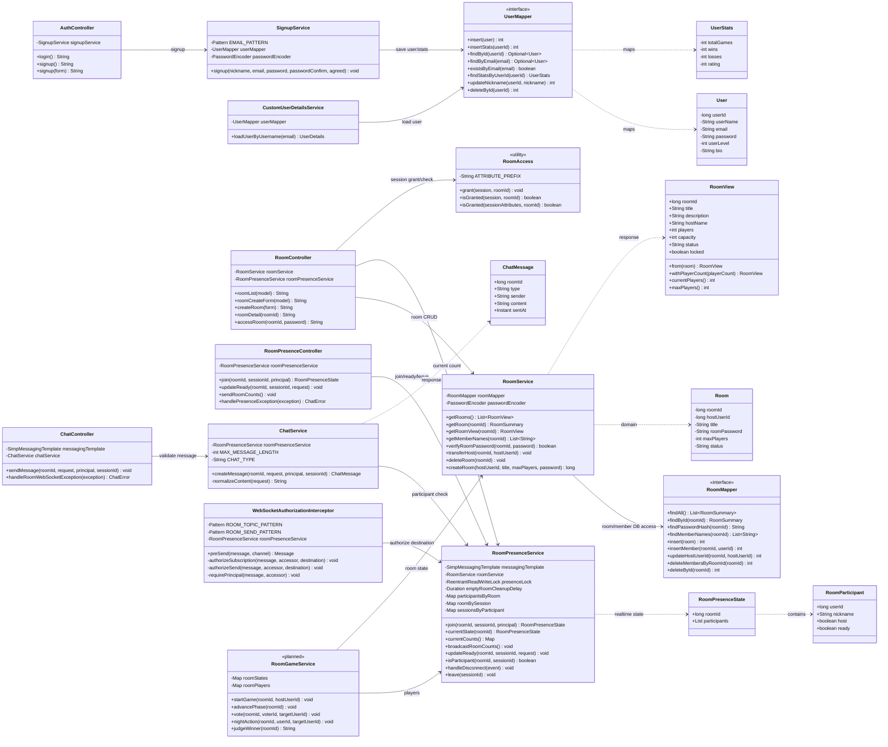
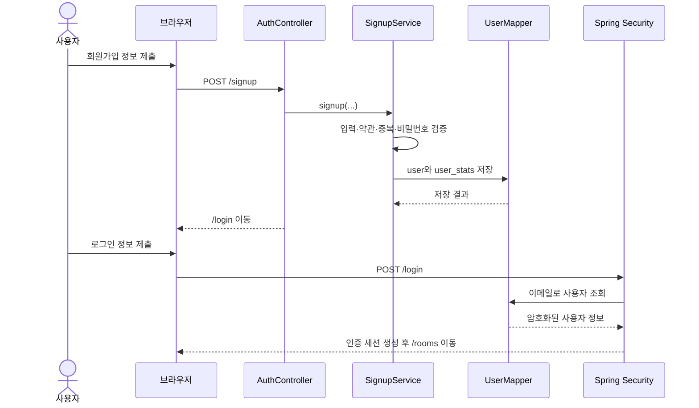
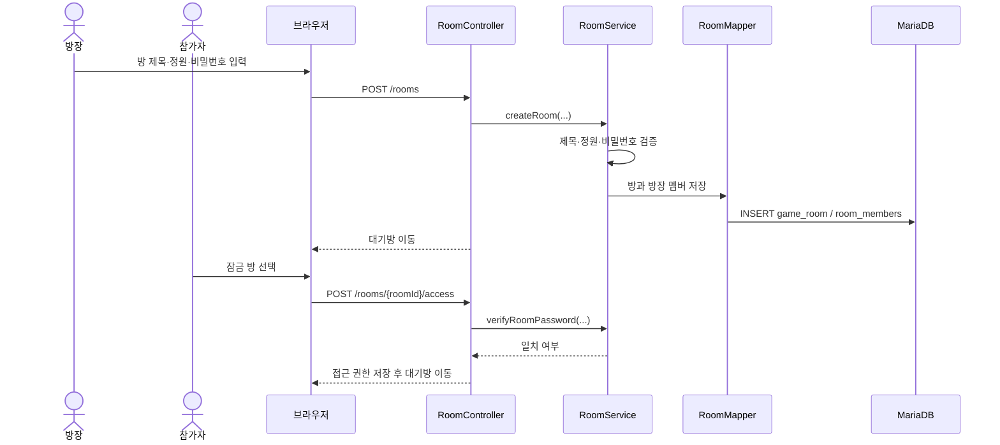
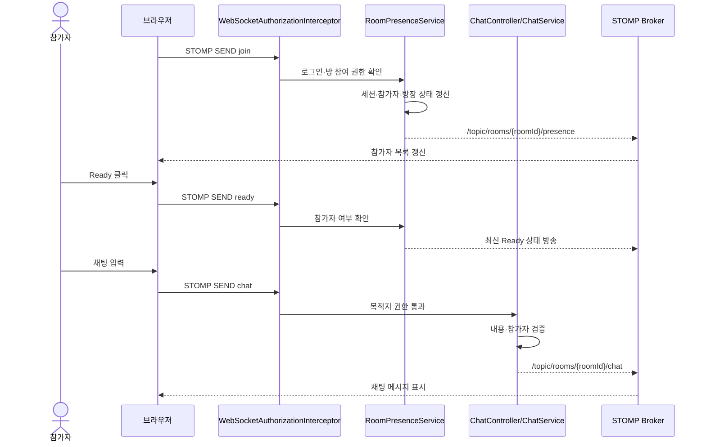
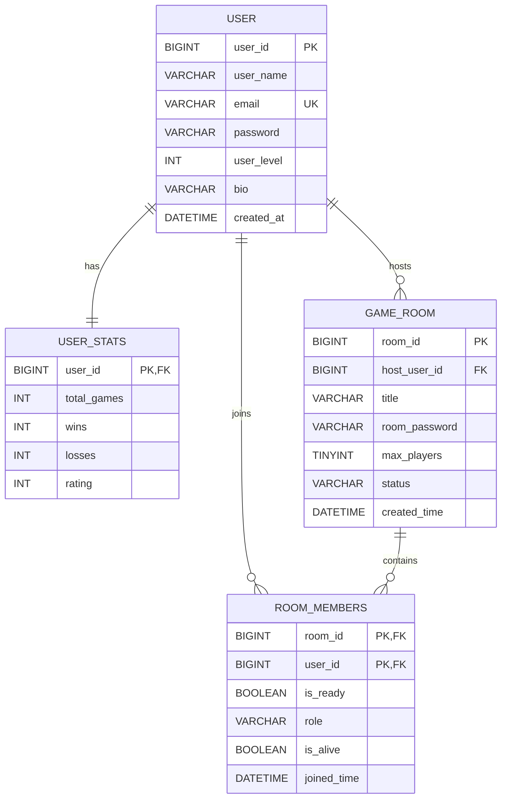

# MAFIAGAME MVP 기획서

> Minimum Viable Product · 내부 구현·검증용 문서

| 항목 | 내용 |
| --- | --- |
| 문서 목적 | MAFIAGAME의 핵심 가설, 최소 기능 범위, 측정 지표, 검증 방법 정의 |
| 대상 | 기획자, 개발자, 테스트 담당자 |
| 기준일 | 2026-09-17 |
| 관련 학습 자료 | [PROJECT_LEARNING_GUIDE.md](./PROJECT_LEARNING_GUIDE.md) |
| 기획 프레임 참고 | [MVP 기획 문서 가시화](https://productmanagement.tistory.com/41) |

이 문서는 기능 목록을 늘리는 문서가 아니라, 별도 프로그램 없이 4~8명의 클라이언트가 같은 게임 상태를 공유하며 한 판을 끝까지 진행할 수 있는지 검증하기 위한 제품 계획이다. MVP는 핵심 기능을 최소 범위로 구현하고, 코드·테스트·시나리오 결과를 바탕으로 다음 개발 우선순위를 결정하는 제품이다. [MVP의 목적과 접근 방식 참고](https://www.elancer.co.kr/blog/detail/70)

---

## 1. 제품 요약

### 1.1 한 문장 정의

MAFIAGAME은 브라우저에서 4~8명이 게임방에 모여 실시간으로 대화하고, 역할별 행동과 투표를 거쳐 한 판의 마피아 게임을 끝낼 수 있게 하는 소셜 디덕션 게임이다.

### 1.2 MVP에서 검증할 사용자 가치

사용자는 다음 과정을 별도 프로그램 설치나 외부 음성 채널 없이 완료할 수 있어야 한다.

```text
로비 접속
  → 방 생성 또는 입장
  → 참가자 모집
  → Ready
  → 역할 확인
  → 토론·투표·밤 행동
  → 승패 확인
  → 다시 플레이 또는 로비 이동
```

현재 프로젝트는 회원 인증, 로비, 방 생성·입장, 실시간 참가자·Ready·대기방 채팅까지 구현되어 있다. 따라서 현재 상태는 MVP의 “대기방 기반”이며, 전체 기능을 검증하려면 실제 게임 진행과 결과 화면을 추가해야 한다.

---

## 2. 문제와 목표 사용자

### 2.1 해결할 문제

- 친구들과 마피아 게임을 하려면 게임방, 음성 채널, 참가자 조율을 별도로 준비해야 한다.
- 현재 게임 단계와 남은 시간이 명확하지 않으면 참여자가 행동할 타이밍을 놓친다.
- 공개 대화와 직업별 비밀 행동을 같은 공간에서 관리하면 정보가 노출되거나 상태가 엇갈릴 수 있다.
- 새로고침이나 네트워크 끊김 뒤에 참가자·방장·게임 상태가 어긋날 수 있다.

### 2.2 1차 목표 사용자

| 사용자 | 상황 | MVP에서 확인할 행동 |
| --- | --- | --- |
| 플레이어 그룹 | 4~8명이 온라인으로 짧은 게임을 진행하는 그룹 | 방을 만들고 전원이 한 판을 완료함 |
| 소셜 게임 입문자 | 복잡한 설치 없이 웹에서 게임을 경험하려는 사용자 | 방 입장부터 역할 확인까지 혼자 이해함 |
| 방장 | 참가자와 게임 시작을 조율하는 사용자 | 인원·Ready 상태를 확인하고 게임을 시작함 |

관전자, 친구 목록, 랭킹은 후속 기능이다. 첫 MVP에서는 플레이어가 게임을 완료하는 핵심 흐름을 우선한다.

---

## 3. 핵심 검증 가설

각 가설은 기능이 아니라 사용자 행동으로 검증한다.

| ID | 핵심 가설 | 확인할 행동 | 성공 신호 |
| --- | --- | --- | --- |
| H1 | 별도 설치가 필요 없는 브라우저 방식은 진입 장벽을 낮춘다. | 초대 링크 또는 로비에서 접속 후 방 입장 | 방문자 중 회원가입·방 입장 완료 비율이 높음 |
| H2 | 4~8명이 모이는 방과 Ready 흐름은 게임 시작을 충분히 조율한다. | 방 생성, 참가자 모집, 전원 Ready | 방이 정원에 도달하고 시작 조건을 충족함 |
| H3 | 역할·토론·투표·밤 행동의 최소 루프만으로도 한 판의 재미를 전달할 수 있다. | 게임 시작 후 결과 화면까지 진행 | 시작한 게임이 중도 이탈 없이 결과에 도달함 |
| H4 | 서버가 상태와 타이머를 관리하면 여러 참가자에게 일관된 게임 경험을 제공할 수 있다. | 여러 브라우저에서 같은 단계·남은 시간 확인 | 상태 불일치, 중복 행동, 권한 오류가 허용 기준 이하임 |
| H5 | 한 판이 끝난 뒤 결과를 이해하고 다음 행동을 선택할 수 있다. | 결과 화면의 다시 하기·로비 이동 | 승패·역할·생존 결과가 표시되고 다음 화면으로 이동함 |

### 3.1 기술 검증 가설

Spring WebSocket/STOMP와 단일 서버의 메모리 상태로 4~8명의 참가자, 채팅, 서버 타이머, 투표 상태를 안정적으로 동기화할 수 있는지 확인한다. 이 가설은 핵심 기능의 동작을 지원하는 기술 가설이며, 단순히 서버가 실행되는 것만으로 완료 처리하지 않는다.

---

## 4. MVP 최소 기능 범위

### 4.1 Must Have: 없으면 한 판을 검증할 수 없는 기능

| 기능 | 최소 요구사항 | 현재 상태 |
| --- | --- | --- |
| 인증 | 닉네임·이메일·비밀번호로 가입·로그인·로그아웃 | 구현 |
| 로비 | 방 목록, 상태, 잠금 여부, 현재 인원 표시 | 구현 |
| 방 생성·입장 | 방 제목, 4~8명 정원, 선택적 비밀번호, 입장 검증 | 구현 |
| 실시간 참가자 | 접속·퇴장·방장·Ready 상태 동기화 | 구현 |
| 대기방 채팅 | 같은 방 참가자 간 공개 채팅 | 구현 |
| 게임 시작 | 방장만 시작, 최소 인원 4명, 전원 Ready 검증 | 추가 필요 |
| 역할 배정 | 마피아·의사·경찰·시민 배정, 본인에게만 공개 | 추가 필요 |
| 게임 페이즈 | 서버 기준 토론·지목·변론·처형·밤 단계 | 추가 필요 |
| 행동·투표 | 현재 역할·생존 상태에 맞는 행동만 허용 | 추가 필요 |
| 승패 판정 | 시민 또는 마피아 승리 조건 판정 | 추가 필요 |
| 결과 | 승리 진영, 역할, 생존 여부, 다시 로비 이동 | 추가 필요 |

핵심 게임 흐름을 검증하려면 현재 구현된 대기방에서 멈추지 않고 최소한 `게임 시작 → 역할 확인 → 한 사이클 진행 → 결과 확인`까지 동작해야 한다.

### 4.2 Should Have: 검증을 돕지만 첫 출시에서 없어도 되는 기능

- 다시 하기 또는 같은 방 재사용
- 초대 URL·초대 코드
- 게임 결과의 간단한 전적 표시
- 재접속 후 진행 중 게임 복귀
- 결과 화면의 오류·상태 안내
- 운영자가 세션·오류를 확인할 수 있는 기본 로그

### 4.3 Won’t Have: 첫 구현에서 제외하는 기능

- 음성 채팅
- 친구 목록, 신고, 랭킹, 상세 업적
- 관전자 모드
- 방장 강퇴와 복잡한 운영 도구
- 아이템, 재화, 상점, 광고 수익화
- 다중 서버·Redis 기반 분산 게임 상태
- 모바일 전용 앱

이 기능들은 핵심 게임 루프의 수요와 재플레이가 확인된 뒤 우선순위를 다시 정한다.

### 4.4 기능 우선순위 번호

기능을 구현할 때 “좋아 보이는 기능”을 모두 같은 수준으로 다루지 않기 위해 다음 번호를 사용한다.

| 번호 | 명칭 | 의미 | MAFIAGAME 적용 기준 |
| --- | --- | --- | --- |
| 1 | Bare Minimum | 없으면 핵심 가설을 검증할 수 없는 필수 기능 | 방 입장, 게임 시작, 역할, 페이즈, 투표, 승패, 결과 |
| 2 | Advanced | 검증 품질과 사용성을 높이지만 첫 구현에서 없어도 되는 기능 | 초대 코드, 다시 하기, 간단한 전적, 재접속 복귀 |
| 3 | Nightmare | 있으면 좋지만 첫 검증의 범위를 크게 넓히는 추가 기능 | 음성, 랭킹, 아이템, 관전자, 다중 서버 |

번호는 개발 난이도가 아니라 MVP 완성에 미치는 영향을 나타낸다. 구현 중 새로운 기능이 제안되면 다음 세 질문으로 번호를 다시 정한다.

1. 이 기능이 없으면 사용자가 한 판을 시작하거나 끝낼 수 없는가?
2. 이 기능으로 확인하려는 사용자 가설이 명확한가?
3. 이번 구현 검증에서 확인할 동작과 연결되는가?

### 4.5 요구사항 정의서(기능·비기능 명세)

각 기능은 “무엇을 만든다”에서 끝내지 않고, 사용자의 목적과 검증 방법까지 정의한다.

| ID | 기능 | 사용자 목적 | 우선순위 | 완료·검증 기준 |
| --- | --- | --- | --- | --- |
| F-01 | 로비와 방 목록 | 참여할 방을 빠르게 찾음 | 1 | 제목·상태·잠금·인원이 표시되고 방을 선택할 수 있음 |
| F-02 | 방 생성·입장 | 여러 플레이어가 같은 게임 공간에 들어감 | 1 | 4~8명 정원과 비밀번호 규칙이 서버에서 검증됨 |
| F-03 | 참가자·Ready 동기화 | 시작 전에 참가자 상태를 확인함 | 1 | 여러 화면에서 참가자와 Ready 상태가 일치함 |
| F-04 | 대기방 채팅 | 게임 전 약속과 소통을 함 | 1 | 같은 방에만 메시지가 전달되고 입력 검증이 적용됨 |
| F-05 | 게임 시작 | 준비된 그룹이 실제 게임으로 진입함 | 1 | 방장·최소 인원·전원 Ready 조건을 모두 서버에서 검사함 |
| F-06 | 역할과 개인 정보 | 역할에 따른 전략을 세움 | 1 | 본인 역할만 확인하고 다른 사용자에게 노출되지 않음 |
| F-07 | 페이즈와 서버 타이머 | 지금 할 일을 이해하고 진행함 | 1 | 모든 참가자가 같은 단계와 종료 시각을 받음 |
| F-08 | 투표·밤 행동 | 게임의 핵심 의사결정을 수행함 | 1 | 생존·역할·현재 단계에 맞는 행동만 허용됨 |
| F-09 | 결과·재플레이 | 한 판의 결과를 이해하고 다음 행동을 선택함 | 1 | 승패·역할·생존 결과가 표시되고 로비로 이동 가능함 |
| F-10 | 초대·다시 하기 | 같은 방의 재진입을 단순화함 | 2 | 초대 또는 다시 하기 선택 후 새 게임 준비가 쉬워짐 |
| F-11 | 상세 전적·랭킹 | 반복 플레이 동기를 높임 | 3 | 핵심 게임 완료율과 재플레이가 확인된 뒤 검토함 |

현재 `F-01`~`F-04`는 구현되어 있고, `F-05`~`F-09`가 MVP 완성을 위해 추가되어야 한다. 상세 API와 클래스 책임은 실제 소스코드와 테스트 결과를 기준으로 갱신한다.

#### 비기능 요구사항

| ID | 요구사항 | 검증 방법 | 상태 |
| --- | --- | --- | --- |
| NFR-01 | 비밀번호는 BCrypt로 저장하고 원문을 로그에 남기지 않는다. | 회원가입·로그인 테스트와 저장값 확인 | [x] |
| NFR-02 | 인증된 사용자만 HTTP/WebSocket 기능을 사용하고, 방 참여자만 해당 방 메시지를 송수신한다. | Security·WebSocket 권한 테스트 | [x] |
| NFR-03 | 같은 사용자의 여러 세션은 한 명으로 계산하며, 다른 방에 입장하면 이전 방 세션을 정리한다. | 다중 세션·방 이동 테스트 | [x] |
| NFR-04 | 방 정원은 4~8명 범위에서 검증하고 동시 입장 시 정원을 초과하지 않는다. | 서비스 단위·동시성 테스트 | [x] |
| NFR-05 | 게임 단계와 타이머는 클라이언트가 아닌 서버 상태를 기준으로 동작한다. | 게임 루프 통합 테스트 | [ ] |
| NFR-06 | 역할·행동·투표·승패 결과는 현재 단계와 권한에 맞는 요청만 허용한다. | 게임 상태 전이·권한 테스트 | [ ] |

기능 ID와 비기능 ID는 MVP 완료 여부를 판단하는 추적 키로 사용한다. 전체 API·클래스·메시지 명세는 실제 구현과 테스트 결과에 맞춰 갱신한다.

---

## 5. 최소 게임 규칙

### 5.1 역할

첫 검증에서는 다음 네 역할만 사용한다.

| 역할 | 공개 정보 | 최소 행동 |
| --- | --- | --- |
| 마피아 | 비공개 | 밤에 제거 대상 선택 |
| 의사 | 비공개 | 밤에 보호 대상 선택 |
| 경찰 | 비공개 | 밤에 한 명의 진영 확인 |
| 시민 | 공개 역할 없음 | 토론과 투표 참여 |

역할 수는 참가 인원에 따라 서버에서 결정하며, 구체적인 비율은 통합 시나리오 테스트 전에 고정한다. 역할 배정 결과는 본인에게만 전달하고, 다른 참가자의 직업 정보는 공개하지 않는다.

### 5.2 게임 단계와 시간

```text
WAITING
  → ROLE_ASSIGNMENT
  → DAY_DISCUSSION (90초)
  → NOMINATION_VOTE (30초)
  → FINAL_DEFENSE (20초)
  → EXECUTION_VOTE (15초)
  → NIGHT (30초)
  → RESULT 또는 DAY_DISCUSSION
```

시간은 클라이언트가 아니라 서버의 상태와 종료 시각을 기준으로 한다. 화면의 카운트다운은 서버 상태를 표시하는 UI일 뿐, 게임 진행 권한을 갖지 않는다.

### 5.3 승리 조건

- 생존한 마피아가 없으면 시민 진영 승리
- 생존 마피아 수가 생존 시민 진영 수 이상이면 마피아 진영 승리
- 결과 판정은 투표·밤 행동 처리 직후 서버에서 수행

---

## 6. 핵심 사용자 흐름과 완료 기준

### 6.1 첫 게임 흐름

| 단계 | 사용자 행동 | 완료 기준 |
| --- | --- | --- |
| 1 | 로비 접속 | 사용자가 방 목록과 방 상태를 이해함 |
| 2 | 가입·로그인 | 인증 후 로비로 이동함 |
| 3 | 방 생성 또는 입장 | 4명 이상이 같은 방에서 확인됨 |
| 4 | Ready | 각 참가자의 상태가 모든 화면에 동기화됨 |
| 5 | 게임 시작 | 방장만 시작할 수 있고 조건 미충족 시 이유가 표시됨 |
| 6 | 역할 확인 | 각 사용자가 본인 역할만 확인함 |
| 7 | 게임 진행 | 모든 화면의 페이즈와 타이머가 일치함 |
| 8 | 결과 확인 | 승리 진영·역할·생존 상태가 표시됨 |
| 9 | 재플레이 판단 | 다시 하기 또는 로비 이동 후 의견을 남김 |

### 6.2 제품 완료 정의

MVP는 다음 조건을 모두 만족해야 한다.

- 4명 이상이 같은 방에서 게임을 시작할 수 있다.
- 방장 권한과 Ready 조건이 서버에서 검증된다.
- 역할 정보가 다른 사용자에게 노출되지 않는다.
- 서버 타이머에 따라 모든 참가자의 단계가 이동한다.
- 이미 행동한 사용자, 죽은 사용자, 권한 없는 사용자의 요청이 거부된다.
- 게임이 결과 단계까지 도달하고 승패가 저장 또는 표시된다.
- 중도 이탈과 재접속 시 방 전체가 치명적인 오류 없이 계속 진행된다.
- 핵심 시나리오를 4명·6명·8명 구성으로 반복 확인한다.

### 6.3 정보구조(IA)

사용자가 어느 화면에 있는지와 다음 행동을 알 수 있도록 기능을 다음 계층으로 구성한다.

```text
MAFIAGAME
├── 공개·인증
│   ├── 로그인
│   └── 회원가입
├── 게임 로비
│   ├── 방 목록·검색·상태 필터
│   ├── 방 생성
│   └── 잠금 방 입장
├── 대기방
│   ├── 참가자·방장 표시
│   ├── Ready 상태
│   └── 공개 채팅
├── 게임 진행 (MVP 추가)
│   ├── 역할 확인
│   ├── 낮 토론·지목·변론
│   ├── 처형 투표
│   └── 밤 행동
└── 결과 (MVP 추가)
    ├── 승리 진영·역할·생존 결과
    ├── 다시 하기
    └── 로비 이동
```

현재 구현 화면은 [로그인](./docs/images/mafiagame-login.png), [회원가입](./docs/images/mafiagame-signup.png), [로비](./docs/images/mafiagame-lobby.png), [방 생성](./docs/images/mafiagame-room-create.png), [방 입장](./docs/images/mafiagame-room-access.png), [대기방](./docs/images/mafiagame-room-detail.png)에서 확인할 수 있다. 게임 진행·결과 화면은 기능 구현 시 같은 IA 아래에 추가한다.

### 6.4 사용자·시스템 상호작용 흐름

기능 정의서의 각 항목은 화면 흐름과 서버 메시지 흐름을 함께 가져야 한다.

```text
[로그인]
    │ 성공
    ▼
[로비] ── 방 생성 ──> [대기방]
    │                    │
    │ 방 입장             ├─ 참가자·Ready·채팅 동기화
    ▼                    │
[비밀번호 확인] ─────────┘
                         │ 방장 시작 + 4명 이상 + 전원 Ready
                         ▼
                    [역할 배정]
                         │
                         ▼
       [토론] → [지목] → [변론] → [처형] → [밤]
          ▲                                  │
          └──── 승패 조건 미충족 ─────────────┘
                         │ 승패 조건 충족
                         ▼
                      [결과]
```

예외 흐름도 기본 흐름에 포함해 설계한다.

```text
잘못된 비밀번호 → 입장 오류 표시 → 비밀번호 재입력 또는 로비 이동
방 정원 초과   → 입장 거부 → 로비의 방 인원 갱신
권한 없는 행동 → 서버 거부 → 개인 오류 메시지
연결 끊김      → 재연결 시도 → 현재 방 상태 재동기화
사용자 나가기  → 참가자 제거·방장 위임·게임 중단 정책 적용
```

브라우저와 서버의 메시지 흐름은 다음처럼 확인한다.

```text
브라우저 ── HTTP ──> Controller ──> Service ──> DB
브라우저 ── STOMP CONNECT ──> WebSocket 권한 검사
브라우저 ── STOMP SEND ──> MessageMapping Controller ──> Game/Presence Service
브라우저 <─ STOMP topic/user 응답 ── Broker
```

### 6.5 UI 정의서

이 절은 현재 홈페이지를 실행해 캡처한 화면을 기준으로 UI 구성, 사용자 동작, 상태 표현, 검증 기준을 정의한다. 현재 구현된 화면은 캡처로 설명하고, 아직 구현되지 않은 게임 화면은 필요한 UI 요소와 동작 기준으로 정의한다.

#### 인증 화면

로그인과 회원가입은 동일한 브랜드 레이아웃을 사용하며, 입력·오류·화면 이동을 확인하는 시작점이다.


#### 로비 화면

로비 캡처에서는 게임방 목록, 방 상태, 현재 인원, 방 검색·필터, 게임방 만들기 버튼을 확인할 수 있다.


#### 방 생성 화면

방 생성 화면은 방 제목, 4~8명 정원, 선택적 비밀번호, 방 만들기·취소 흐름을 보여 준다.


#### 잠금 방 입장 화면

잠금 방은 방 비밀번호를 입력한 뒤 입장하도록 분리되어 있다. 비밀번호가 맞지 않으면 같은 화면에서 오류를 표시한다.


#### 대기방 화면

대기방 캡처에서는 방 제목·상태·정원, 참가자 카드, 방장 표시, Ready 버튼, 공개 채팅 영역을 확인할 수 있다. 실제 게임 시작 버튼과 게임 진행 영역은 MVP 게임 기능 구현 후 이 화면 흐름에 연결한다.


#### 게임 화면 설계 보완점

현재 캡처에는 실제 게임 진행 화면이 없으므로 다음 요소를 추가해야 한다.

- 현재 페이즈와 서버 기준 남은 시간
- 생존자·탈락자 상태
- 본인에게만 보이는 역할 카드와 비공개 결과
- 현재 페이즈에서 허용된 행동 버튼
- 행동 완료·거부·오류 상태
- 결과 화면과 로비·다시 하기 이동

역할 정보나 경찰의 조사 결과처럼 개인 정보인 값은 공개 영역과 분리한다.

### 6.6 사용자 스토리보드

| 장면 | 사용자가 보는 화면 | 사용자 행동 | 시스템 반응 | 내부 확인 항목 |
| --- | --- | --- | --- | --- |
| 1. 진입 | 로그인 또는 회원가입 | 계정 생성·로그인 | 로비로 이동 | 인증 상태·보호 URL |
| 2. 탐색 | 로비 | 방을 검색하거나 생성 | 방 목록·인원 표시 | 방 생성·조회·입장 결과 |
| 3. 대기 | 대기방 | Ready 후 채팅 | 참가자 상태 방송 | 참가자·Ready·채팅 동기화 |
| 4. 시작 | 시작 조건 안내 | 방장이 게임 시작 | 조건 확인 후 역할 배정 | 방장·인원·Ready 검증 |
| 5. 플레이 | 페이즈 화면 | 토론·투표·밤 행동 | 권한과 단계 검증 | 상태 전이·행동 거부 |
| 6. 결과 | 결과 화면 | 승패 확인·다시 하기 선택 | 결과 저장·로비 이동 | 승패·역할·생존 결과 |
| 7. 이탈 | 어느 단계의 연결 오류 | 재접속 또는 나가기 | 상태 복원·정리 정책 적용 | 세션·메모리·DB 정리 |

스토리보드의 목적은 화면을 많이 만드는 것이 아니라, 사용자의 한 판 경험이 어디에서 끊기는지 관찰하는 것이다. 각 장면에서 “사용자가 무엇을 해야 하는가”와 “서버가 어떤 상태를 보장하는가”를 함께 기록한다.

---

## 7. 현재 구현과 개발 갭

### 이미 검증 가능한 영역

- [x] 회원가입·로그인·로그아웃
- [x] 로비와 방 목록
- [x] 4~8명 방 생성 및 비밀번호 검증
- [x] 실시간 참가자·Ready 상태
- [x] 같은 방 공개 채팅
- [x] 동일 사용자의 다중 세션 처리
- [x] 다른 방 접속 시 이전 방 참가자 정리
- [x] 재접속·빈 방 정리·기본 방장 위임

### MVP 완성 전에 추가할 영역

- [ ] 방장 게임 시작 명령과 시작 조건
- [ ] `RoomGameService` 또는 동등한 게임 상태 관리 모델
- [ ] 역할 배정과 개인 메시지
- [ ] 서버 기준 페이즈·타이머
- [ ] 낮 투표·밤 행동·권한별 검증
- [ ] 승패 판정과 결과 화면
- [ ] 완료 게임 이벤트와 최소 운영 기록

현재 게임 상태는 단일 서버의 메모리 관리를 전제로 한다. 초기 구현에서는 분산 서버보다 한 서버에서 4~8명의 상태를 안정적으로 동기화하는 것을 우선한다.

---

### 7.1 주요 클래스 다이어그램

현재 구현된 인증·방·실시간 대기방 기능과 MVP에서 추가할 게임 기능의 책임 경계를 한눈에 볼 수 있도록 정리한다. 세부 필드와 메서드는 실제 클래스의 책임에 맞춰 관리한다.



`RoomGameService`는 아직 구현 전인 게임 상태 전담 영역이다. 인증·방·대기방·채팅의 현재 책임은 기존 서비스에 유지하고, 게임 페이즈·타이머·투표·승패 판정은 이 서비스로 분리한다.

### 7.2 주요 기능 시퀀스 다이어그램

#### 회원가입·로그인



#### 방 생성·잠금 방 입장



#### 대기방 참가·Ready·채팅



게임 시작·역할 배정·페이즈 전환·투표·승패 판정 시퀀스는 해당 기능을 구현할 때 확정한다.

---

## 8. DB 구조와 ER 다이어그램

현재 데이터베이스의 핵심 관계와 MVP 게임 상태 확장 지점을 함께 기록한다. 실시간 대기방의 접속·Ready 기준 상태는 현재 `RoomPresenceService`의 메모리 상태이고, 영속 DB의 `room_members`는 방과 사용자 관계 및 게임 상태 저장을 위한 스키마로 사용한다.



게임 완료 단계에서는 `game_history`와 `game_player_log`를 추가해 방 단위 실시간 상태와 완료된 게임 이력을 분리한다.

---

## 9. 기술·운영 제약

- Java 17, Spring Boot, Spring MVC, Thymeleaf, Spring Security, MyBatis, MariaDB, WebSocket/STOMP를 사용한다.
- 비밀번호는 BCrypt로 저장하고, 역할·투표·밤 행동 권한은 서버에서 검증한다.
- 클라이언트의 버튼 비활성화와 입력 검증은 사용성 기능이며 보안 경계가 아니다.
- 서버가 게임 상태와 타이머의 기준이며, 클라이언트 카운트다운은 표시용이다.
- 게임 종료 후 메모리 상태를 정리하고, 결과 저장 실패가 다음 게임에 영향을 주지 않도록 처리한다.
- 테스트 로그에는 비밀번호, 역할, 채팅 원문 같은 민감한 값을 남기지 않는다.

---

## 10. 실행 계획

| 단계 | 목표 | 산출물 | 종료 조건 |
| --- | --- | --- | --- |
| 0. 검증 준비 | 대기방 회귀와 단위·통합 테스트 시나리오 정리 | 실행 체크리스트 | 현재 기능의 핵심 테스트가 통과함 |
| 1. 게임 루프 | 한 판 시작·진행·결과 구현 | 게임 상태 모델, 화면, 서버 검증 | 4명 이상이 결과까지 도달 |
| 2. 내부 시나리오 테스트 | 4·6·8명 구성과 예외 흐름 확인 | 테스트 결과, 오류 목록 | 치명적 상태 불일치 없음 |
| 3. 회귀·예외 검증 | 재접속·중도 이탈·권한·동시성 점검 | 회귀 체크리스트 | 기존 기능이 깨지지 않음 |
| 4. 문서화 | 구현 상태와 검증 결과 정리 | 완료 보고서 | 요구사항과 테스트 결과가 연결됨 |

각 단계에서 기능 수보다 요구사항이 실제 코드와 테스트로 증명되었는지를 완료 기준으로 삼는다.

---

## 11. 한 페이지 검증 체크리스트

### MVP 구현 전

- [x] 회원가입·로그인·로그아웃이 동작한다.
- [x] 방 생성·입장·Ready가 동작한다.
- [ ] 방장만 게임을 시작할 수 있다.
- [ ] 역할이 개인별로 안전하게 전달된다.
- [ ] 토론·투표·밤 행동·승패 판정이 한 사이클 동작한다.
- [ ] 서버 타이머와 화면 타이머가 일치한다.
- [x] 대기방의 연결 종료·재접속·중도 이탈 처리 로직이 구현·테스트되었다.
- [ ] 4명·6명·8명 시나리오를 각각 실행했다.
- [x] 대기방 WebSocket 권한과 비정상 요청 검증 테스트가 통과했다.
- [x] 테스트용 H2 스키마와 초기화 절차가 준비되어 있다.

### 기능 시나리오 검증 중

- [x] 방 생성부터 대기방 참가·Ready·채팅까지의 요청·응답 흐름을 확인했다.
- [ ] 각 페이즈에서 허용된 행동과 거부되는 행동을 확인했다.
- [ ] 서버 타이머와 화면 타이머가 일치하는지 확인했다.
- [x] 대기방의 연결 종료·재접속·방장 이탈 시 상태를 확인했다.
- [ ] 게임 완료 후 메모리·DB 상태가 정리되는지 확인했다.

### 검증 후

- [x] 관련 Java 단위·통합 테스트와 JavaScript 테스트가 통과했다.
- [ ] 4명·6명·8명 시나리오 결과를 기록했다.
- [ ] 발견된 오류의 원인과 수정 내용을 기록했다.
- [ ] 후순위 기능을 추가하기 전에 핵심 게임 루프의 회귀를 확인했다.
