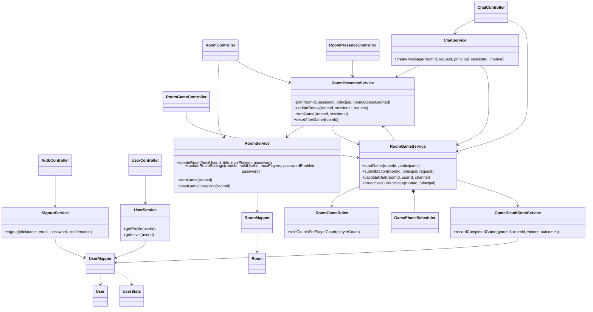
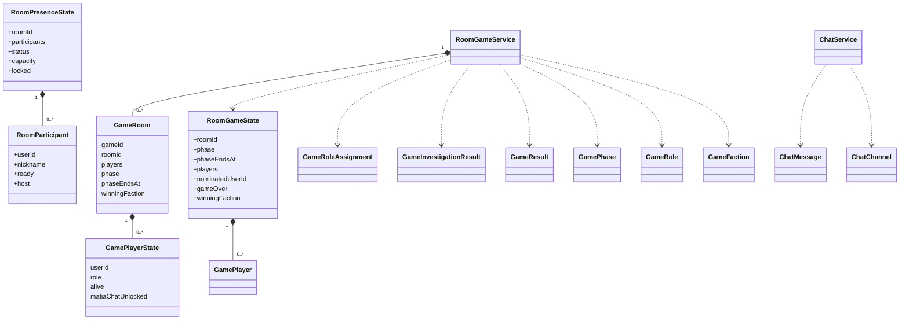
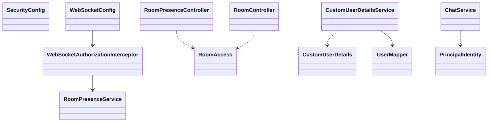
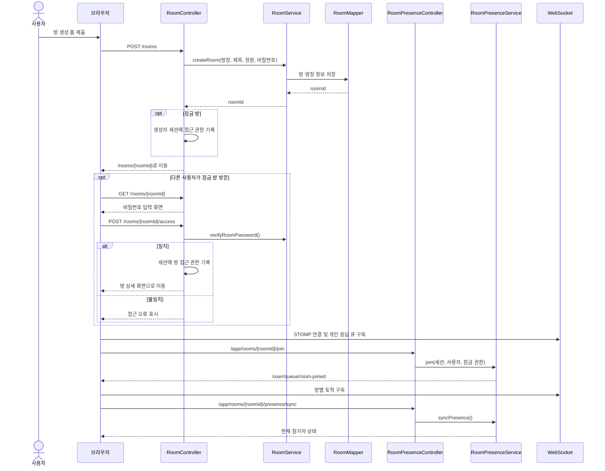
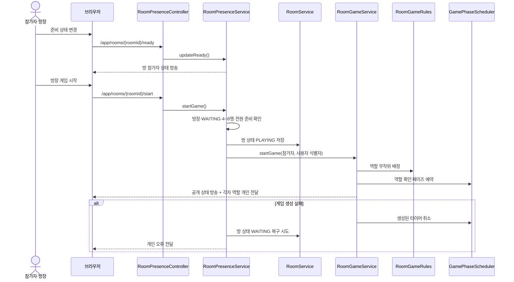
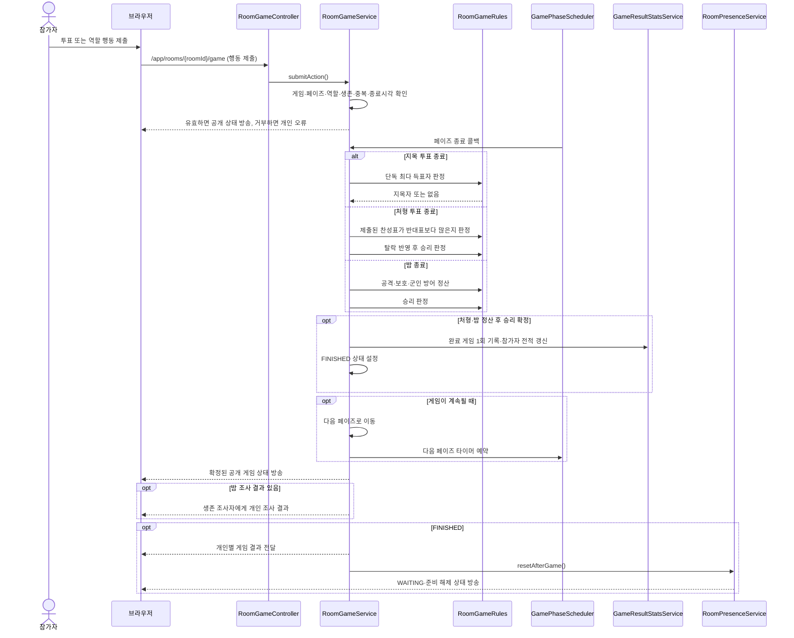
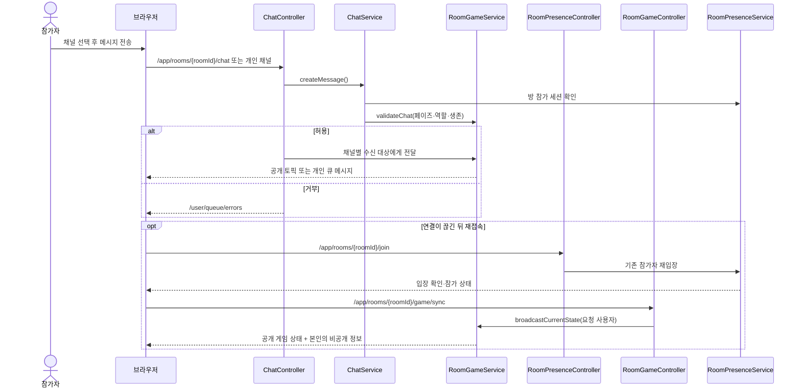
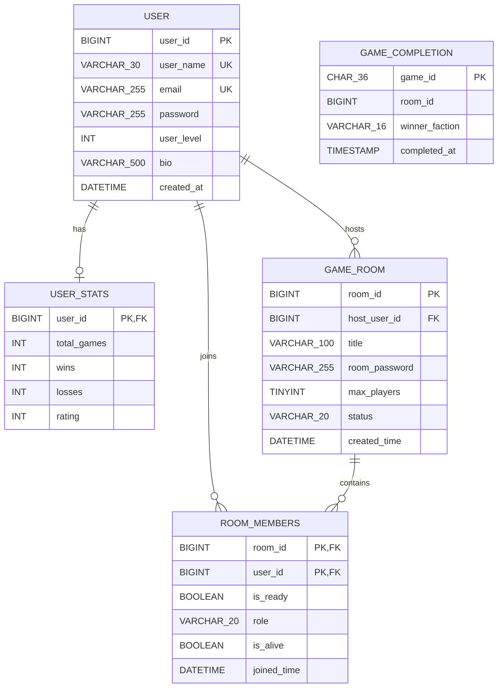

# MAFIAGAME 통합 설계·요구사항·UI·장애 문서

- 기준일: 2026-09-29
- 범위: 현재 `src/main/**` 구현, `mafiasql.sql`과 DB 마이그레이션, 기존 요구사항·UI·버그·트러블슈팅 문서
- 구성: 클래스·시퀀스·ER 다이어그램과 기존 네 문서의 내용을 한 파일에 수록한다.

> 다이어그램은 현재 코드와 스키마를 설명한다. 요구사항·UI·버그·트러블슈팅 장은 기존 문서의 세부 항목을 보존해 합쳤다. 과거 장애의 해결 기록과 현재 코드의 정적 확인은 운영 환경의 재현 검증 결과와 구분한다. 테스트 코드 변경 이력은 수록하지 않는다.

## 문서 목차

1. [시스템 구조와 클래스 다이어그램](#1-시스템-구조와-클래스-다이어그램)
2. [게임방·주요 게임 기능 시퀀스 다이어그램](#2-게임방주요-게임-기능-시퀀스-다이어그램)
3. [ER 다이어그램과 데이터 경계](#3-er-다이어그램과-데이터-경계)
4. [요구사항 명세](#4-요구사항-명세)
5. [UI 정의](#5-ui-정의)
6. [버그 리포트](#6-버그-리포트)
7. [트러블슈팅 기록](#7-트러블슈팅-기록)

## 1. 시스템 구조와 클래스 다이어그램

### 1.1 주요 클래스와 의존 관계

`RoomGameService` 안의 비공개 `GameRoom`·`GamePlayerState`가 진행 중인 게임과 플레이어별 역할·행동을 보관한다. `RoomPresenceService`의 참가자·세션 상태도 메모리다. 위의 양방향 서비스 의존은 실제 협력 관계를 나타내며, `RoomGameService`는 현재 `GamePhaseScheduler`를 직접 생성한다. `RoomGameRules`는 역할 배정·투표·밤 정산·승리 판정의 규칙 계산을 담당한다.

### 1.2 상태 전달 객체

공개 게임 상태와 개인 역할·조사·결과 메시지는 별도 DTO다. 공개 상태의 역할 필드는 종료 전 비공개이고, `FINISHED` 이후 전체 역할이 공개된다.

### 1.3 인증과 WebSocket 권한

`SecurityConfig`는 공개 HTTP 경로와 인증 필요 경로를 구분한다. `WebSocketAuthorizationInterceptor`는 STOMP 목적지별 인증·방 참가 권한을 확인한다. `RoomAccess`는 잠금 방 비밀번호 확인 결과를 HTTP 세션에서 조회한다. 이 클래스들은 DB의 방 참가 행만으로 실시간 권한을 판정하지 않는다.

### 1.4 런타임·배포 경계

| 영역 | 현행 구현 | 설계상 경계 |
| --- | --- | --- |
| HTTP 화면 | Spring MVC 컨트롤러가 Thymeleaf 템플릿과 폼 응답을 제공한다. 일반 보호 경로는 인증이 필요하고 상태 변경 폼은 Spring Security CSRF 보호를 사용한다. | 로그인·방 접근용 HTTP 세션과 WebSocket 참가 상태는 서로 다른 단계다. |
| 실시간 연결 | `/ws`에서 STOMP를 사용한다. 애플리케이션 목적지는 `/app`, 공개 토픽·큐 prefix는 `/topic`, `/queue`, 사용자 destination prefix는 `/user`다. 브로커 heartbeat는 양방향 10초로 설정돼 있다. | 현재 Origin 허용 목록은 `https://mafiaweb01.duckdns.org`다. 다른 호스트명·스킴·로컬 미리보기에서 접속할 때는 핸드셰이크가 거부될 수 있다. |
| 서버 메모리 상태 | 참가자·세션·준비·유예 작업은 `RoomPresenceService`가 관리하고, 게임·투표·행동은 `RoomGameService`가 보관한다. 게임별 잠금으로 상태 변경을 직렬화하고, `GamePhaseScheduler`는 한 방당 하나의 페이즈 타이머를 관리한다. | 프로세스 재시작 시 진행 중인 게임은 복원하지 않는다. 준비 완료 시 DB의 `PLAYING` 방을 `WAITING`으로 초기화한다. |
| 동시 실행·전달 | Spring `enableSimpleBroker`와 서비스 내부 메모리 맵·타이머를 사용한다. | **코드에서 도출한 운영 경계:** 애플리케이션 인스턴스 간 공유 브로커나 상태 저장소가 확인되지 않는다. 따라서 여러 인스턴스를 두면 참가 상태·게임 판정·메시지 전달이 분리될 수 있으며, 다중 인스턴스 운영에는 별도 공유 상태 및 브로커 설계가 필요하다. |

기본 애플리케이션 포트는 `8080`이고, 기본 MariaDB 주소의 포트는 `23306`이다. DB URL은 `SPRING_DATASOURCE_URL` 환경 값이 있으면 이를 적용하고, 없으면 `application.properties`의 `spring.datasource.url`을 사용한다.

## 2. 게임방·주요 게임 기능 시퀀스 다이어그램

### 2.1 방 생성·잠금 확인·실시간 입장

HTTP의 방 접근 확인과 WebSocket의 방 참가 확인은 별도 단계다. 입장 응답 전에는 방별 구독·준비·채팅을 사용할 수 없다.

### 2.2 준비와 게임 시작

### 2.3 투표·밤 행동·종료

실제 페이즈 순서는 **역할 확인 → 첫 밤 → 낮 토론 → 지목 투표 → 최종 변론 → 처형 투표 → 밤**이다. 지목자가 없으면 변론·처형 투표를 건너뛴다. 승리 확정 시 다음 페이즈 타이머는 예약하지 않는다.

### 2.4 채팅과 재접속

진행 중 사망자의 공개 주소 메시지는 생존자에게 방송하지 않고 사망자 수신 대상에게 보낸다. 게임 종료 후에는 누구나 전체 채널만 사용한다.

## 3. ER 다이어그램과 데이터 경계

- `user_name`의 고유 제약은 `src/main/resources/db/migration/V2__unique_user_name.sql`에 있다. `email` 고유 제약은 기본 스키마에 있다.
- `USER_STATS.user_id`는 PK이자 FK다. DB 제약상 사용자는 통계 행이 없을 수도 있지만, 가입 흐름은 통계 행 생성을 시도한다.
- `GAME_COMPLETION.room_id`는 방 ID를 기록하지만 FK 제약이 없다. 따라서 물리 ER 관계선으로 연결하지 않는다. `game_id`는 게임 완료의 중복 반영을 막는 PK다.
- `ROOM_MEMBERS`의 `(room_id, user_id)`는 복합 PK지만, 현재 접속 인원·준비·역할·생존 상태를 이 테이블만으로 해석하면 안 된다. 실시간 참가자와 진행 중 게임은 서버 메모리 상태가 기준이다.
- 근거: `mafiasql.sql`, `src/main/resources/db/migration/V1__create_game_completion.sql`, `src/main/resources/db/migration/V2__unique_user_name.sql`, `src/main/resources/mappers/RoomMapper.xml`, `src/main/resources/mappers/UserMapper.xml`.

### 통합 검토에서 확인한 문서 보완점과 남은 차이

| 항목 | 소스에서 확인한 현재 동작·차이 | 문서 처리 |
| --- | --- | --- |
| 게임 도움말 | 고정 역할 안내, 마피아 승리 문구, 페이즈 목록이 실제 규칙과 다르다. 특히 역할 확인 뒤 서버는 낮 토론이 아니라 첫 밤으로 이동한다. | 요구사항은 `RoomGameRules`·`RoomGameService`를 기준으로 적고, UI·장애 문서에는 화면의 불일치를 남긴다. UI 구현은 이 문서 작업에서 변경하지 않았다. |
| 회원가입 동의 | 약관 체크박스는 브라우저 `required`만 설정되어 있고 서버 제출 필드가 없으며, 링크 목적지는 `#`다. | UI 정의서에 서버 동의 기록 기능이 확인되지 않는 경계와 링크 상태를 명시한다. |
| WebSocket 출처 | `/ws`의 허용 Origin은 `WebSocketConfig`에 `https://mafiaweb01.duckdns.org`로 지정돼 있다. | 보안 요구사항과 연결 장애 진단에 현재 설정값 및 다른 출처에서의 핸드셰이크 실패 가능성을 반영한다. |
| 게임 결과 저장 | DB에는 게임별 방·승리 진영 완료 행과 사용자별 누적 통계가 저장되며, 참가자별 역할·완료 결과 이력은 저장하지 않는다. | ER·요구사항·데이터 경계에서 단일 완료 기록과 누적 통계를 구분한다. |
| 이탈에 따른 조기 종료 | `handlePlayerDeparture()`의 승리 경로에는 예약된 페이즈 타이머를 직접 취소하는 호출이 보이지 않는다. 타이머가 만료된 뒤 종료 상태·개인 결과가 다시 방송될 가능성을 정적 검토에서 확인했다. | 과거 장애로 단정하지 않고, 트러블슈팅 문서의 미검증 점검 항목으로 기록한다. 실행 검증은 이번 요청 범위에 포함하지 않았다. |

요구사항·UI·트러블슈팅의 상세 본문은 각각의 독립 문서와 같은 내용을 수록한다. 문서가 소스 동작을 설명하는 경우와 실제 화면에 남아 있는 안내 문구를 구분하며, 소스 검토만으로 발견한 가능성은 재현된 장애와 별도로 표시한다.

## 4. 요구사항 명세

- 작성 기준일: 2026-09-29
- 기준: `src/main/**`의 현행 구현
- 범위: 회원, 게임방, 게임 진행, 채팅, 전적 및 접근 제어

> 이 문서는 현재 애플리케이션에서 확인되는 동작을 요구사항 형태로 정리한 현행 명세다. 향후 기능의 승인 여부나 운영 환경의 성능 목표를 정의하지 않는다.

### 1. 목적과 사용자

MAFIAGAME은 로그인한 사용자가 4~8인 게임방에 참가하여 역할 기반 마피아 게임을 진행하는 웹 애플리케이션이다. 비회원은 공개 게임방 목록과 로그인·회원가입 화면을 볼 수 있다. 로그인 사용자는 게임방 생성·참가, 게임 진행, 채팅, 프로필 조회를 이용한다. 방장은 게임방 설정 변경과 게임 시작 권한을 갖는다.

### 2. 기능 요구사항

각 항목의 **완료 기준**은 해당 기능이 충족해야 하는 관찰 가능한 결과다. 입력·권한 검증 실패는 사용자에게 오류를 알려야 하며, 시작·종료 중 예외가 발생했을 때의 복구 조건은 해당 항목에 별도로 적는다.

#### 2.1 회원과 프로필

| ID | 요구사항 | 완료 기준 |
| --- | --- | --- |
| FR-AUTH-01 | 사용자는 닉네임, 이메일, 비밀번호로 가입할 수 있다. | 닉네임과 이메일은 앞뒤 공백을 제거하고 이메일은 소문자로 정규화한다. 닉네임은 2~30자, 이메일은 형식 검사 및 255자 이하, 비밀번호는 8자 이상·UTF-8 기준 72바이트 이하이며 확인 입력과 일치한다. 정규화된 이메일과 닉네임은 중복될 수 없다. 동시 가입으로 사전 조회를 통과해도 DB 유일 제약으로 중복 저장을 막는다. 성공 시 비밀번호를 BCrypt로 해시해 저장하고 전적을 초기화한 뒤 로그인 화면으로 이동한다. |
| FR-AUTH-02 | 사용자는 이메일과 비밀번호로 로그인하고 로그아웃할 수 있다. | 로그인 성공 시 게임방 목록으로 이동한다. 로그아웃 시 인증과 HTTP 세션을 종료하고 세션 쿠키를 삭제한다. |
| FR-USER-01 | 사용자는 다른 사용자의 프로필과 자신의 레벨을 조회할 수 있다. | 프로필은 닉네임, 소개, 총 게임 수, 승·패, 경험치, 가입 시기와 레벨 진행률을 표시한다. 없는 사용자는 게임방 목록으로 이동한다. 자신의 레벨 조회는 인증된 사용자에게 JSON으로 응답한다. |

#### 2.2 게임방

| ID | 요구사항 | 완료 기준 |
| --- | --- | --- |
| FR-ROOM-01 | 비회원도 게임방 목록과 현재 인원을 볼 수 있다. | 목록은 방 제목·방장·상태·정원·잠금 여부를 표시한다. 현재 참가 인원과 전체 온라인 인원은 실시간 접속 상태를 기준으로 표시한다. |
| FR-ROOM-02 | 로그인 사용자는 게임방을 생성할 수 있다. | 제목은 공백 제거 후 2~100자, 정원은 4~8명이다. 비밀번호를 설정한다면 공백 제거 후 4~20자이며 해시로 저장한다. 생성 시 방 상태는 `WAITING`이고 생성자는 방장으로 등록된다. |
| FR-ROOM-03 | 잠긴 게임방에는 비밀번호 확인 후 입장할 수 있다. | 방장이 아닌 사용자는 비밀번호 확인 전 방 상세 화면에 진입할 수 없다. 올바른 비밀번호를 확인하면 HTTP 세션에 해당 방의 접근 권한을 기록한다. 잘못된 비밀번호는 접근을 허용하지 않는다. |
| FR-ROOM-04 | 로그인 사용자는 WebSocket으로 방에 참가할 수 있다. | 존재 여부, 잠금 권한, 게임 진행 상태와 정원을 검사한 뒤 참가자를 등록하고 현재 참가자 상태를 전송한다. 진행 중인 게임에는 새 참가자가 들어갈 수 없으며, 기존 참가자의 재접속은 허용한다. 동일 사용자의 복수 세션은 한 참가자로 취급하고 다른 방으로 이동하면 이전 방 세션을 정리한다. |
| FR-ROOM-05 | 참가자는 대기방에서 준비 상태를 변경할 수 있다. | 해당 방에 참가한 세션만 준비 상태를 변경할 수 있다. `PLAYING` 상태에서는 변경할 수 없다. 변경 결과는 방 참가자에게 방송한다. |
| FR-ROOM-06 | 방장은 대기방의 정원과 비밀번호 설정을 변경할 수 있다. | 방장만 변경할 수 있으며 정원은 4~8명이고 현재 참가자 수보다 작을 수 없다. 게임 시작 후에는 변경할 수 없다. 변경 결과는 현재 참가자 화면에 반영된다. |
| FR-ROOM-07 | 방장은 게임 시작 조건을 충족할 때 게임을 시작할 수 있다. | 방장 세션, `WAITING` 상태, 참가자 4~8명, 전원 준비를 확인한다. 성공 시 방 상태를 `PLAYING`으로 저장하고 역할 배정 및 첫 페이즈를 시작한다. 시작 중 실패하면 부분 생성된 게임·타이머를 정리하고 `WAITING` 복구를 시도한다. 복구도 실패하면 최초 오류와 복구 오류를 로그·예외에 보존한다. |
| FR-ROOM-08 | 접속 종료와 재접속을 처리한다. | 재접속한 참가자의 기존 방 상태를 복원한다. 대기방 방장 이탈 시 기본 10초 유예 후 다른 참가자에게 방장을 이전한다. 빈 방은 기본 15초 유예 후 삭제한다. 진행 중 이탈자는 기본 30초 내 재접속하지 않으면 게임에서 탈락 처리한다. 유예 시간은 `mafiagame.room.host-transfer-grace-period`, `mafiagame.room.empty-cleanup-delay`, `mafiagame.room.game-departure-grace-period` 설정으로 바꿀 수 있다. |
| FR-ROOM-09 | 게임이 끝나면 방을 다음 게임의 대기 상태로 되돌린다. | DB 및 실시간 방 상태를 `WAITING`으로 변경하고 참가자는 유지하되 준비 상태를 모두 해제한다. |
| FR-ROOM-10 | 사용자는 로비에서 방을 찾고 실시간 변경을 볼 수 있다. | 방 제목 검색과 `전체`·`대기 중`·`게임 중` 필터를 제공한다. 방별 인원이 바뀌면 표시를 갱신하고, 새 방은 카드로 추가하며, 비어 정리된 방은 목록에서 제거한다. |

#### 2.3 게임 진행과 규칙

| ID | 요구사항 | 완료 기준 |
| --- | --- | --- |
| FR-GAME-01 | 게임 시작 시 인원수에 맞게 역할을 무작위 배정한다. | 아래 역할 구성표에 맞춰 참가자마다 역할 하나를 배정한다. 역할은 본인에게만 전달하고 게임 종료 전 공개 상태에는 포함하지 않는다. 마피아에게는 본인을 제외한 마피아 동료의 닉네임을 개인 역할 안내로 전달한다. |
| FR-GAME-02 | 참가자는 자신의 역할을 확인할 수 있다. | 역할 확인 페이즈에서 각 참가자의 확인을 한 번만 받는다. 전원 확인 시 즉시 첫 밤으로 이동하며, 미확인자가 있어도 제한 시간이 끝나면 이동한다. |
| FR-GAME-03 | 게임은 정해진 페이즈 순서와 제한 시간에 따라 진행한다. | 역할 확인 → 첫 밤 → 낮 토론 → 지목 투표 → 최종 변론 → 처형 투표 → 밤 순서로 진행한다. 지목 대상이 없으면 변론·처형 투표를 건너뛰고 밤으로 이동한다. 방마다 현재 페이즈의 타이머 하나를 유지하고 서버 종료 시각이 지난 행동은 거부한다. 승리 조건이 성립하면 `FINISHED`로 전환하고 다음 타이머를 예약하지 않는다. |
| FR-GAME-04 | 생존 참가자는 지목 투표를 할 수 있다. | 지목 투표 페이즈에서 자신과 사망자를 제외한 참가자 한 명을 한 번 지목한다. 종료 시 단독 최다 득표자가 최종 변론 대상이다. 동률 또는 유효표가 없으면 처형 없이 밤으로 진행한다. |
| FR-GAME-05 | 생존 참가자는 처형 찬반 투표를 할 수 있다. | 처형 투표 페이즈에서 지목 당사자를 제외한 생존 참가자가 한 번 투표한다. 찬성이 반대보다 많을 때만 지목자를 처형한다. |
| FR-GAME-06 | 밤에는 역할별 행동을 제출할 수 있다. | 마피아는 시민 진영을 공격하고, 의사는 생존자를 보호하며, 경찰은 생존자를 조사한다. 스파이는 자신을 제외한 생존자를 조사하고, 영매사는 사망자를 조사한다. 각 역할은 해당 행동을 밤마다 한 번만 제출할 수 있다. |
| FR-GAME-07 | 밤 종료 시 행동을 함께 정산한다. | 마피아 공격 대상의 득표를 집계하고 동률이면 무작위로 선택한다. 의사의 보호를 받은 대상은 사망하지 않는다. 군인은 의사의 보호가 적용되지 않은 첫 마피아 공격을 방어하고 정체가 공개된다. 조사 결과는 행동 제출 시점이 아니라 밤 정산 후 생존한 조사자에게만 개인 메시지로 전송한다. |
| FR-GAME-08 | 스파이의 마피아 접선을 처리한다. | 스파이가 마피아 역할을 조사하면 마피아 정보를 받고 마피아 채팅 사용 권한을 얻는다. 접선 전 스파이는 마피아 채팅을 사용할 수 없다. |
| FR-GAME-09 | 페이즈 종료 및 참가자 탈락 후 승리를 판정한다. | 마피아 진영 생존자가 없으면 시민 진영이 승리한다. 마피아 측의 유효 생존자 수가 시민 진영 생존자 수 이상이면 마피아 진영이 승리한다. 접선 전 스파이는 이 수적 우세 계산에서 제외한다. |
| FR-GAME-10 | 게임 종료 결과와 전적을 기록한다. | 게임 식별자당 완료 기록을 한 번만 저장한다. 참가자별 게임 수와 승·패를 갱신하고 승리 시 경험치 500, 패배 시 100을 더한다. 공개 종료 상태와 개인별 결과를 전송한다. |
| FR-GAME-11 | 참가자는 재접속 후 게임 상태를 동기화할 수 있다. | 입장 확인 후 방 참가 상태와 게임 상태를 다시 요청한다. 게임 공개 상태는 방 토픽에 다시 방송하고, 요청한 인증 사용자에게만 역할을 재전송한다. 이미 종료된 게임이면 본인의 결과도 개인 큐로 다시 전달한다. |
| FR-GAME-12 | 게임 종료 시 전체 역할과 개인 결과를 구분해 공개한다. | `FINISHED` 공개 상태에는 참가자별 역할·생존 여부를 포함한다. 개인별 승리 진영·본인 역할·생존 여부 결과는 해당 사용자에게 별도로 전달한다. |

##### 인원별 역할 구성

| 인원 | 마피아 | 스파이 | 경찰 | 의사 | 군인 | 영매사 | 시민 |
| ---: | ---: | ---: | ---: | ---: | ---: | ---: | ---: |
| 4 | 1 | 0 | 1 | 1 | 0 | 0 | 1 |
| 5 | 1 | 0 | 1 | 1 | 0 | 0 | 2 |
| 6 | 1 | 1 | 1 | 1 | 1 | 0 | 1 |
| 7 | 2 | 0 | 1 | 1 | 1 | 1 | 1 |
| 8 | 2 | 1 | 1 | 1 | 1 | 1 | 1 |

##### 기본 페이즈 시간

| 페이즈 | 기본 시간 |
| --- | ---: |
| 역할 확인 | 15초 |
| 낮 토론 | 60초 |
| 지목 투표 | 20초 |
| 최종 변론 | 20초 |
| 처형 투표 | 20초 |
| 밤 | 35초 |
| 게임 종료 | 타이머 없음 |

검증용 `MAFIAGAME_PHASE_PROFILE=short` 환경에서는 종료 페이즈를 제외한 각 페이즈가 3초로 동작한다.

#### 2.4 채팅

| ID | 요구사항 | 완료 기준 |
| --- | --- | --- |
| FR-CHAT-01 | 방 참가자는 메시지를 보낼 수 있다. | 공백만 있는 메시지는 거부하고 길이는 유니코드 코드 포인트 기준 300자 이하로 제한한다. 방에 참가하지 않은 세션은 전송할 수 없다. |
| FR-CHAT-02 | 공개·마피아·사망자 채널을 구분한다. | 마피아 채널은 생존 마피아와 접선한 생존 스파이에게, 사망자 채널은 사망자와 영매사에게만 개인 전송한다. |
| FR-CHAT-03 | 페이즈와 생존 상태에 맞는 발언 권한을 적용한다. | 역할 확인 중 채팅은 금지한다. 최종 변론 중 생존자의 공개 채팅은 지목자만 사용할 수 있고 밤에는 생존자의 공개 채팅을 금지한다. 게임 중 사망자가 공개 채팅 주소로 보낸 메시지는 생존자에게 공개하지 않고 사망자 채널 수신자에게 전송한다. 게임 종료 후에는 공개 채널만 사용할 수 있다. |

### 3. 접근 제어 및 데이터 요구사항

| ID | 요구사항 | 완료 기준 |
| --- | --- | --- |
| SEC-01 | 보호된 화면과 동작은 인증된 사용자에게만 허용한다. | 방 목록·방 카드·로그인·회원가입·정적 리소스·오류 화면은 비회원에게 허용하고, 그 밖의 일반 HTTP 요청은 인증을 요구한다. `/ws/**` 핸드셰이크는 열려 있으나 메시지 구독·전송은 별도 WebSocket 인가 규칙을 적용한다. |
| SEC-02 | WebSocket 목적지별 접근 권한을 확인한다. | 방별 토픽 구독과 방별 요청은 로그인 및 해당 방 참가 세션을 요구한다. 방 입장 요청은 로그인 상태에서 참가 검사 전에 허용한다. 개인 큐는 로그인 상태에서만 구독한다. 로비 인원 토픽 구독과 로비 인원 요청은 비회원에게도 허용한다. |
| SEC-03 | 비밀번호와 비공개 게임 정보를 보호한다. | 회원·방 비밀번호는 해시로 저장한다. 게임 종료 전 역할과 개인 조사 결과는 공개 방 토픽에 포함하지 않고 해당 사용자에게만 전송한다. |
| SEC-04 | HTTP 폼 제출과 WebSocket 연결 출처를 제한한다. | 상태 변경 HTTP 폼은 Spring Security CSRF 보호를 적용하고 폼에 CSRF 토큰을 포함한다. `/ws` 연결은 `WebSocketConfig`에 명시된 Origin 허용 목록과 일치해야 한다. 현재 허용 값은 `https://mafiaweb01.duckdns.org`이며, 다른 호스트명이나 로컬 미리보기 주소는 허용 목록에 없으면 핸드셰이크가 거부된다. |
| DATA-01 | 영속 정보와 실시간 정보를 구분한다. | 회원·전적·방 기본 정보와 방 상태는 DB에 저장한다. 접속 세션, 준비 상태, 진행 중 게임·투표·밤 행동은 서버 메모리에서 관리한다. 애플리케이션 준비 완료 이벤트에서 중단된 게임방의 DB 상태를 `WAITING`으로 되돌린다. |
| DATA-02 | 경험치로 레벨을 산정한다. | 기본 경험치는 1000이며, 레벨은 `max(1, 경험치 / 1000)`의 정수 몫으로 계산한다. |
| DATA-03 | 게임 완료와 참가자 전적을 기록한다. | `game_completion`에는 게임 ID, 방 ID, 승리 진영, 완료 시각을 저장하고 게임 ID를 중복 방지 키로 사용한다. 참가자별 역할·개별 결과 이력은 별도 영속화하지 않고, 사용자 통계에는 누적 게임·승·패·경험치만 반영한다. |

### 4. 현행 구현의 경계

- 방 비밀번호를 확인한 세션의 접근 권한은 방 ID별 HTTP 세션 값으로 보관된다. 방 비밀번호 변경 시 기존 세션의 권한을 자동으로 취소하는 처리는 현재 확인되지 않는다.
- 진행 중 게임의 역할·투표·밤 행동은 서버 메모리에 있다. 재시작 시 진행 게임을 이어서 복원하지 않으며, DB에 남은 `PLAYING` 방을 `WAITING`으로 되돌린다.
- 실시간 참가·게임 상태는 프로세스 내부 자료구조에 있고 WebSocket은 Spring의 in-process simple broker를 사용한다. 코드상 여러 애플리케이션 인스턴스 사이에 상태나 메시지를 공유하는 구성은 확인되지 않았으므로, 다중 인스턴스 배포는 별도 공유 상태·브로커 설계 없이 지원된다고 볼 수 없다.
- 게임 결과 테이블은 완료 게임의 방·승리 진영만 보존한다. 참가자별 게임 결과는 종료 시 개인 큐로 전달되며, 프로세스 재시작 후 복원되는 결과 이력으로 저장되지는 않는다.
- 게임방 도움말의 일부 고정 설명은 현재 역할 구성·승리 규칙·페이즈 순서와 다르다. 실제 역할·승리·진행 판정 기준은 `RoomGameRules`와 `RoomGameService`이며, 도움말 문구 정정은 별도 작업이다.
- 이탈 유예 처리로 게임이 조기 종료될 때 이미 예약된 페이즈 타이머가 남을 가능성이 소스 검토에서 확인됐다. 종료 메시지 중복 여부는 실행으로 재현하지 않았으며 트러블슈팅 기록에 미검증 항목으로 남긴다.

### 5. 검증 시나리오

1. 회원가입의 정상 입력과 닉네임·이메일 중복, 비밀번호 불일치를 확인한다.
2. 공개 목록에서 방을 만들고, 잠긴 방의 비밀번호 성공·실패와 정원 초과를 확인한다.
3. 참가자 전원이 준비하기 전과 후의 방장 게임 시작 결과를 비교한다.
4. 4~8명 각각의 역할 구성, 본인만 볼 수 있는 역할 전달, 페이즈 시간을 확인한다.
5. 지목 동률, 처형 찬반, 의사 보호, 군인 방어, 각 조사 결과와 승리 판정을 확인한다.
6. 채널별 권한, 최종 변론·밤의 발언 제한, 사망자 메시지의 비공개 전달을 확인한다.
7. 재접속·이탈 유예·방장 이전·빈 방 삭제·게임 종료 후 대기방 복귀를 확인한다.
8. 게임 완료의 중복 기록 방지와 승·패·경험치·레벨 표시를 확인한다.
9. 폼의 CSRF 토큰 요구 여부와 설정된 Origin을 이용한 `/ws` 연결 성공, 허용 목록 밖 출처의 핸드셰이크 거부를 확인한다.
10. 게임 완료 테이블의 게임별 행과 사용자별 누적 전적을 대조하고, 참가자별 결과가 영속 이력으로 저장되지 않는 경계를 확인한다.
11. 페이즈 타이머가 남은 상태에서 이탈 유예만으로 게임이 조기 종료되면 원래 타이머 만료 시 공개 종료 상태와 개인 결과가 재전송되는지 확인한다. 전적 저장 중복 여부는 메시지 재전송과 분리해 확인한다.

### 6. 주요 근거 파일

- `src/main/java/kr/or/oti/mafiagame/controller/`: HTTP 및 WebSocket 진입점
- `src/main/java/kr/or/oti/mafiagame/service/SignupService.java`: 가입 입력 규칙
- `src/main/java/kr/or/oti/mafiagame/service/RoomService.java`: 방 생성·설정·상태 저장
- `src/main/java/kr/or/oti/mafiagame/service/RoomPresenceService.java`: 참가·준비·시작·이탈·정리
- `src/main/java/kr/or/oti/mafiagame/service/RoomGameService.java`: 행동·페이즈·결과 전달
- `src/main/java/kr/or/oti/mafiagame/service/RoomGameRules.java`: 역할 구성·투표·밤·승리 규칙
- `src/main/java/kr/or/oti/mafiagame/service/ChatService.java`: 채팅 입력과 권한 확인
- `src/main/java/kr/or/oti/mafiagame/config/`: HTTP 및 WebSocket 접근 제어

## 5. UI 정의

- 작성 기준일: 2026-09-29
- 기준: `src/main/resources/templates/**`, `src/main/resources/static/js/**`, `src/main/resources/static/css/app.css`와 연결된 컨트롤러의 현행 구현
- 목적: 화면 구성, 표시 데이터, 사용자 동작, 상태별 표시와 오류 피드백을 일관되게 설명한다.

> 이 문서는 현재 구현된 UI의 정의서다. 목업이나 미구현 화면을 포함하지 않으며, 실제 브라우저 시각 검증 결과를 뜻하지 않는다.

### 1. 화면 목록과 이동

| 화면 ID | 화면명 | URL | 접근 | 주요 이동 |
| --- | --- | --- | --- | --- |
| UI-01 | 로그인 | `GET /login` | 전체 | 성공 → 로비, 회원가입 링크 → UI-02 |
| UI-02 | 회원가입 | `GET /signup` | 전체 | 성공 → 로그인, 로그인 링크 → UI-01 |
| UI-03 | 게임 로비 | `GET /`, `GET /rooms` | 전체 | 새 게임 만들기 → 로그인 후 UI-04, 방 입장 → 로그인 후 UI-06 또는 UI-05 |
| UI-04 | 새 방 만들기 | `GET /rooms/new` | 로그인 | 성공 → 생성된 UI-06, 취소 → UI-03 |
| UI-05 | 잠금 방 입장 | `GET /rooms/{roomId}`의 접근 제한 상태 | 로그인 | 비밀번호 확인 성공 → UI-06, 목록 링크 → UI-03 |
| UI-06 | 게임방 | `GET /rooms/{roomId}` | 로그인 및 방 접근 권한 | 목록 링크 → UI-03, 참가·준비·게임·채팅은 화면 안에서 처리 |
| UI-07 | 사용자 프로필 | `GET /users/{userId}` | 로그인 | 게임 로비 링크 → UI-03 |

`/rooms/{roomId}/card`는 로비의 방 카드 갱신에 쓰이는 HTML 조각이며 독립 화면이 아니다. 방 상세·잠금 방 접근 화면은 로그인이 필요하다. 없는 방의 상세 URL은 로비로 이동하며, 없는 방의 카드 URL은 404를 반환한다.

### 2. 공통 UI

| 요소 | 정의 |
| --- | --- |
| 상단 브랜드 | MAFIAGAME 로고를 누르면 로비로 이동한다. |
| 계정 메뉴 | 비회원은 게스트 표시와 로그인·회원가입 링크를 본다. 로그인 사용자는 닉네임·레벨, 마이페이지, 로그아웃을 본다. 레벨은 별도 조회로 갱신한다. |
| 주요 색상 | 본문 잉크 `#1a1e28`, 강조 코럴 `#f45d4d`, 짙은 네이비 `#252b3c`를 사용한다. 본문 글꼴은 Noto Sans KR, 브랜드는 DM Mono다. |
| 반응형 구성 | Bootstrap 그리드를 사용한다. 로그인·회원가입의 왼쪽 아트 영역은 큰 화면에서만 표시한다. 게임방은 큰 화면에서 참가자·게임 영역과 채팅을 좌우로 배치하고 작은 화면에서 세로로 쌓는다. |
| 피드백 | 서버 폼 오류는 화면의 경고 영역에, 게임방 실시간 오류는 토스트와 상태 문구에 표시한다. 진행 중 사용 불가한 버튼·입력은 비활성화한다. |

### 3. 화면별 상세 정의

#### UI-01 로그인

| 영역 | 구성·동작 |
| --- | --- |
| 입력 폼 | 이메일 입력(`type=email`, 필수), 비밀번호 입력(`type=password`, 필수), 로그인 버튼. `POST /login`으로 제출한다. |
| 상태 메시지 | 로그인 실패 시 오류, 로그아웃 완료 및 회원가입 완료 시 성공 알림을 표시한다. |
| 보조 이동 | 회원가입 링크와 로비로 이동하는 브랜드 링크를 제공한다. |

#### UI-02 회원가입

| 영역 | 구성·동작 |
| --- | --- |
| 입력 폼 | 닉네임 2~30자, 이메일 255자 이하, 비밀번호·확인 각 8~72자 입력과 약관 동의 체크박스가 있다. 가입 버튼은 `POST /signup`을 제출한다. |
| 오류 상태 | 서버 검증 실패 시 상단 오류 문구를 표시하고 닉네임·이메일 입력값을 유지한다. 비밀번호 값은 유지하지 않는다. |
| 보조 이동 | 로그인 링크와 로비로 이동하는 브랜드 링크를 제공한다. |

브라우저 입력 길이 제한은 문자 수 기준이다. 서버의 비밀번호 검증은 UTF-8 바이트 수 72 이하도 확인한다. 현재 약관·개인정보 처리방침 링크의 목적지는 `#`이며, 동의 체크박스는 `required` 속성만 있고 서버 제출 이름이 없어 브라우저에서만 필수로 취급된다. 서버에 동의 상태를 저장하거나 검증하는 기능은 확인되지 않았다.

#### UI-03 게임 로비

| 영역 | 구성·동작 |
| --- | --- |
| 헤더 | 브랜드, 현재 온라인 인원, 계정 메뉴. |
| 소개 영역 | 게임 소개 문구와 `새 게임 만들기` 버튼. 비회원이 버튼을 누르면 인증 흐름으로 이동한다. |
| 방 목록 | 방 번호, 잠금 표시, 제목, `대기 중`/`게임 중` 상태, 방장, 현재 인원/정원, `입장하기` 링크를 표시한다. |
| 검색·필터 | 방 제목의 대소문자 구분 없는 검색과 `모든 게임`·`대기 중`·`게임 중` 필터를 제공한다. `방 개수`는 검색·필터 결과 수가 아닌 현재 목록의 전체 방 수다. 표시할 방이 없으면 빈 상태 문구를 표시한다. |
| 실시간 갱신 | WebSocket 방 인원 방송으로 온라인 인원과 카드의 참가자 수를 갱신한다. 새 방은 접속자가 확인되면 서버 HTML 조각을 받아 카드를 추가하고, 접속자가 없는 방 카드는 목록에서 제거한다. |
| 패치노트 | 최신 내용 모달과 전체 내용 모달을 제공한다. `오늘 하루 보지 않기` 선택은 날짜와 내용 지문을 로컬 저장소에 기록한다. 내용이 바뀌면 같은 날에도 다시 표시된다. |

#### UI-04 새 방 만들기

| 요소 | 입력·동작 |
| --- | --- |
| 방 제목 | 필수, 2~100자. |
| 최대 인원 | 4~8명 중 하나를 라디오 버튼으로 선택한다. 초기 선택은 8명이다. |
| 비밀번호로 방 보호하기 | 체크하면 비밀번호 입력을 보이고 필수로 만든다. 해제하면 입력을 숨기고 비우며 제출 대상에서 제외한다. 비밀번호는 4~20자다. |
| 방 만들기 | `POST /rooms` 제출 성공 시 생성된 방으로 이동한다. 실패 시 오류 문구와 제목·정원·비밀번호 사용 여부를 복원한다. |
| 취소 | 로비로 이동한다. |

#### UI-05 잠금 방 입장

방 제목과 비밀번호 입력 폼을 표시한다. `입장하기`는 `POST /rooms/{roomId}/access`를 제출한다. 비밀번호가 틀리면 같은 화면에 오류를 표시한다. 성공하면 방 상세 화면으로 이동한다. `게임 목록으로` 링크가 있다.

#### UI-06 게임방

##### 기본 배치

| 영역 | 구성 |
| --- | --- |
| 방 헤더 | 방 번호, 잠금 여부, 제목, `대기 중`/`게임 중` 상태와 현재 인원/정원. |
| 참가자 패널 | 참가자 아바타·닉네임·방장/준비/사망 상태, 빈 자리, 준비 버튼, 방장용 게임 시작 버튼, 도움말 버튼, 방장용 설정 버튼. |
| 게임 패널 | 현재 페이즈, 남은 시간, 진행 안내, 개인 역할, 페이즈별 행동, 밤 조사 결과, 종료 결과. 시작 전에는 자리 표시 영역을 보인다. |
| 채팅 패널 | 연결 상태, 메시지 목록, 채널 선택, 메시지 입력과 전송 버튼. |
| 공통 피드백 | 서버 오류는 토스트로 표시한다. 연결 상태는 `연결 중`·`실시간`·`재연결 중`·`오류` 등으로 표시한다. |

##### 대기·진행 상태

| 화면 상태 | 표시·사용 가능 동작 |
| --- | --- |
| 연결 중·입장 전 | 준비·시작·채팅·게임 행동을 비활성화한다. 서버의 입장 확인을 받은 후 방 토픽을 구독하고 현재 상태를 동기화한다. |
| 대기 중 | 참가자 및 빈 자리를 표시한다. 준비 버튼은 `준비 완료`와 `준비 취소` 사이에서 전환된다. 방장은 4명 이상·전원 준비·연결 완료 시 게임 시작 버튼을 사용할 수 있다. 미충족 사유를 시작 안내에 표시한다. |
| 역할 확인 | 본인에게만 역할을 표시하고, 마피아 역할을 받은 참가자에게는 다른 마피아의 닉네임을 표시한다. `역할 확인 완료` 버튼은 확인 전 한 번만 사용할 수 있다. 채팅은 비활성화한다. |
| 낮 토론 | 페이즈 안내와 남은 시간을 표시한다. 허용된 참가자는 전체 채팅을 사용한다. |
| 지목 투표 | 생존한 다른 참가자를 목록에서 골라 `지목 투표`를 제출한다. 제출 후 버튼을 잠그고 투표 현황을 표시한다. |
| 최종 변론 | 지목자에게 전체 채팅 발언 안내를 표시한다. 다른 참가자에게는 청취 및 다음 투표 안내를 표시한다. |
| 처형 투표 | 지목자 이외의 생존 참가자에게 `처형`·`살려두기` 버튼을 제공한다. |
| 밤 | 마피아·스파이·의사·경찰·영매사에게 역할별 대상 선택과 `밤 행동 제출` 버튼을 제공한다. 시민과 군인에게는 제출 행동을 제공하지 않는다. 대상 후보는 역할에 맞게 생존자·다른 생존자·사망자로 제한한다. 밤 배경색을 적용한다. |
| 조사 결과 | 경찰에게는 대상의 `마피아팀`·`시민팀` 진영만 표시한다. 스파이·영매사의 직업 조사 결과에는 진영과 상세 직업을 구분해 표시한다. 스파이가 마피아를 찾은 경우 확인된 마피아 명단도 개인 결과에 표시한다. |
| 종료 | 승리 진영, 본인 역할·생존 여부와 전체 참가자의 역할 공개 목록을 표시한다. 생존 여부와 관계없이 전체 채널만 선택·사용할 수 있다. 방이 대기 상태로 돌아가면 다시 준비할 수 있다. |

페이즈가 바뀌면 행동 제출 상태를 초기화한다. 제출 오류가 오면 토스트를 띄우고 제출 상태를 해제한다. 남은 시간은 서버가 보낸 페이즈 종료 시각을 기준으로 화면에서 갱신한다. 재연결 시 이전 화면 상태를 비우고 입장·게임 상태를 다시 동기화한다.

##### 채팅 채널

| 채널 | UI 표시 조건·처리 |
| --- | --- |
| 전체 | 대기방 및 허용된 게임 페이즈에서 선택할 수 있다. 역할 확인·밤에는 비활성화하며 최종 변론에서는 지목자만 전송할 수 있다. 게임 종료 후에는 모든 참가자가 전체 채널만 이용한다. |
| 마피아 | 진행 중인 게임의 생존 마피아 또는 마피아와 접선한 생존 스파이에게만 표시한다. 역할 확인 단계와 게임 종료 후에는 숨긴다. |
| 사망자 | 진행 중 사망 참가자와 생존 영매사에게 표시한다. 사망자에게는 전체 채널을 숨기고 사망자 채널을 기본 선택한다. 역할 확인 단계와 게임 종료 후에는 숨긴다. |

메시지 입력은 최대 300자로 제한한다. 전송 메시지는 채널에 따라 전체, 마피아, 사망자 목적지로 보낸다. 목록은 실시간 메시지를 표시하며 화면에 남기는 메시지 수에 상한을 둔다.

##### 보조 모달

| 모달 | 구성·동작 |
| --- | --- |
| 방 설정 | 방장에게만 버튼과 모달이 보이며 게임 중에는 설정 버튼을 숨긴다. 최대 인원 4~8명, 비밀번호 사용 스위치와 새 비밀번호를 편집한다. 이미 잠긴 방의 비밀번호를 유지하려면 입력을 비워 둔다. 현재 참가자 수보다 작은 정원은 경고하고 저장을 막는다. 저장 후 같은 방으로 돌아와 성공·오류 메시지를 모달에 표시한다. |
| 게임 도움말 | 게임 규칙, 방 정원별 역할 구성, 진행 순서, 직업별 설명을 표시한다. 역할 구성은 현재 방의 **최대 인원**을 기준으로 강조하며, 실제 배정은 게임 시작 시 참가 인원에 따른다. |

#### UI-07 사용자 프로필

| 영역 | 표시 데이터 |
| --- | --- |
| 프로필 헤더 | 닉네임 첫 글자 아바타, 닉네임, 소개, 가입 시기. |
| 통계 카드 | 총 게임 수, 승리 횟수, 패배 횟수. |
| 레벨 카드 | 현재 레벨·경험치, 다음 레벨 진행 막대, 다음 레벨까지 필요한 경험치와 승·패 경험치 안내. |
| 이동 | 로비로 돌아가는 링크와 계정 메뉴. |

### 4. 화면 데이터와 이벤트

| 데이터·이벤트 | 사용하는 화면 | 갱신 방식 |
| --- | --- | --- |
| 방 목록·방장·잠금·상태 | UI-03, UI-05, UI-06 | 최초 HTML 렌더링, 방 카드 조각 조회, 방 상세 재방문 |
| 로비 온라인 인원·방 인원 | UI-03 | WebSocket `/topic/rooms/presence` |
| 참가자·준비·방 설정 | UI-06 | WebSocket `/topic/rooms/{roomId}/presence`와 개인 동기화 응답 |
| 공개 게임 상태·타이머·생존자 | UI-06 | WebSocket `/topic/rooms/{roomId}/game` |
| 개인 역할·밤 조사·결과 | UI-06 | `/user/queue/game-role`, `/user/queue/night-result`, `/user/queue/game-result` |
| 채팅·오류 | UI-06 | 방 공개 토픽, 개인 채팅 큐 및 `/user/queue/errors` |
| 사용자 레벨·전적 | 계정 메뉴, UI-07 | 레벨 JSON 조회, 프로필 HTML 렌더링 |

### 5. 확인이 필요한 현행 UI 내용

- 게임 도움말의 고정 설명 문구에는 `5명부터 스파이`, `6명부터 군인`, `8명부터 영매사`, `마피아팀이 시민팀보다 많아지면 승리`라고 적혀 있다. 실제 구성에서는 5명은 시민 2명이며, 6명에 스파이·군인이 추가되고, 7명에는 스파이 없이 마피아 2명·영매사가 배정된다. 8명에 스파이가 다시 포함된다. 승리 규칙도 단순한 인원 초과가 아니다. 마피아팀이 전멸하면 시민팀이 승리하고, 접선하지 않은 스파이를 동수 판정에서 제외한 마피아팀 생존 인원이 시민 진영 생존 인원 **이상**이면 마피아팀이 승리한다.
- 같은 도움말의 진행 순서도 실제 게임과 다르다. 도움말은 역할 확인 다음에 낮 토론을 표시하지만 서버는 역할 확인이 끝나면 첫 밤으로 이동하고, 이후 낮 토론·지목 투표·최종 변론·처형 투표·밤을 반복한다. 정적 역할 표와 별개로, 실제 배정은 게임 시작 시 참가 인원 기준이고 도움말의 동적 표시는 방 정원 기준이다. 고정 설명과 페이즈 목록을 코드의 현재 규칙에 맞춰 정정할 필요가 있다.
- 회원가입 화면의 이용약관·개인정보 처리방침 링크는 현재 `#`를 가리킨다. 실제 문서 연결 여부는 별도 결정이 필요하다.

### 6. 근거 파일

- `src/main/resources/templates/auth/login.html`, `signup.html`
- `src/main/resources/templates/rooms/list.html`, `create.html`, `access.html`, `detail.html`
- `src/main/resources/templates/users/detail.html`, `fragments/user-menu.html`
- `src/main/resources/static/js/room-list.js`, `chat.js`, `user-level.js`
- `src/main/resources/static/css/app.css`
- `src/main/java/kr/or/oti/mafiagame/controller/` 및 관련 서비스의 입력·상태 검증

## 6. 버그 리포트

> 기존 장애 기록과 현재 `src/main/**` 구현을 대조한 문서다. 아래의 과거 증상은 현재 재발 여부를 뜻하지 않는다. 배포 사고의 미확인 사실은 별도로 표시한다.

### 1. 게임 종료 시 채널이 사망자 채널로 고정되는 문제

#### 현상

- 게임이 종료되는 시점에 채팅 채널을 사용하거나 채널 상태가 갱신되면 사용자의 채널 선택이 비정상적으로 변경된다.
- 게임 종료 후 생존 여부와 관계없이 사망자 채널만 사용할 수 있는 상태로 노출되는 문제가 있다.
- 게임 종료 화면에서 전체 채널로 복귀하지 못한다.

#### 재현 시나리오

1. 게임방에 입장해 게임을 시작한다.
2. 마지막 처형 또는 밤 결과 처리로 게임이 종료되는 상황을 만든다.
3. 종료 상태를 받은 직후 채널 선택기와 채팅 입력 상태를 확인한다.
4. 이전에는 종료 후 사망자 채널만 선택되는지 확인했고, 현재는 전체 채널만 표시·허용되는지 확인한다.

#### 기대 동작

- 게임 종료(`FINISHED`) 후에는 생존 여부와 역할에 관계없이 모든 참가자에게 전체 채널만 표시·허용되어야 한다.
- 진행 중에만 사망자 또는 영매사에게 사망자 채널을 허용하고, 게임 종료 시 채널 선택을 전체 채널로 되돌려야 한다.
- 게임 종료 화면으로 전환되더라도 채널 선택기와 채팅 입력 상태가 종료 후 권한과 일치해야 한다.

#### 현재 처리

- 클라이언트는 `FINISHED` 상태에서 사망자·마피아 채널 선택지를 비활성화하고 전체 채널을 선택한다.
- 서버는 종료된 게임에서 전체 채널 외의 채팅 요청을 거부한다. 종료 후 사망자의 전체 채널 메시지도 전체 채널로 전달한다.
- 근거 구현: `src/main/resources/static/js/chat.js`의 채널 선택 상태 갱신, `src/main/java/kr/or/oti/mafiagame/service/RoomGameService.java`의 종료 후 채널 검증·공개 메시지 전달.

### 2. 경찰 조사 결과가 직업 정보처럼 보이던 문제

#### 현상

- 경찰이 밤에 플레이어를 조사하면 조사 결과 상단에 `마피아`처럼 개별 직업으로 읽힐 수 있는 문구가 먼저 표시되었다.
- 경찰이 전략을 판단할 때 필요한 진영 정보가 결과 제목·상단 영역에서 명확하게 구분되지 않는다.

#### 기대 동작

- 경찰 조사 결과 상단에 조사 대상의 진영을 표시한다.
- 마피아 또는 스파이처럼 마피아팀에 속한 대상은 `마피아팀`으로 표시한다.
- 경찰·의사·군인·영매사·시민처럼 시민 진영에 속한 대상은 `시민팀`으로 표시한다.
- 경찰 조사 결과에는 대상의 상세 직업을 노출하지 않는다. 직업 조사가 가능한 다른 역할의 결과는 진영과 직업을 구분해 표시한다.

#### 현재 처리

- 서버는 경찰 조사 결과에 대상의 진영만 담고, 스파이를 포함한 마피아팀은 `마피아팀`, 나머지 시민 진영은 `시민팀`으로 분류한다.
- 클라이언트는 경찰 조사 결과 상단에 진영을 표시한다. 직업 조사 결과를 받은 경우에만 상세 직업 영역을 별도로 표시한다.
- 근거 구현: `src/main/java/kr/or/oti/mafiagame/service/RoomGameService.java`의 경찰 조사 결과 생성, `src/main/resources/static/js/chat.js`의 진영·직업 표시 분기.

### 3. 서비스 실행 중 SCP 전송 후 `ThrowableProxy` 오류가 반복된 문제

#### 현상

- 서비스 실행 중 SCP로 파일을 전송한 뒤 파일 손상이 보고되었다.
- 이후 `NoClassDefFoundError: ...ThrowableProxy` 오류가 로그에 반복해서 출력되었다.
- 손상된 파일의 경로·크기·체크섬, 최초 오류 시각과 전체 로그는 현재 리포트에 남아 있지 않다.

#### 발생 경과와 확인할 항목

1. 기록된 순서는 서비스 실행 → SCP 전송 → 파일 손상 보고 및 반복 오류 → 서비스 중지 후 파일 삭제·재전송 → 재시작 후 증상 해소다.
2. 같은 현상이 다시 발생하면 전송 원본과 대상의 파일 경로·크기·체크섬, SCP 종료 상태를 기록한다.
3. 배포 시각과 최초 오류 시각을 대조하고, 어떤 파일의 로딩 실패가 `ThrowableProxy` 오류로 이어졌는지 로그를 확인한다.

#### 기대 동작

- 실행 중인 서비스 파일은 배포 전송으로 부분 기록되거나 손상되지 않아야 한다.
- 배포 파일은 전송과 무결성 확인이 끝난 뒤 서비스에 반영되어야 하며, 오류 발생 시 손상되지 않은 이전 파일로 복구할 수 있어야 한다.

#### 확인된 조치와 미확인 원인

- 기존 기록상 서비스를 중지하고 손상된 파일을 삭제·재업로드한 뒤 재시작해 증상이 해소되었다.
- 전송과 오류의 시간적 연관 및 복구 경과는 기록되어 있으나, 정확히 어떤 파일이 손상됐고 왜 `ThrowableProxy` 로딩 오류가 발생했는지는 확인되지 않았다. 특정 라이브러리 결함으로 단정할 근거도 없다.
- 재발 방지를 위해 새 배포본을 별도 위치에 완전히 업로드하고 무결성을 확인한 후 서비스 파일을 교체한다. 실패 시 이전 정상 파일로 복구할 수 있도록 보관한다.

### 4. 진행 중 사망자의 채널 표시와 전달 대상이 어긋나던 문제

#### 현상

- 게임 진행 중 사망자의 화면에 전체 채널이 표시되거나 선택되는 상태가 실제 사망자 채널 전달 대상과 어긋났다.
- 이 문제는 1번의 **게임 종료 후** 채널 고정과 발생 시점이 다르다.

#### 기대 동작

- 진행 중 사망자에게는 전체 채널을 숨기고 사망자 채널을 기본 선택한다. 생존 영매사도 사망자 채널을 이용할 수 있다.
- 사망자의 메시지는 생존자에게 공개되지 않아야 한다. 게임이 종료되면 모든 참가자를 전체 채널로 전환한다.

#### 현재 처리

- `src/main/resources/static/js/chat.js`는 진행 중 사망자에게 전체 채널을 숨기고 사망자 채널을 선택한다.
- `src/main/java/kr/or/oti/mafiagame/service/RoomGameService.java`는 진행 중 사망자의 공개 채널 메시지를 사망자 채널 수신 대상에게만 전달하며, 종료 후에는 전체 채널로 전달한다.

### 상태

| 버그 | 우선순위 | 현재 확인 범위 |
| --- | --- | --- |
| 게임 종료 후 사망자 채널 고정 | 높음 | 종료 후 전체 채널로 전환하는 구현 확인 |
| 경찰 조사 결과의 직업·진영 혼동 | 보통 | 진영만 전달·표시하는 구현 확인 |
| SCP 전송 후 `ThrowableProxy` 반복 오류 | 높음 | 증상 해소 기록 있음, 손상 파일과 세부 원인 미확인 |
| 진행 중 사망자 채널 표시·전달 불일치 | 높음 | 화면 선택과 수신 대상 처리 구현 확인 |

위 상태는 소스와 기존 기록을 대조한 결과이며, 이번 문서 검토에서 실제 게임이나 배포 환경의 재현 여부를 판정한 결과는 아니다.

## 7. 트러블슈팅 기록

- 작성 기준일: 2026-09-29
- 범위: 과거 GitHub PR #1~#28의 변경 설명, `docs/BUG_REPORT.md`, 현재 `src/main/**`의 실제 구현
- 목적: 재발 시 증상에서 원인을 좁히고 안전하게 복구할 수 있도록 제품·운영 문제의 배경과 조치를 보존한다.

### 기록을 읽는 방법

PR에는 당시의 변경 의도와 해결 내용이 기록되어 있다. 아래의 **확인된 원인**은 PR 또는 버그 리포트에 명시된 경우에만 그렇게 표시했다. 구체적인 고장 경로가 남아 있지 않은 부분은 **가능한 원인·점검 지점**으로 구분했다. 현재 상태는 현재 소스와 대조했으며 운영 서버가 동일한 버전이라는 뜻은 아니다.

| 구분 | 주요 증상 | 관련 기록 |
| --- | --- | --- |
| DB 연결·계정 | DB 포트 불일치, 중복 닉네임 가입 | [PR #5](https://github.com/yongminp42/mafiaweb/pull/5), [PR #28](https://github.com/yongminp42/mafiaweb/pull/28) |
| 배포 | SCP 전송 후 `ThrowableProxy` 오류 반복 | [버그 리포트](BUG_REPORT.md), [PR #24](https://github.com/yongminp42/mafiaweb/pull/24) |
| 입장·접속 | WebSocket 권한 거부, 재접속 후 상태 불일치 | [PR #10](https://github.com/yongminp42/mafiaweb/pull/10), [PR #16](https://github.com/yongminp42/mafiaweb/pull/16) |
| 채팅 | 종료 후 잘못된 채널, 사망자 메시지 노출·표시 오류 | [버그 리포트](BUG_REPORT.md), [PR #21](https://github.com/yongminp42/mafiaweb/pull/21), [PR #27](https://github.com/yongminp42/mafiaweb/pull/27) |
| 게임 진행 | 시작 실패 후 `PLAYING` 잔류, 타이머·승리 판정 불일치 | [PR #14](https://github.com/yongminp42/mafiaweb/pull/14), [PR #24](https://github.com/yongminp42/mafiaweb/pull/24), [PR #25](https://github.com/yongminp42/mafiaweb/pull/25) |
| 표시·로비 | 경찰 조사 정보 오해, 방 인원·카드 갱신 지연, 패치노트 모달 | [버그 리포트](BUG_REPORT.md), [PR #22](https://github.com/yongminp42/mafiaweb/pull/22), [PR #23](https://github.com/yongminp42/mafiaweb/pull/23), [PR #27](https://github.com/yongminp42/mafiaweb/pull/27) |

### 1. MariaDB 접속 포트가 기본값과 다른 문제

**증상.** 애플리케이션 시작 시 DB 연결이 실패하거나 로그인·방 목록처럼 DB를 읽는 화면이 정상 동작하지 않는다. 과거 설정 변경으로 연결 URL에서 프로젝트의 로컬 포트가 빠져 이를 복원한 이력이 있다.

**확인된 원인.** 프로젝트의 로컬 MariaDB 주소는 `jdbc:mariadb://localhost:23306/mafiaweb`이며, [PR #5](https://github.com/yongminp42/mafiaweb/pull/5)에서 `23306` 포트를 복원했다. 현재 `application.properties`도 같은 기본 URL을 사용한다. 배포 환경에서는 `SPRING_DATASOURCE_URL`이 이를 덮어쓸 수 있다.

**진단 순서.**

1. 실행 환경에 `SPRING_DATASOURCE_URL`이 설정됐는지 먼저 확인한다. 설정됐다면 파일의 기본 URL보다 그 값을 우선한다.
2. 선택된 URL의 호스트·포트·스키마를 각각 확인한다. 웹 서버 포트 `8080`/`8081`과 DB 포트 `23306`을 혼동하지 않는다.
3. 같은 주소·계정·스키마로 인증된 읽기 전용 `SELECT 1`이 성공하는지 확인한다. TCP 포트가 열려 있는 것만으로 DB 준비 완료로 판단하지 않는다.
4. 연결 오류가 `Access is denied`, `EPERM` 또는 Windows 소켓 오류 `10013`이면 서비스 중지와 실행 권한 차단을 구분한다. 권한 때문에 실패한 조회를 DB 장애로 단정하지 않는다.

**조치.** 실행 환경과 애플리케이션 URL을 일치시키고, 비밀번호는 명령행·로그에 남기지 않는다. Spring 환경 변수 `SPRING_DATASOURCE_URL`이 있으면 이를 우선 확인하고, 없으면 `application.properties`의 기본 MariaDB 주소를 확인한다. 현재 기본 DB 포트 `23306`과 게임 웹 서버 포트 `8080`은 서로 다르다. 로컬 MariaDB 클라이언트에서 SSL 초기화 오류 `2026`이 발생하면 로컬 주소에 한해 TCP 연결과 `--skip-ssl`을 사용한다. 원격 DB의 TLS 설정은 임의로 해제하지 않는다.

**현재 관련 위치.** `src/main/resources/application.properties`, `src/main/java/kr/or/oti/mafiagame/dao/`.

### 2. 실행 중 SCP 전송으로 배포 파일이 손상된 문제

**증상.** 서비스가 실행 중일 때 SCP로 파일을 전송한 뒤 `NoClassDefFoundError: ...ThrowableProxy`가 반복해서 로그에 나타났다.

**확인된 사실과 한계.** [버그 리포트](BUG_REPORT.md)는 실행 중 파일 교체로 손상된 파일이 생겼고, 서비스를 멈춘 뒤 손상 파일을 삭제·재전송하고 재시작해 복구됐다고 기록한다. 손상된 정확한 경로와 `ThrowableProxy` 로딩 실패까지 이어진 내부 경로는 확인되지 않았다. 따라서 특정 라이브러리 자체의 결함으로 단정하지 않는다.

**진단 순서.**

1. 오류가 배포 직후 시작됐는지 확인하고, 첫 오류 시각과 전송 시작·종료 시각을 비교한다.
2. 대상 서버에 남은 파일의 크기·체크섬을 전송 원본과 비교한다. SCP의 종료 상태도 확인한다.
3. 대상이 실행 JAR, 라이브러리 또는 설정 파일인지 식별한다. 오류 메시지만 보고 다른 파일을 삭제하지 않는다.
4. 서비스가 여전히 손상 파일을 사용 중이면 새 배포를 즉시 반복하지 말고, 정상 파일을 준비해 교체 순서를 정한다.

**복구·재발 방지.** 정상 배포본을 별도 위치에 완전히 업로드하고 무결성을 확인한 뒤 서비스를 중지한다. 그다음 대상 파일을 교체하고 서비스를 시작해 최초 기동 로그를 확인한다. 이전 정상 파일을 남겨 두면 교체 후 기동 실패 시 되돌릴 수 있다. 현재 기록에서 확인되지 않은 손상 경로는 향후 같은 현상이 발생할 때 체크섬·배포 로그로 보완한다.

### 3. WebSocket 입장·재접속과 권한 상태 불일치

**증상.** 방 화면은 열렸지만 채팅·준비 버튼이 동작하지 않거나, 재접속 뒤 이전 방의 참가 상태·구독이 남아 있는 것처럼 보인다. 인증되지 않은 사용자가 방 토픽을 구독하거나 방 참가 전 행동을 보내는 문제도 초기 구현에서 방어가 필요했다.

**원인과 구조.** HTTP로 방 화면을 열었다는 사실만으로 WebSocket 참가가 끝난 것은 아니다. [PR #10](https://github.com/yongminp42/mafiaweb/pull/10)과 [PR #16](https://github.com/yongminp42/mafiaweb/pull/16)은 세션 기반 입장 확인, 방별 구독 제한, 재연결 후 재입장·상태 동기화를 정리했다. 현재 `chat.js`는 연결 후 먼저 오류·입장 확인 큐를 구독하고 `/app/rooms/{roomId}/join`을 보낸다. 입장 확인을 받은 후에만 방 토픽을 구독한다.

**진단 순서.**

1. HTTP 페이지 접근 권한과 WebSocket 참가 권한을 따로 본다. 잠긴 방은 비밀번호 확인으로 HTTP 세션에 접근 권한이 있어야 한다.
2. STOMP 프레임이 시작되기 전에 `/ws` 핸드셰이크가 실패하면 브라우저 요청의 Origin과 `WebSocketConfig` 허용 목록을 대조한다. 현재 소스는 `https://mafiaweb01.duckdns.org`만 허용하므로 다른 호스트명·스킴·로컬 미리보기 출처에서는 연결이 거부될 수 있다.
3. 핸드셰이크가 성공하면 STOMP `CONNECTED`, 방 `join` 응답, 방별 `presence`·`game`·`chat` 구독 순서 중 어디서 멈췄는지 확인한다.
4. `/user/queue/errors`에 `먼저 게임방에 입장해 주세요`, `로그인 후 이용해 주세요`, 비밀번호·정원·진행 중 입장 제한 메시지가 있는지 확인한다.
5. 새로고침·재접속 후 이전 세션이 남았다고 보이면 참가자별 세션과 방별 참가 상태를 구분해 확인한다. 동일 사용자의 여러 세션과 다른 방 이동도 고려한다.

**현재 처리.** `WebSocketAuthorizationInterceptor`가 방별 구독과 행동의 로그인·참가 여부를 검사하고, `RoomPresenceService`가 입장·퇴장·재접속 상태를 관리한다. 클라이언트는 연결이 끊기면 행동을 비활성화하고 재입장 후 상태를 복원한다. 진행 중 새 사용자의 입장은 거부하고 기존 참가자 재접속은 허용한다. 관련 구현은 `config/WebSocketAuthorizationInterceptor.java`, `service/RoomPresenceService.java`, `static/js/chat.js`다.

### 4. 게임 종료 후 채팅 채널이 잘못 고정된 문제

**증상.** 게임이 종료되는 순간 채널 선택이 사망자 채널로 바뀌거나, 종료 후에도 전체 채널로 돌아오지 못한다. [버그 리포트](BUG_REPORT.md)의 첫 항목이다.

**원인 분석의 범위.** 버그 리포트는 종료 이벤트와 채널 상태 갱신이 겹치는 상황을 재현 조건으로 기록했지만 단일 코드 행을 원인으로 확정하지 않았다. [PR #21](https://github.com/yongminp42/mafiaweb/pull/21)은 `FINISHED`를 별도 권한 상태로 처리하도록 수정했다.

**재현·진단.** 마지막 처형 또는 밤 결과로 `FINISHED`가 되는 시점에 생존자와 사망자의 채널 선택기·입력 가능 상태를 비교한다. 클라이언트가 받은 공개 게임 상태의 `phase`와 화면의 선택값을 함께 확인한다. 서버가 같은 시점에 어떤 채널을 허용하는지도 확인해야 화면 상태만의 오류와 서버 권한 오류를 구분할 수 있다.

**현재 처리.** 서버 `RoomGameService.validateChat()`은 종료 후 전체 채널만 허용한다. 화면 `chat.js`는 종료 상태에서 선택값을 `PUBLIC`으로 돌리고 마피아·사망자 선택을 숨긴다. 종료 후 사망자의 전체 채팅도 전체 참가자에게 전달한다. 두 쪽을 함께 맞춰야 화면만 바뀌고 전송은 거부되는 불일치를 피할 수 있다.

### 5. 진행 중 사망자 채널 표시와 실제 전송 대상이 어긋난 문제

**증상.** 사망자에게 화면상 전체 채널만 표시되는데 실제로는 사망자 채널에 들어가 있는 상태가 있었다. 이는 종료 후 채널 고정 문제와는 별개의 진행 중 표시 문제다. [PR #27](https://github.com/yongminp42/mafiaweb/pull/27)에 수정 내용이 기록되어 있다.

**점검 지점.** 진행 중 사망자, 생존 영매사, 생존 마피아, 접선 전·후 스파이의 채널 선택 항목을 각각 확인한다. 과거 게임의 개인 채널 구독이 남아 있어도 현재 게임의 권한을 우회하지 않는지 서버 수신 대상 계산을 확인한다. 공개 채널에서 사망자가 보낸 메시지가 생존자에게 보이지 않아야 한다.

**현재 처리.** 진행 중 사망자는 화면에서 전체 채널 선택을 숨기고 사망자 채널을 기본 선택한다. 사망자·영매사 메시지는 개인 큐로 전달한다. 마피아 채널 역시 현재 게임에서 살아 있는 마피아와 접선한 스파이에게만 개별 전송한다. 역할 확인 중, 최종 변론 중, 밤에는 페이즈별 발언 제한이 추가로 적용된다. 관련 구현은 `service/RoomGameService.java`, `service/ChatService.java`, `static/js/chat.js`다.

### 6. 경찰 조사 결과가 직업 정보처럼 보인 문제

**증상.** 조사 결과 상단에 `마피아`처럼 개별 직업으로 읽히는 문구가 먼저 보였고, 경찰이 알아야 하는 진영 정보가 명확하지 않았다. [버그 리포트](BUG_REPORT.md)의 둘째 항목이다.

**문제의 핵심.** 경찰의 결과는 `마피아팀` 또는 `시민팀`이라는 **진영** 정보다. 스파이와 영매사는 별도 동작에 따라 개별 직업을 확인할 수 있지만, 경찰에게도 직업이 공개된다고 이해하면 정보 규칙이 달라진다. [PR #21](https://github.com/yongminp42/mafiaweb/pull/21)이 표시를 정리했고 [PR #22](https://github.com/yongminp42/mafiaweb/pull/22)가 패치노트 설명도 이 규칙에 맞춰 바로잡았다.

**진단·조치.** 결과 DTO의 `faction`·`factionLabel`과 화면 상단 라벨을 먼저 대조한다. 경찰 결과의 `role`·`roleLabel`은 비어 있어야 하며, 화면은 진영 라벨을 우선 표시한다. 스파이·영매사의 상세 직업 정보는 별도 표시 영역으로 구분한다. 서버 결과와 화면 문구가 다를 때에는 UI만 고치기 전에 개인 큐 payload가 어떤 필드를 담는지 확인한다.

### 7. 게임 시작 실패 후 방 상태가 `PLAYING`으로 남는 문제

**증상.** 게임 시작 중 역할 배정·상태 생성·최초 방송이 실패하면 DB 방 상태만 `PLAYING`으로 바뀌고 실제 게임은 시작되지 않아 재시작도 못 하는 상황이 생길 수 있다. 재기동 뒤 이전 게임의 `PLAYING` 상태가 남는 문제도 [PR #24](https://github.com/yongminp42/mafiaweb/pull/24)의 변경 대상이었다.

**확인된 조치.** 현재 시작 흐름은 `RoomPresenceService.startGame()`이 방장·인원·전원 준비를 확인하고 DB 상태를 `PLAYING`으로 바꾼 후 `RoomGameService.startGame()`을 호출한다. 후자가 실패하면 생성된 게임과 타이머를 제거하고 DB 방 상태를 `WAITING`으로 되돌린다. 복구도 실패하면 원래 실패 원인을 보존해 기록한다. 서버 준비 완료 이벤트에서는 `RoomPresenceService.resetInterruptedGamesAfterRestart()`가 DB에 남은 `PLAYING` 방을 `WAITING`으로 복구한다.

**진단 순서.**

1. 방의 DB 상태와 메모리 게임 상태가 모두 있는지 구분한다. `PLAYING`만 남고 해당 방의 게임 상태가 없다면 부분 시작 실패 가능성을 본다.
2. 시작 실패가 최초 원인인지, `WAITING` 복구 실패가 추가 원인인지 로그의 억제된 예외까지 확인한다.
3. 재시작 뒤에는 준비 완료 이벤트에서 중단 방 복구가 실행됐는지 확인한다. 임의의 방 상태를 수동 변경하기 전에 현재 참가 세션과 실제 실행 중 게임을 확인한다.

**현재 관련 위치.** `service/RoomPresenceService.java`, `service/RoomGameService.java`, `service/RoomService.java`, `mappers/RoomMapper.xml`.

### 8. 페이즈 경계·중복 행동과 승리 판정 불일치

**증상.** 타이머가 끝나는 순간 투표·밤 행동이 들어오거나 재접속·이탈이 겹치면 중복 제출, 이미 끝난 페이즈의 행동 수락, 결과 재계산 누락이 생길 수 있다. 과거 [PR #14](https://github.com/yongminp42/mafiaweb/pull/14)와 [PR #16](https://github.com/yongminp42/mafiaweb/pull/16)이 이 경계를 보강했다.

**현재 방어 방식.** 게임별 잠금 안에서 현재 게임 식별, 페이즈 종료 시각, 생존 여부, 역할, 중복 제출을 확인하고 행동을 기록한다. 방마다 페이즈 타이머 하나만 유지하고 새 예약 시 이전 예약을 취소한다. 오래된 게임의 콜백이 새 게임을 바꾸지 못하도록 현재 게임 객체를 다시 비교한다. 이탈 유예가 끝난 참가자는 투표·밤 행동에서 제외하고 승리 조건을 다시 계산한다.

**승리 규칙에서 주의할 점.** [PR #24](https://github.com/yongminp42/mafiaweb/pull/24)는 마피아와 시민의 유효 생존 인원이 **같아도** 마피아 승리라고 명확히 했다. [PR #25](https://github.com/yongminp42/mafiaweb/pull/25)는 미접선 스파이를 이 동수 판정에서 제외하고 마피아팀 전멸 시 시민 승리를 우선하도록 정리했다. 현재 `RoomGameRules.determineWinner()`도 그 순서로 판단한다.

**진단 순서.** 문제 발생 시 방 ID, 페이즈, 서버의 `phaseEndsAt`, 제출자·대상·행동 종류, 해당 게임 ID, 이탈·재접속 시각을 같은 타임라인에 놓는다. 화면 타이머만으로 서버의 수락 시각을 판단하지 않는다. 승리 판정은 단순 전체 생존자 수가 아니라 역할·접선 상태와 마피아팀 전멸 우선 규칙을 적용해 다시 계산한다.

### 9. 역할 구성과 게임 안내의 불일치

**증상.** 방 정원별 역할 안내와 실제 배정이 서로 달라 보일 수 있다. [PR #25](https://github.com/yongminp42/mafiaweb/pull/25)는 5인에서 스파이를 빼고 시민 2명을, 7인에서 스파이를 빼고 영매사를 넣는 규칙으로 변경했다. [PR #28](https://github.com/yongminp42/mafiaweb/pull/28)은 도움말의 동적 역할 수를 `RoomGameRules`에서 계산하도록 연결했다.

**진단 순서.** 방의 실제 참가자 수와 최대 정원을 구분한다. 도움말의 역할 구성은 **방 최대 인원** 기준이며, 게임 시작 시 실제 역할 배정은 **참가자 수** 기준이다. 정원을 바꾼 직후 도움말을 열었다면 선택된 정원에 해당하는 카드가 보이는지 확인한다.

**남은 문구 불일치.** 현재 `rooms/detail.html` 도움말의 고정 설명에는 `5명부터 스파이`, `8명부터 영매사`, `마피아팀이 시민팀보다 많아지면 승리`라고 남아 있다. 진행 순서 목록은 역할 확인 다음에 낮 토론을 표시하고 첫 밤을 누락한다. 실제 역할 구성은 동적 표와 `RoomGameRules`가, 승리 판정과 페이즈 순서는 `RoomGameRules`·`RoomGameService`가 기준이다. 정적 문구의 세 차이를 화면에 표시되는 동적 역할 표와 혼동하지 않는다. 이 항목은 해결 완료로 표시하지 않는다.

### 10. 로비 인원·방 카드가 늦거나 잘못 갱신되는 문제

**증상.** 방 인원 변화 없이 준비 상태만 바뀌어도 로비에 중복 알림이 많이 가거나, 새 방이 로비에 즉시 나타나지 않거나, 빈 방 카드가 남는 현상이 있었다. 방 입장과 지연 삭제가 겹치면 오래된 DB 조회 결과로 참가를 처리할 위험도 있다.

**확인된 변경.** [PR #24](https://github.com/yongminp42/mafiaweb/pull/24)는 로비 인원 요청을 세션별·전체 간격으로 제한했다. [PR #27](https://github.com/yongminp42/mafiaweb/pull/27)은 참가 상태 잠금 안의 반복 DB 조회를 줄이고, 입장·삭제 사이에 삭제 세대와 진행 상태를 재확인하도록 했다. DB 방 목록의 인원 집계를 제거하고 현재 접속 인원을 메모리 상태로 표시하며, 인원 값이 달라질 때만 로비 알림을 보낸다. [PR #28](https://github.com/yongminp42/mafiaweb/pull/28)은 방 카드 하나를 갱신할 때 전체 인원 맵과 목록 전체를 반복 계산하지 않도록 정리했다.

**진단 순서.**

1. DB의 `room_members` 행 수와 화면의 현재 접속 인원은 같은 지표가 아님을 확인한다. 로비 숫자는 실시간 참가 상태를 본다.
2. 새 방 이벤트 수신 후 `/rooms/{roomId}/card` 조회가 성공하고 카드가 삽입되는지 확인한다.
3. 빈 방의 지연 정리 시각과 그 사이 재입장 여부를 확인한다. 카드 제거 직후 재입장했다면 서버의 최신 참가 상태가 다시 전송됐는지 본다.
4. 화면 이탈 중 목록 갱신을 멈추는 로직이 현재 이동과 경합하지 않는지 확인한다.

**현재 관련 위치.** `service/RoomPresenceService.java`, `mappers/RoomMapper.xml`, `static/js/room-list.js`.

### 11. 방 설정의 정원·비밀번호와 저장 결과 표시

**증상.** 현재 인원보다 작은 정원 설정, 진행 중 방의 설정 변경, 비밀번호 해제·유지 시 입력 처리가 일관되지 않으면 화면과 서버의 방 상태가 달라질 수 있다. 방 설정 저장 후 결과가 모달 밖에 있어 사용자가 성공·실패를 놓치던 흐름도 개선됐다.

**확인된 변경.** [PR #21](https://github.com/yongminp42/mafiaweb/pull/21)은 대기 중 방장만 정원 4~8명과 비밀번호를 변경·해제하도록 제한하고 실시간 동기화를 추가했다. [PR #25](https://github.com/yongminp42/mafiaweb/pull/25)은 저장 결과를 설정 모달 안에서 표시하도록 했다. 현재 `RoomService.updateRoomSettings()`는 방장·`WAITING`·정원·현재 인원·비밀번호 길이를 서버에서 다시 검사한다.

**진단 순서.** 화면에서 저장 버튼이 막혔는지와 서버가 요청을 거부했는지를 분리한다. 재접속한 방장이 모달을 볼 수 있는지, 변경 직후 참가자 화면에 새 정원·잠금 표시가 반영됐는지 확인한다. 잠금 방에서 비밀번호를 비워 저장하면 기존 해시를 유지하며, 스위치를 끄면 잠금을 해제한다. 오류를 받았다면 모달 안의 메시지와 서버 검증 조건을 대조한다.

### 12. 닉네임 중복과 동시 가입 문제

**증상.** 이미 사용 중인 닉네임으로 가입이 진행되거나, 동시에 들어온 가입 요청이 각각 사전 중복 조회를 통과할 수 있다.

**확인된 조치.** [PR #28](https://github.com/yongminp42/mafiaweb/pull/28)은 공백을 정리한 닉네임으로 사용 여부를 검사하고, DB migration `V2__unique_user_name.sql`에 `user_name` 유일 제약을 추가했다. 현재 `SignupService`는 DB 제약 충돌 후 닉네임과 이메일 중 어떤 값이 겹쳤는지 다시 확인해 알맞은 오류를 반환한다.

**진단·운영 주의.** 가입 오류가 발생하면 입력 정규화 후 값, 닉네임·이메일 중복 검사 결과, DB 유일 제약 오류를 순서대로 확인한다. 이미 중복된 닉네임이 존재하는 오래된 DB에 유일 제약을 추가하면 migration이 실패할 수 있으므로, 적용 전에 기존 데이터의 중복 여부를 확인해야 한다. 이 마지막 항목은 migration의 일반적인 선행 조건이며 과거 실제 장애로 보고된 것은 아니다.

### 13. 패치노트 모달의 빠른 닫기·오늘 숨김 상태

**증상.** 로비 첫 방문에 자동으로 열리는 패치노트 모달의 등장 애니메이션 중 닫기 버튼을 빠르게 누르면 모달이 남아 있을 수 있었다. [PR #23](https://github.com/yongminp42/mafiaweb/pull/23)은 첫 시도에서 이 현상을 기록하고 닫기 처리를 보완했다.

**현재 처리.** `room-list.js`는 열림 애니메이션 중 닫기 요청을 기억했다가 `shown.bs.modal` 뒤 다시 닫는다. `오늘 하루 보지 않기`는 날짜와 패치노트 본문 지문을 함께 저장하므로 같은 날 내용이 바뀌면 다시 표시한다. 저장소를 사용할 수 없어도 닫기는 계속 가능하다. 재현 시에는 모달 등장 직후 클릭, 내용 수정 뒤 같은 날 재방문, 브라우저 저장소 제한 상태를 각각 구분해 확인한다.

### 정적 코드 검토에서 확인한 미검증 항목

아래 항목은 이번 문서 보강을 위한 소스 대조에서 찾은 점검 대상이다. 과거 운영 장애로 보고된 사실이나 실행으로 재현한 결과가 아니다.

#### 이탈로 게임이 조기 종료될 때 이전 페이즈 타이머가 남을 가능성

`RoomGameService.handlePlayerDeparture()`는 재접속 유예가 끝난 참가자를 탈락 처리하고 승리 조건이 성립하면 `finishGame()`을 호출한다. 이 경로에서 현재 예약된 타이머를 직접 취소하거나 완료 처리하는 호출은 확인되지 않았다. 기존 타이머가 만료되면 `advancePhase()`의 `FINISHED` 분기가 종료 상태와 개인 결과를 다시 방송할 수 있다. 이 흐름은 `GamePhaseScheduler`와 함께 확인한 정적 검토 결과이며 실제 클라이언트에서 중복 메시지가 발생하는지는 실행 검증하지 않았다.

재현 여부를 확인할 때는 페이즈 타이머가 남아 있는 중에 이탈 유예만으로 승리가 결정되는 경우를 사용하고, 첫 종료 알림과 원래 타이머 만료 시각의 공개 상태·개인 결과 메시지를 비교한다. 게임 완료 기록의 중복 여부와 WebSocket 결과 재전송 여부는 별도로 확인한다. 코드 후속 작업이 필요하면 종료 경로에서 타이머를 정리하고 이미 끝난 게임 콜백의 중복 전달을 막는 조건을 검토한다.

### 사건을 다시 조사할 때의 기록 항목

장애를 다시 만났을 때에는 **발생 시각, 사용자에게 보인 메시지, 방 ID, 게임 페이즈·종료 시각, WebSocket 연결·입장 상태, DB 방 상태, 적용 버전, 직전 배포 시각**을 먼저 모은다. 비밀번호·세션 토큰·개인정보는 기록에서 제외한다. 특히 UI 표시 오류는 서버의 공개 메시지와 개인 큐 응답을 분리해 확인하고, 배포 오류는 전송 파일의 무결성부터 확인한다.

### 주요 원문과 구현 위치

- GitHub [PR 목록](https://github.com/yongminp42/mafiaweb/pulls?q=is%3Apr+is%3Aclosed): 각 항목에 연결된 PR의 당시 변경 배경
- [버그 리포트](BUG_REPORT.md): 채널, 경찰 조사 결과, SCP 배포 사고의 원문
- `src/main/java/kr/or/oti/mafiagame/service/`: 방·게임·채팅·가입의 현재 처리
- `src/main/java/kr/or/oti/mafiagame/config/`: WebSocket 인가와 인증
- `src/main/resources/static/js/chat.js`, `room-list.js`: 게임방·로비의 현재 화면 상태 처리
- `src/main/resources/db/migration/`: 완료 기록과 닉네임 유일 제약
