# MAFIAGAME MVP 문서

> Minimum Viable Product · 내부 구현·검증용 문서

| 항목 | 내용 |
| --- | --- |
| 문서 목적 | MAFIAGAME의 핵심 가설, 최소 기능 범위, 구현 상태, 검증 방법 정의 |
| 대상 | 기획자, 개발자, 테스트 담당자 |
| 기준일 | 2026-09-18 |
| 문서 상태 | 핵심 게임 루프 구현 반영, QA 통합 보고서 기준 검증 상태 기록 |
| 관련 학습 자료 | [PROJECT_LEARNING_GUIDE.md](./PROJECT_LEARNING_GUIDE.md) |
| 기획 프레임 참고 | [MVP 기획 문서 가시화](https://productmanagement.tistory.com/41) |

이 문서는 기능 목록을 늘리는 문서가 아니라, 별도 프로그램 없이 4~8명의 클라이언트가 같은 게임 상태를 공유하며 한 판을 끝까지 진행할 수 있는지 검증하기 위한 제품 계획이다. MVP는 핵심 기능을 최소 범위로 구현하고, 코드·테스트·시나리오 결과를 바탕으로 다음 개발 우선순위를 결정하는 제품이다. [MVP의 목적과 접근 방식 참고](https://www.elancer.co.kr/blog/detail/70)

---

## 1. 제품 요약

### 1.1 한 문장 정의

MAFIAGAME은 브라우저에서 4~8명이 게임방에 모여 실시간으로 대화하고, 역할별 행동과 투표를 거쳐 한 판의 마피아 게임을 끝낼 수 있게 하는 소셜 디덕션 게임이다.

### 1.2 MVP에서 검증할 사용자 가치

사용자는 다음 과정을 별도 프로그램 설치나 외부 음성 채널 없이 완료할 수 있어야 한다.

```text
로비 접속
  → 방 생성 또는 입장
  → 참가자 모집
  → Ready
  → 역할 확인
  → 토론·투표·밤 행동
  → 승패 확인
  → 결과 확인
  → 같은 게임방에서 다시 대기
  → 반복 플레이
```

현재 프로젝트는 회원 인증, 로비, 방 생성·입장, 실시간 참가자·Ready·채팅 채널, 게임 시작 조건 검증과 방 상태 전환, 역할 확인(10초)·낮(60초)·지목 투표(15초)·최종 변론(15초)·처형 투표(15초)·밤(30초)의 서버 타이머 자동 전환, 지목·처형 투표 및 역할별 밤 행동의 서버 검증, 역할 배정·개인 역할 전달, 승패 판정·결과 표시·같은 방 재대기까지 구현되어 있다. 역할 확인 단계에서 각 플레이어는 자신의 역할을 확인할 수 있고, 전원이 확인하면 낮 토론으로 즉시 전환된다. 최종 변론 단계에서는 지목된 후보자만 전체 채널에 발언할 수 있으며, 변론 종료 후 처형 투표로 이동한다. 밤에는 생존 마피아 전용 채널만 허용하고, 생존하지 않은 플레이어는 사망자 채널에서만 채팅할 수 있다. 사망자 채널 메시지는 생존자에게 전달하지 않는다. 밤에는 마피아 제거, 의사 보호, 경찰 조사 결과의 개인 큐 전달이 동작한다. 처형 후보자는 `EXECUTION_VOTE`에 참여할 수 없고, `NOMINATION_VOTE`에 유효한 단독 최다 득표자가 없으면 처형 투표 없이 밤으로 전환한다. 게임이 끝나기 전에는 역할을 공개하지 않고, `FINISHED` 상태에서 전체 역할을 공개한다. 게임 이력 영속 저장은 아직 구현 범위에 포함되지 않는다.

---

### 1.3 마피아 게임 기본 규칙

게임은 낮과 밤을 반복하며 진행된다. 낮에는 참가자들이 공개적으로 토론하고 투표하며, 밤에는 역할에 따라 비공개 행동을 수행한다. 사망한 플레이어는 행동·투표에는 참여할 수 없고, 생존자와 분리된 사망자 채널에서만 채팅할 수 있다.

#### 역할별 규칙

| 역할 | 기본 행동 | 규칙 |
| --- | --- | --- |
| 마피아 | 밤에 플레이어 1명 지목 | 생존 마피아는 밤마다 한 명을 지목할 수 있다. 마피아가 2명 이상이면 각 마피아가 한 명씩 대상을 선택하고, 제출된 공격만 집계한다. 공격이 없으면 밤 사망자는 없으며, 여러 대상이 제출되면 최다 지목 대상 중 한 명을 무작위로 최종 사망 처리한다. 마피아는 마피아 채널을 사용할 수 있고 밤에는 전체 채널을 사용할 수 없다. |
| 경찰 | 밤에 플레이어 1명 조사 | 경찰은 밤마다 살아 있는 플레이어 한 명을 조사할 수 있다. 현재 구현은 조사 결과를 마피아(`MAFIA`)인지 비마피아(`CITIZEN`) 진영인지로 반환하며, 의사·경찰·시민을 개별 직업으로 구분해 공개하지 않는다. 조사 결과는 해당 경찰에게만 공개된다. 개별 직업 판별은 후속 규칙 확장이다. |
| 의사 | 밤에 플레이어 1명 보호 | 의사는 밤마다 살아 있는 플레이어 한 명을 지킬 수 있으며 자기 보호와 연속 밤 자기 보호를 허용한다. 마피아의 최종 지목 대상과 의사의 보호 대상이 같으면 해당 플레이어는 그 밤에 죽지 않는다. |
| 시민 | 낮 토론·투표 참여 | 시민에게는 밤 전용 행동이 없다. 낮 토론과 투표를 통해 마피아를 찾아내는 역할을 한다. |

#### 밤 행동과 처리 순서

1. 생존한 마피아·경찰·의사는 각자의 역할에 맞는 밤 행동을 최대 한 번 제출한다. 행동하지 않은 역할은 공격·보호·조사를 하지 않은 것으로 처리한다.
2. 마피아가 여러 명이면 제출된 지목을 집계하고, 최다 지목 대상이 여러 명으로 동률인 경우 그 대상 중 한 명을 무작위로 최종 지목 대상으로 결정한다.
3. 의사의 보호 대상이 마피아의 최종 지목 대상과 같으면 사망 처리를 취소한다.
4. 보호되지 않은 최종 지목 대상은 밤이 끝날 때 사망한다.
5. 경찰의 조사 결과는 다른 참가자에게 공개하지 않고 조사한 경찰에게만 전달한다. 조사 대상이 이미 죽었거나 탈주한 경우 행동은 거부한다.

채팅은 `PUBLIC` 전체 채널과 `MAFIA` 마피아 채널로 분리하고, 사망자에게는 생존자와 분리된 사망자 채널을 제공한다. 생존 마피아만 마피아 채널을 구독·전송할 수 있으며, 밤에는 생존 마피아의 마피아 채널만 허용한다. 사망자는 사망자 채널에서만 채팅할 수 있고, 사망자의 메시지는 생존자에게 전달하지 않는다. 탈주 처리된 참가자는 채팅·투표·밤 행동을 제출할 수 없다. 동일 사용자의 투표·밤 행동 중복 요청은 첫 요청만 반영한다.

처형 투표는 찬성표가 반대표보다 많을 때만 처형한다. `0:0` 또는 동률이면 처형하지 않고 밤으로 이동한다. 지목 투표가 0표이거나 최다 득표가 동률이면 처형 후보자 없이 바로 밤으로 이동한다. 모든 마감 판정은 서버 시각과 서버가 부여한 `phaseEndsAt`을 기준으로 하며, 마감 이후 도착한 요청은 무효로 집계하지 않는다.

밤 행동은 생존 여부, 역할, 대상의 유효성, 중복 제출 여부를 서버에서 검증한다. 클라이언트 화면에서 버튼을 숨기거나 비활성화하는 것만으로 행동을 제한하지 않는다.

#### 승리 조건

- **마피아 승리**: 생존 마피아 수가 생존 시민 진영 생존자 수보다 많은 경우(`aliveMafia > aliveCitizenFaction`). 같은 수이면 마피아 승리가 아니다.
- **시민 승리**: 모든 마피아가 사망한 경우.

승리 조건을 충족하면 현재 밤 또는 낮 사이클을 종료하고 결과를 표시한다. 결과 확인 후에는 로비로 이동하지 않고 같은 게임방을 `WAITING` 상태로 되돌려 다시 게임을 시작할 수 있다.

## 2. 문제와 목표 사용자

### 2.1 해결할 문제

- 친구들과 마피아 게임을 하려면 게임방, 음성 채널, 참가자 조율을 별도로 준비해야 한다.
- 현재 게임 단계와 남은 시간이 명확하지 않으면 참여자가 행동할 타이밍을 놓친다.
- 공개 대화와 직업별 비밀 행동을 같은 공간에서 관리하면 정보가 노출되거나 상태가 엇갈릴 수 있다.
- 새로고침이나 네트워크 끊김 뒤에 참가자·방장·게임 상태가 어긋날 수 있다.

### 2.2 1차 목표 사용자

| 사용자 | 상황 | MVP에서 확인할 행동 |
| --- | --- | --- |
| 플레이어 그룹 | 4~8명이 온라인으로 짧은 게임을 진행하는 그룹 | 방을 만들고 전원이 한 판을 완료함 |
| 소셜 게임 입문자 | 복잡한 설치 없이 웹에서 게임을 경험하려는 사용자 | 방 입장부터 역할 확인까지 혼자 이해함 |
| 방장 | 참가자와 게임 시작을 조율하는 사용자 | 인원·Ready 상태를 확인하고 게임을 시작함 |

관전자, 친구 목록, 랭킹은 후속 기능이다. 첫 MVP에서는 플레이어가 게임을 완료하는 핵심 흐름을 우선한다.

---

## 3. 핵심 검증 가설

각 가설은 기능이 아니라 사용자 행동으로 검증한다.

| ID | 핵심 가설 | 확인할 행동 | 성공 신호 |
| --- | --- | --- | --- |
| H1 | 별도 설치가 필요 없는 브라우저 방식은 진입 장벽을 낮춘다. | 초대 링크 또는 로비에서 접속 후 방 입장 | 방문자 중 회원가입·방 입장 완료 비율이 높음 |
| H2 | 4~8명이 모이는 방과 Ready 흐름은 게임 시작을 충분히 조율한다. | 방 생성, 참가자 모집, 전원 Ready | 방이 정원에 도달하고 시작 조건을 충족함 |
| H3 | 역할·토론·투표·밤 행동의 최소 루프만으로도 한 판의 재미를 전달할 수 있다. | 게임 시작 후 결과 화면까지 진행 | 시작한 게임이 중도 이탈 없이 결과에 도달함 |
| H4 | 서버가 상태와 타이머를 관리하면 여러 참가자에게 일관된 게임 경험을 제공할 수 있다. | 여러 브라우저에서 같은 단계·남은 시간 확인 | 상태 불일치, 중복 행동, 권한 오류가 허용 기준 이하임 |
| H5 | 한 판이 끝난 뒤 결과를 이해하고 같은 게임방에서 다시 시작할 수 있다. | 결과 화면 확인 후 대기방 복귀·다시 시작 | 승패·역할·생존 결과가 표시되고 방 상태가 `PLAYING`에서 `WAITING`으로 전환됨 |

### 3.1 기술 검증 가설

Spring WebSocket/STOMP와 단일 서버의 메모리 상태로 4~8명의 참가자, 채팅, 서버 타이머, 투표 상태를 안정적으로 동기화할 수 있는지 확인한다. 이 가설은 핵심 기능의 동작을 지원하는 기술 가설이며, 단순히 서버가 실행되는 것만으로 완료 처리하지 않는다.

---

## 4. MVP 최소 기능 범위

### 4.1 Must Have: 없으면 한 판을 검증할 수 없는 기능

| 기능 | 최소 요구사항 | 현재 상태 |
| --- | --- | --- |
| 인증 | 닉네임·이메일·비밀번호로 가입·로그인·로그아웃 | 구현 |
| 로비 | 방 목록, 상태, 잠금 여부, 현재 인원 표시 | 구현 |
| 방 생성·입장 | 방 제목, 4~8명 정원, 선택적 비밀번호, 입장 검증 | 구현 |
| 실시간 참가자 | 접속·퇴장·방장·Ready 상태 동기화 | 구현 |
| 채팅 채널 | 같은 방 전체 채팅·마피아 채팅·사망자 채널과 상태별 수신자 분리 | 구현 |
| 게임 시작 | 방장만 시작, 현재 참가자 전원 Ready 검증 | 구현 |
| 역할 배정 | 마피아·의사·경찰·시민 배정, 본인에게만 공개 | 구현 |
| 게임 페이즈 | 서버 기준 역할 확인 10초·낮 60초·지목 투표 15초·최종 변론 15초·처형 투표 15초·밤 30초 자동 전환 | 구현 |
| 행동·투표 | 지목·처형 투표를 페이즈별로 처리하고 역할별 행동을 검증 | 구현 |
| 승패 판정 | 시민 또는 마피아 승리 조건 판정 | 구현 |
| 결과 | 승리 진영, 역할, 생존 여부, 같은 게임방에서 다시 대기 | 구현 |

핵심 게임 흐름을 검증하려면 현재 구현된 대기방에서 멈추지 않고 최소한 `대기 중 → 게임 시작 → 역할 확인 → 사이클 진행 → 결과 확인 → 다시 대기 중`까지 동작해야 한다. 게임이 종료되면 방을 삭제하거나 로비로 이동하지 않고, 같은 게임방을 유지한 채 방 상태를 `PLAYING`에서 `WAITING`으로 되돌린다.

### 4.2 Should Have: 검증을 돕지만 첫 출시에서 없어도 되는 기능

- 초대 URL·초대 코드
- 게임 결과의 간단한 전적 표시
- 게임 결과 이력 저장·조회
- 결과 화면의 확장된 오류·상태 안내
- 운영자가 세션·오류를 확인할 수 있는 기본 로그
- 낮 건너뛰기 투표와 조기 페이즈 전환

### 4.3 Won’t Have: 첫 구현에서 제외하는 기능

- 음성 채팅
- 친구 목록, 신고, 랭킹, 상세 업적
- 관전자 모드
- 방장 강퇴와 복잡한 운영 도구
- 아이템, 재화, 상점, 광고 수익화
- 다중 서버·Redis 기반 분산 게임 상태
- 모바일 전용 앱

이 기능들은 핵심 게임 루프의 수요와 재플레이가 확인된 뒤 우선순위를 다시 정한다.

### 4.4 기능 우선순위 번호

기능을 구현할 때 “좋아 보이는 기능”을 모두 같은 수준으로 다루지 않기 위해 다음 번호를 사용한다.

| 번호 | 명칭 | 의미 | MAFIAGAME 적용 기준 |
| --- | --- | --- | --- |
| 1 | Bare Minimum | 없으면 핵심 가설을 검증할 수 없는 필수 기능 | 방 입장, 게임 시작, 역할, 페이즈, 투표, 승패, 결과 |
| 2 | Advanced | 검증 품질과 사용성을 높이지만 첫 구현에서 없어도 되는 기능 | 초대 코드, 다시 하기, 간단한 전적, 재접속 복귀 |
| 3 | Nightmare | 있으면 좋지만 첫 검증의 범위를 크게 넓히는 추가 기능 | 음성, 랭킹, 아이템, 관전자, 다중 서버 |

번호는 개발 난이도가 아니라 MVP 완성에 미치는 영향을 나타낸다. 구현 중 새로운 기능이 제안되면 다음 세 질문으로 번호를 다시 정한다.

1. 이 기능이 없으면 사용자가 한 판을 시작하거나 끝낼 수 없는가?
2. 이 기능으로 확인하려는 사용자 가설이 명확한가?
3. 이번 구현 검증에서 확인할 동작과 연결되는가?

### 4.5 요구사항 정의서(기능·비기능 명세)

각 기능은 “무엇을 만든다”에서 끝내지 않고, 사용자의 목적과 검증 방법까지 정의한다.

| ID | 기능 | 사용자 목적 | 우선순위 | 완료·검증 기준 |
| --- | --- | --- | --- | --- |
| F-01 | 로비와 방 목록 | 참여할 방을 빠르게 찾음 | 1 | 제목·상태·잠금·인원이 표시되고 방을 선택할 수 있음 |
| F-02 | 방 생성·입장 | 여러 플레이어가 같은 게임 공간에 들어감 | 1 | 4~8명 정원과 비밀번호 규칙이 서버에서 검증됨 |
| F-03 | 참가자·Ready 동기화 | 시작 전에 참가자 상태를 확인함 | 1 | 여러 화면에서 참가자와 Ready 상태가 일치함 |
| F-04 | 대기방 채팅 | 게임 전 약속과 소통을 함 | 1 | 같은 방에만 메시지가 전달되고 입력 검증이 적용됨 |
| F-05 | 게임 시작 | 준비된 그룹이 실제 게임으로 진입함 | 1 | 방장·현재 참가자 전원 Ready 조건을 모두 서버에서 검사함 |
| F-06 | 역할과 개인 정보 | 역할에 따른 전략을 세움 | 1 | 본인 역할만 확인하고 다른 사용자에게 노출되지 않음 |
| F-07 | 페이즈와 서버 타이머 | 지금 할 일을 이해하고 진행함 | 1 | 모든 참가자가 같은 단계와 종료 시각을 받음 |
| F-08 | 투표·밤 행동 | 게임의 핵심 의사결정을 수행함 | 1 | 생존·역할·현재 단계에 맞는 행동만 허용됨 |
| F-09 | 결과·재플레이 | 한 판의 결과를 이해하고 같은 게임방에서 다음 게임을 시작함 | 1 | 승패·역할·생존 결과가 표시되고 방 상태가 `WAITING`으로 전환됨 |
| F-10 | 초대·다시 하기 | 같은 방의 재진입을 단순화함 | 2 | 초대 또는 다시 하기 선택 후 새 게임 준비가 쉬워짐 |
| F-11 | 상세 전적·랭킹 | 반복 플레이 동기를 높임 | 3 | 핵심 게임 완료율과 재플레이가 확인된 뒤 검토함 |
| F-12 | 낮 건너뛰기 투표 | 토론이 충분히 끝난 경우 다음 단계로 빠르게 이동함 | 2 | 낮에 생존자 과반이 건너뛰기에 찬성하면 서버가 `NOMINATION_VOTE`로 즉시 전환함 |

현재 `F-01`~`F-09`의 Must Have 기본 흐름은 구현되어 있다. `F-05`는 방장 전용 버튼, 현재 참가자 전원 Ready 및 최소 4명 조건의 서버 검증, `WAITING`에서 `PLAYING`으로의 상태 전환까지 포함한다. `F-06`은 역할을 개인 큐로 전달하고 공개 게임 상태에는 역할을 포함하지 않으며, `ROLE_ASSIGNMENT`에서 개인별 확인 상태를 처리한다. `F-07`은 `GamePhase` enum 기준 역할 확인(10초), 낮(60초), 지목 투표(15초), 최종 변론(15초), 처형 투표(15초), 밤(30초), 종료(`FINISHED`)를 서버가 관리하고 모든 참가자에게 방송한다. `F-08`은 현재 페이즈·생존 여부·역할·대상 유효성·중복 제출을 서버에서 검증하며, 처형 후보자 투표 제외, 지목 동률 시 무처형, 최종 변론 중 후보자만 전체 채팅 허용, 마피아 제거·의사 보호·경찰 조사와 밤 종료 후 결과 해소를 처리한다. `F-09`는 승리 진영·개인 역할·생존 여부를 전달하고, 완료 후 방 상태와 Ready를 `WAITING` 기준으로 초기화한다. `F-12` 낮 건너뛰기 투표는 핵심 게임 루프에 필수적이지 않은 추가 기능으로 분류하며 현재 미구현이다. 상세 API와 클래스 책임은 실제 소스코드와 테스트 결과를 기준으로 갱신한다.

> **시작 인원 기준(2026-09-18)**: 최소 4명 시작 조건은 서버와 클라이언트에 적용되어 있다. 4명 미만 시작 거부와 전원 Ready·방장 권한 검증은 자동 테스트로 확인한다. 4명·6명·8명 E2E 결과와 재플레이 검증 상태는 [QA 통합 보고서](./QA_report/MAFIAGAME_QA_REPORT_CONSOLIDATED_2026-09-18.md)에 기록한다.

#### 비기능 요구사항

| ID | 요구사항 | 검증 방법 | 상태 |
| --- | --- | --- | --- |
| NFR-01 | 비밀번호는 BCrypt로 저장하고 원문을 로그에 남기지 않는다. | 회원가입·로그인 테스트와 저장값 확인 | [x] |
| NFR-02 | 인증된 사용자만 HTTP/WebSocket 기능을 사용하고, 방 참여자만 해당 방 메시지를 송수신한다. | Security·WebSocket 권한 테스트 | [x] |
| NFR-03 | 같은 사용자의 여러 세션은 한 명으로 계산하고, 다른 방에 입장하면 이전 방 세션을 정리하며, 로비 온라인 인원도 중복 없이 표시한다. | 다중 세션·방 이동·온라인 인원 테스트 | [x] |
| NFR-04 | 방 정원은 4~8명 범위에서 검증하고 동시 입장 시 정원을 초과하지 않는다. | 서비스 단위·동시성 테스트 | [x] |
| NFR-05 | 게임 단계와 타이머는 클라이언트가 아닌 서버 상태를 기준으로 동작한다. | 페이즈 상태·타이머 JavaScript 테스트와 게임 서비스 검토 | [x] |
| NFR-06 | 역할·행동·투표·승패 결과는 현재 단계와 권한에 맞는 요청만 허용한다. | 게임 상태 전이·권한 테스트 | [x] |

기능 ID와 비기능 ID는 MVP 완료 여부를 판단하는 추적 키로 사용한다. 전체 API·클래스·메시지 명세는 실제 구현과 테스트 결과에 맞춰 갱신한다.

---

## 5. 최소 게임 규칙

### 5.1 역할

첫 검증에서는 다음 네 역할만 사용한다.

| 역할 | 공개 정보 | 최소 행동 |
| --- | --- | --- |
| 마피아 | 비공개 | 밤에 제거 대상 선택 |
| 의사 | 비공개 | 밤에 보호 대상 선택 |
| 경찰 | 비공개 | 밤에 한 명의 진영 확인 |
| 시민 | 공개 역할 없음 | 토론과 투표 참여 |

역할 수는 서버에서 참가자 수에 따라 결정한다. 현재는 4~5명에서 마피아 1명, 6~8명에서 마피아 2명이며, 가능한 인원에는 의사·경찰을 한 명씩 배정하고 나머지는 시민으로 채운다. 시민 수는 `전체 인원 - (마피아 + 경찰 + 의사)`로 계산한다. 역할 배정 결과는 본인에게만 전달하고, 게임이 `FINISHED`가 되기 전에는 다른 참가자의 직업 정보를 공개하지 않는다.

마피아가 여러 명인 경우 각 마피아가 제출한 대상이 서로 다르면 해당 대상 중 한 명을 서버가 무작위로 최종 지목 대상으로 결정한다. 의사의 보호 대상과 경찰의 조사 결과는 각각 해당 역할의 개인 행동·개인 큐로 처리한다.

### 5.2 게임 단계와 시간

```text
WAITING
  → DAY_DISCUSSION (60초)
  → NOMINATION_VOTE (15초)
  → EXECUTION_VOTE (15초, 단독 최다 지목자 대상)
  → NIGHT (30초)
  → DAY_DISCUSSION 또는 RESULT
```

현재 구현에서 `GamePhase` enum은 `ROLE_ASSIGNMENT(10s)`, `DAY_DISCUSSION(60s)`, `NOMINATION_VOTE(15s)`, `FINAL_DEFENSE(15s)`, `EXECUTION_VOTE(15s)`, `NIGHT(30s)`, `FINISHED` 단계로 구성된다. 게임 시작 시 역할을 개인 큐로 전달하고 `ROLE_ASSIGNMENT`를 시작한다. 각 플레이어가 역할 확인을 제출하면 확인 상태가 개인 큐로 갱신되며, 전원이 확인하거나 10초가 지나면 `DAY_DISCUSSION`으로 이동한다. 낮 토론이 끝나면 `NOMINATION_VOTE`에서 생존자들이 처형할 사람을 지목한다. 최다 득표자가 한 명이면 그 사람이 처형 후보자가 되고 `FINAL_DEFENSE` 15초 동안 후보자만 전체 채널에서 변론할 수 있다. 변론이 끝나면 후보자를 제외한 나머지 생존자들이 `EXECUTION_VOTE`에서 처형 찬성·반대 투표를 진행한다. 최다 득표자가 2명 이상으로 동률이거나 유효 지목이 0표이면 처형 후보자를 정하지 않고 `FINAL_DEFENSE`와 `EXECUTION_VOTE`를 모두 생략하며, 아무도 처형하지 않은 채 바로 `NIGHT`로 전환한다. `EXECUTION_VOTE`에서 찬성표가 반대표보다 많으면 처형 후보자를 처형하고, `0:0` 또는 동률이면 처형하지 않는다. 밤 행동은 `NIGHT`에서 역할별로 최대 한 번 제출하며, 종료 시 서버가 제출된 마피아 공격과 의사 보호를 해소한 뒤 승패를 재판정한다. 승리 조건이 충족되지 않으면 다시 `DAY_DISCUSSION`부터 낮·지목 투표·최종 변론(필요한 경우)·처형 투표(필요한 경우)·밤의 순환을 반복한다. 시간은 클라이언트가 아니라 서버의 상태와 종료 시각을 기준으로 하며, 마감 이후 요청은 무효표로 집계하지 않는다. 화면의 카운트다운은 서버 상태를 표시하는 UI일 뿐, 게임 진행 권한을 갖지 않는다.

투표 흐름은 다음과 같이 처리한다.

1. 낮에 참가자들이 공개 채팅으로 토론한다.
2. `NOMINATION_VOTE`에서 생존자들이 처형할 후보를 지목한다.
3. `NOMINATION_VOTE`의 최다 득표자가 한 명이면 그 사람을 처형 후보자로 확정한다.
4. 단독 최다 득표자가 처형 후보자로 확정되면 `FINAL_DEFENSE`에서 15초 동안 후보자에게 최종 변론 기회를 제공한다.
5. 최종 변론 중에는 후보자만 전체 채널에 메시지를 보낼 수 있고, 다른 생존자는 메시지를 보낼 수 없다.
6. 변론이 끝나면 처형 후보자는 자신의 처형 찬성·반대 투표에 참여할 수 없고, 나머지 생존자들이 `EXECUTION_VOTE`를 진행한다.
7. `NOMINATION_VOTE`의 최다 득표자가 2명 이상으로 동률이면 처형 후보자를 확정하지 않고 `FINAL_DEFENSE`와 `EXECUTION_VOTE`를 생략한다.
8. `EXECUTION_VOTE`에서 찬성표가 반대표보다 많으면 처형 후보자를 처형하고, 그렇지 않으면 처형하지 않은 채 `NIGHT`로 이동한다.
9. 밤 행동과 결과를 처리한 뒤 승리 조건을 확인하고, 승리 조건이 충족되지 않으면 다시 낮 토론으로 이동한다.

### 5.3 추가 기능: 낮 건너뛰기 투표

낮 건너뛰기 투표는 한 판의 진행과 MVP 핵심 가설 검증에 필수적이지 않은 추가 기능이다. 기능이 없어도 낮 토론 타이머가 종료되면 지목 투표로 정상 전환되어야 하며, 기본 게임 루프는 `낮 토론 → 지목 투표` 순서로 완료할 수 있어야 한다.

- `DAY_DISCUSSION`에서 생존 참가자만 `낮 건너뛰기` 투표를 제출할 수 있다.
- 한 생존자는 한 표만 행사할 수 있으며, 중복 요청은 추가 표로 집계하지 않는다. 사망자·미참가자·다른 페이즈의 요청은 서버가 거부한다.
- 서버는 현재 생존자 수를 기준으로 필요한 찬성표를 `floor(생존자 수 / 2) + 1`로 계산한다.
- 필요한 찬성표에 도달하면 남은 낮 토론 시간을 기다리지 않고 모든 참가자를 `NOMINATION_VOTE`로 전환한다.
- 과반에 도달하지 않으면 낮은 기존처럼 최대 60초까지 유지되고, 타이머 만료 시 정상적으로 지목 투표로 전환된다.
- 화면에는 건너뛰기 투표 버튼, 현재 찬성표와 필요 찬성표, 투표 완료 상태를 표시한다. 서버가 전환한 페이즈·종료 시각을 모든 클라이언트에 방송한다.

### 5.4 승리 조건

- 생존한 마피아가 모두 사망하면 시민 진영 승리
- 생존 마피아 수가 생존 시민 진영 생존자 수보다 많으면(`aliveMafia > aliveCitizenFaction`) 마피아 진영 승리
- 결과 판정은 투표·밤 행동 처리 직후 서버에서 수행

시민 또는 마피아의 승리 조건이 성립하면 게임을 즉시 종료하고 결과 창을 표시한다. 결과 창에는 승리 진영과 참가자의 역할·생존 여부를 표시한 뒤, 모든 참가자가 같은 게임방에 남아 결과를 확인할 수 있어야 한다. 결과 처리가 끝나면 게임방을 삭제하거나 로비로 이동하지 않고 다음과 같이 초기화한다.

- 게임방 상태를 `PLAYING`에서 `WAITING`으로 변경한다.
- 모든 참가자의 `ready` 상태를 해제한다.
- 이전 게임의 역할·투표·생존 상태·밤 행동 데이터를 다음 게임에 남기지 않는다.
- 마지막 세션이 끊긴 플레이어는 10초 안에 재접속하면 기존 생존 상태와 제출한 밤 행동을 유지하고, 10초가 지나면 탈주 처리되어 생존자·승리 판정에서 제외된다.
- 게임 종료 시 전체 참가자의 역할과 생존 여부를 공개한 뒤 다시 Ready할 수 있다.
- 참가자들은 같은 게임방에서 다시 Ready한 뒤 새 게임을 시작한다.

따라서 전체 게임 루프는 `낮 채팅 → NOMINATION_VOTE → 단독 최다 득표자 처형 후보 확정 → (후보자 제외) EXECUTION_VOTE → 처형 여부 결정 → NIGHT`를 승리 조건이 성립할 때까지 반복하고, 승리 후 `결과 창 → 같은 게임방 WAITING → 전원 Ready 해제` 순서로 마무리된다. `NOMINATION_VOTE`에서 최다 득표자가 동률이면 처형 후보자를 정하지 않고 `EXECUTION_VOTE`를 생략한 뒤 아무도 처형하지 않은 채 바로 `NIGHT`로 이동한다.

여기서 시민 진영 생존자 수에는 시민뿐 아니라 생존한 의사와 경찰도 포함한다.

---

## 6. 핵심 사용자 흐름과 완료 기준

### 6.1 첫 게임 흐름

| 단계 | 사용자 행동 | 완료 기준 |
| --- | --- | --- |
| 1 | 로비 접속 | 사용자가 방 목록과 방 상태를 이해함 |
| 2 | 가입·로그인 | 인증 후 로비로 이동함 |
| 3 | 방 생성 또는 입장 | 4명 이상이 같은 방에서 확인됨 |
| 4 | Ready | 각 참가자의 상태가 모든 화면에 동기화됨 |
| 5 | 게임 시작 | 방장만 시작할 수 있고 조건 미충족 시 이유가 표시됨 |
| 6 | 역할 확인 | 각 사용자가 본인 역할만 확인함 |
| 7 | 게임 진행 | 모든 화면의 페이즈와 타이머가 일치함 |
| 8 | 결과 확인 | 승리 진영·역할·생존 상태가 표시됨 |
| 9 | 재플레이 | 같은 게임방에서 다시 Ready하고 다음 게임을 시작함 |

### 6.2 제품 완료 정의

MVP는 다음 조건을 모두 만족해야 한다.

- 4명 이상이 같은 방에서 게임을 시작할 수 있다.
- 방장 권한과 Ready 조건이 서버에서 검증된다.
- 역할 정보가 다른 사용자에게 노출되지 않는다.
- 서버 타이머에 따라 역할 확인·낮·지목 투표·최종 변론·처형 투표·밤 단계가 이동하고, 밤에는 역할별 행동을 제출할 수 있다.
- 이미 행동한 사용자, 죽은 사용자, 권한 없는 사용자의 요청이 거부된다.
- 게임이 결과 단계까지 도달하고 승패가 저장 또는 표시된다.
- 중도 이탈과 재접속 시 방 전체가 치명적인 오류 없이 계속 진행된다.
- 핵심 시나리오를 4명·6명·8명 구성으로 반복 확인한다.

### 6.3 정보구조(IA)

사용자가 어느 화면에 있는지와 다음 행동을 알 수 있도록 기능을 다음 계층으로 구성한다.

```text
MAFIAGAME
├── 공개·인증
│   ├── 로그인
│   └── 회원가입
├── 게임 로비
│   ├── 방 목록·검색·상태 필터
│   ├── 방 생성
│   └── 잠금 방 입장
├── 대기방
│   ├── 참가자·방장 표시
│   ├── Ready 상태
│   └── 공개 채팅
├── 게임 진행
│   ├── 역할 확인
│   ├── 낮 토론·지목
│   ├── 처형 찬성·반대 투표
│   └── 밤 행동
└── 결과
    ├── 승리 진영·역할·생존 결과
    └── 같은 게임방에서 다시 대기·시작
```

현재 구현 화면은 [로그인](./images/mafiagame-login.png), [회원가입](./images/mafiagame-signup.png), [로비](./images/mafiagame-lobby.png), [방 생성](./images/mafiagame-room-create.png), [방 입장](./images/mafiagame-room-access.png), [대기방](./images/mafiagame-room-detail.png)에서 확인할 수 있다. 게임 진행·역할별 밤 행동·결과 영역은 대기방 화면의 게임 패널에 포함되어 있다.

### 6.4 사용자·시스템 상호작용 흐름

기능 정의서의 각 항목은 화면 흐름과 서버 메시지 흐름을 함께 가져야 한다.

```text
[로그인]
    │ 성공
    ▼
[로비] ── 방 생성 ──> [대기방]
    │                    │
    │ 방 입장             ├─ 참가자·Ready·채팅 동기화
    ▼                    │
[비밀번호 확인] ─────────┘
                         │ 방장 시작 + 4명 이상 + 전원 Ready
                         ▼
                    [역할 확인 10초]
                         │ 전원 확인 또는 시간 만료
                         ▼
       [낮 채팅] → [NOMINATION_VOTE]
                          │
             ┌────────────┴────────────┐
             │ NOMINATION 동률       │ 단독 최다 득표자
             ▼                        ▼
          [밤]              [처형 후보자 확정]
                                         │
                              [FINAL_DEFENSE 15초]
                                         │ 후보자만 전체 채널 변론
                                         ▼
                              후보자 본인 제외 후 [EXECUTION_VOTE]
                                         │
                              찬성 > 반대? ─────┐
                                         │       │
                                         ▼       ▼
                                      [처형]  [처형 없음]
                                         └───────┬───────┘
                                                 ▼
                                               [밤]
                          │
          승패 조건 미충족 ─┘    승패 조건 충족
                 ▲                        ▼
                 │                     [결과]
                 │                        │ 결과 확인
                 │                        ▼
                 │             [같은 게임방 WAITING]
                 │                        │ Ready 해제
                 └────────────────────────┘
                                          │
                                  다시 시작 → [역할 확인]
```

예외 흐름도 기본 흐름에 포함해 설계한다.

```text
잘못된 비밀번호 → 입장 오류 표시 → 비밀번호 재입력 또는 로비 이동
방 정원 초과   → 입장 거부 → 로비의 방 인원 갱신
권한 없는 행동 → 서버 거부 → 개인 오류 메시지
연결 끊김      → 재연결 시도 → 현재 방 상태 재동기화
사용자 나가기  → 참가자 제거·방장 위임·게임 중단 정책 적용
```

브라우저와 서버의 메시지 흐름은 다음처럼 확인한다.

```text
브라우저 ── HTTP ──> Controller ──> Service ──> DB
브라우저 ── STOMP CONNECT ──> WebSocket 권한 검사
브라우저 ── STOMP SEND ──> MessageMapping Controller ──> Game/Presence Service
브라우저 <─ STOMP topic/user 응답 ── Broker
```

### 6.5 UI 정의서

이 절은 현재 홈페이지를 실행해 캡처한 화면과 실제 게임 패널 구현을 기준으로 UI 구성, 사용자 동작, 상태 표현, 검증 기준을 정의한다.

#### 인증 화면

로그인과 회원가입은 동일한 브랜드 레이아웃을 사용하며, 입력·오류·화면 이동을 확인하는 시작점이다.

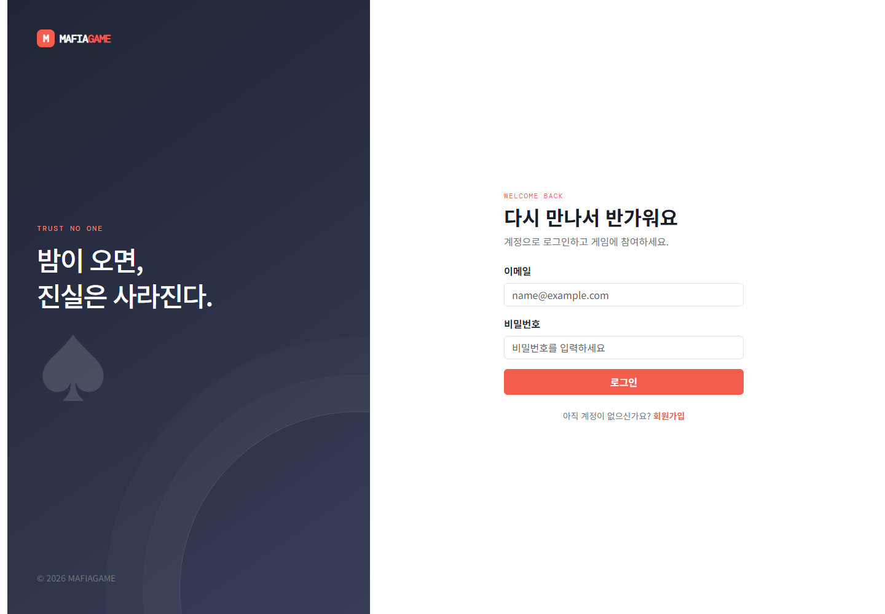

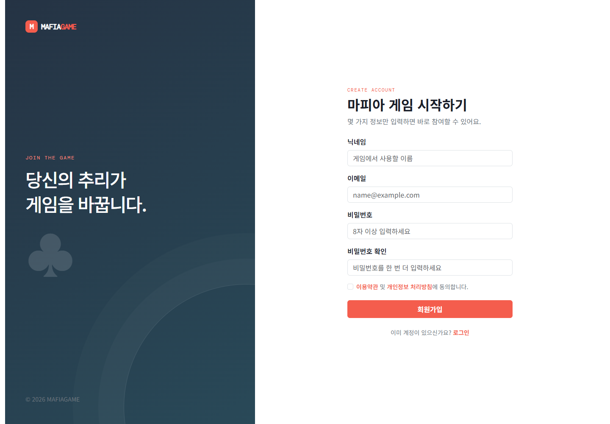

#### 로비 화면

로비 캡처에서는 게임방 목록, 방 상태, 현재 인원, 방 검색·필터, 게임방 만들기 버튼을 확인할 수 있다.

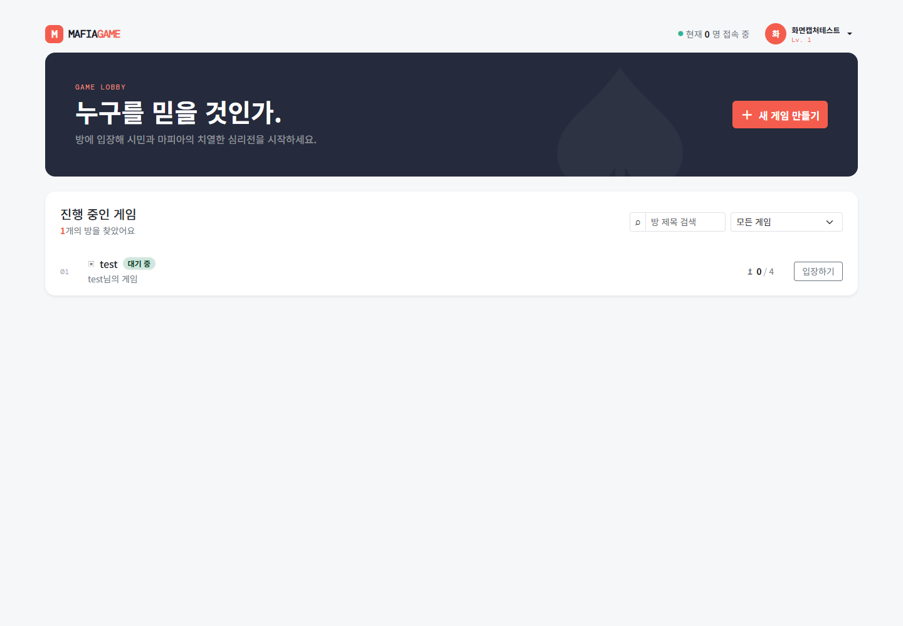

#### 방 생성 화면

방 생성 화면은 방 제목, 4~8명 정원, 선택적 비밀번호, 방 만들기·취소 흐름을 보여 준다.

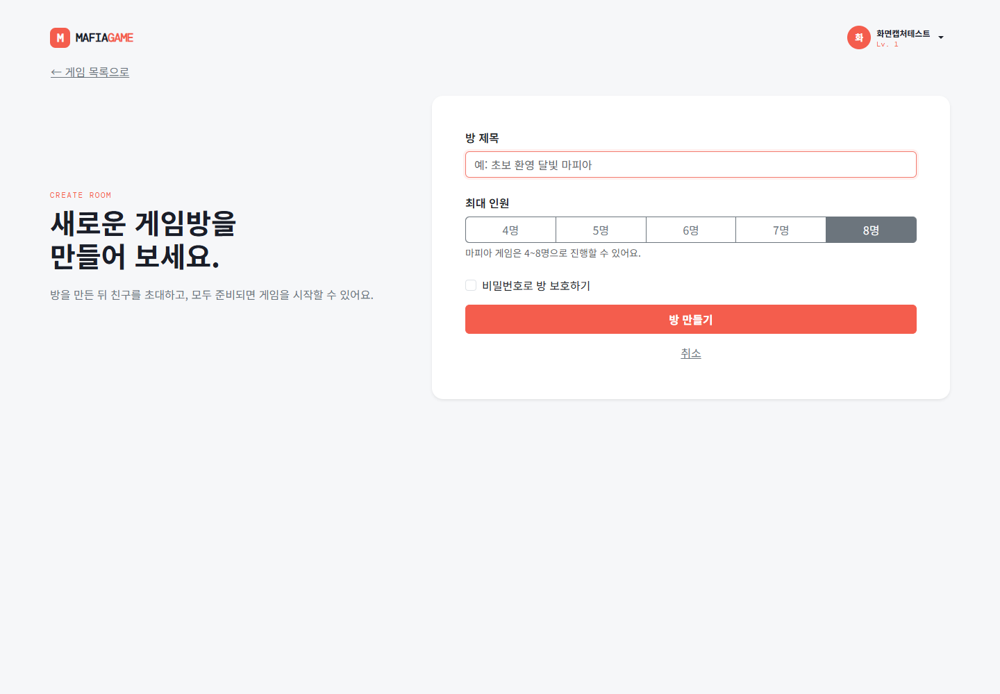

#### 잠금 방 입장 화면

잠금 방은 방 비밀번호를 입력한 뒤 입장하도록 분리되어 있다. 비밀번호가 맞지 않으면 같은 화면에서 오류를 표시한다.

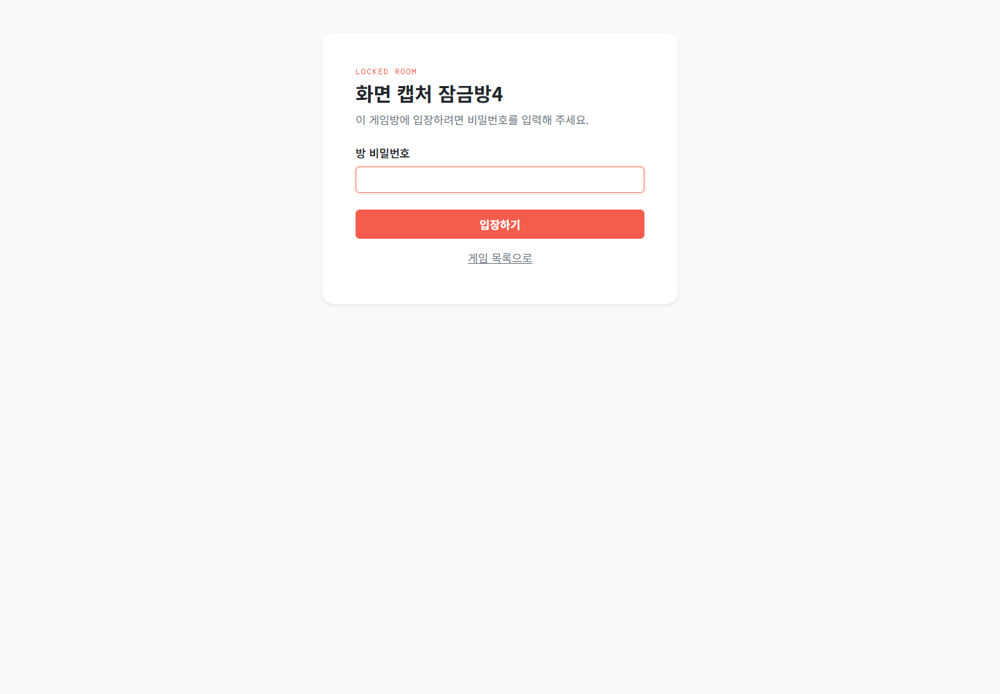

#### 대기방 화면

대기방 캡처에서는 방 제목·상태·정원, 참가자 카드, 방장 표시, Ready 버튼, 공개 채팅 영역을 확인할 수 있다. 게임 시작 버튼은 방장에게만 표시되며, 현재 참가자가 모두 준비되었을 때 활성화된다. 시작 후에는 모든 참가자의 방 상태가 `PLAYING`으로 동기화되고, 게임 패널에서 역할 확인·낮·지목 투표·최종 변론·처형 투표·밤과 남은 시간을 확인할 수 있다. 최종 변론 중에는 지목 후보자에게만 전체 채널 발언 UI가 활성화된다. 게임 종료 시 같은 패널에서 승리 진영·본인 역할·생존 여부를 확인하고, 방 상태가 `WAITING`으로 돌아가 다시 Ready할 수 있다.

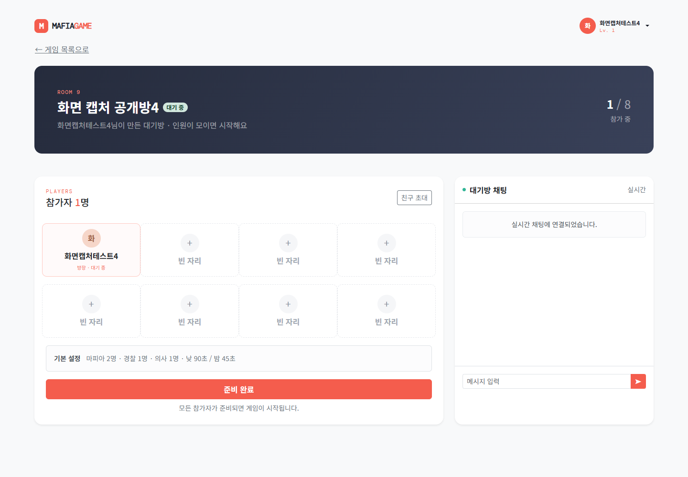

#### 게임 화면 구현 상태와 보완점

게임 진행 화면은 대기방의 게임 패널에 구현되어 있으며, 다음 요소를 제공한다.

- 현재 페이즈와 서버 기준 남은 시간
- 생존자·탈락자 상태
- 본인에게만 보이는 역할 카드와 비공개 결과
- 현재 페이즈에서 허용된 행동 버튼
- 처형 후보자 처형 찬성·반대 투표 버튼과 후보자 본인의 투표 제한
- 행동 완료·거부·오류 상태
- 결과 화면과 같은 게임방 대기 복귀·다시 시작

낮 건너뛰기 투표는 현재 화면에 포함되지 않은 후속 기능이다. 마피아 채널과 사망자 채널은 채널 선택기에서 현재 생존 상태에 맞게 제공한다.

역할 정보나 경찰의 조사 결과처럼 개인 정보인 값은 공개 영역과 분리한다.

### 6.6 사용자 스토리보드

| 장면 | 사용자가 보는 화면 | 사용자 행동 | 시스템 반응 | 내부 확인 항목 |
| --- | --- | --- | --- | --- |
| 1. 진입 | 로그인 또는 회원가입 | 계정 생성·로그인 | 로비로 이동 | 인증 상태·보호 URL |
| 2. 탐색 | 로비 | 방을 검색하거나 생성 | 방 목록·인원 표시 | 방 생성·조회·입장 결과 |
| 3. 대기 | 대기방 | Ready 후 채팅 | 참가자 상태 방송 | 참가자·Ready·채팅 동기화 |
| 4. 시작 | 시작 조건 안내 | 방장이 게임 시작 | 조건 확인 후 역할 배정 | 방장·인원·Ready 검증 |
| 5. 플레이 | 페이즈 화면 | 토론·투표·밤 행동 | 권한과 단계 검증 | 상태 전이·행동 거부 |
| 6. 결과 | 결과 화면 | 승패 확인·같은 게임방에서 다시 대기 | 개인 결과 전달·방 상태를 `WAITING`으로 전환 | 승패·역할·생존 결과 |
| 7. 반복 | 같은 게임방 대기방 | 다시 준비하고 게임 시작 | 동일 방에서 역할 배정부터 새 게임 시작 | 이전 게임 상태·투표·역할 초기화 |
| 8. 이탈 | 어느 단계의 연결 오류 | 재접속 또는 나가기 | 상태 복원·정리 정책 적용 | 세션·메모리·DB 정리 |

스토리보드의 목적은 화면을 많이 만드는 것이 아니라, 사용자의 한 판 경험이 어디에서 끊기는지 관찰하는 것이다. 각 장면에서 “사용자가 무엇을 해야 하는가”와 “서버가 어떤 상태를 보장하는가”를 함께 기록한다.

---

## 7. 현재 구현과 남은 개발 항목

### 이미 검증 가능한 영역

- [x] 회원가입·로그인·로그아웃
- [x] 로비와 방 목록
- [x] 4~8명 방 생성 및 비밀번호 검증
- [x] 실시간 참가자·Ready 상태
- [x] 같은 방 공개 채팅
- [x] 생존 마피아 전용 채널·사망자 전용 채널과 채널 선택기
- [x] 동일 사용자의 다중 세션 처리
- [x] 다른 방 접속 시 이전 방 참가자 정리
- [x] 재접속·빈 방 정리·기본 방장 위임
- [x] 로비 온라인 접속 인원의 중복 없는 실시간 표시
- [x] 방장 전용 게임 시작 버튼과 전원 Ready 서버 검증
- [x] 게임 시작 시 `WAITING`에서 `PLAYING`으로 방 상태 전환·방송
- [x] 역할 확인 10초·낮 60초·지목 투표 15초·최종 변론 15초·처형 투표 15초·밤 30초 페이즈 자동 전환 (`GamePhase` enum 기준)
- [x] 지목·처형 투표를 현재 페이즈와 생존 상태에 맞게 서버에서 검증

### 현재 구현된 게임 영역

- [x] 역할 배정과 개인 메시지 (공개 게임 상태와 분리된 개인 큐)
- [x] `ROLE_ASSIGNMENT` 역할 확인 페이즈와 개인별 확인 처리
- [x] `FINAL_DEFENSE` 최종 변론 페이즈와 후보자 전용 전체 채널 발언 검증
- [x] 역할별 밤 행동 처리 (마피아 제거·의사 보호·경찰 조사) 및 전체 게임 권한 검증
- [x] 승패 판정 (`moveAfterExecutionVote`·`NIGHT` 종료 후 생존자 수 기준 판정)
- [x] 결과 화면, 완료 게임 이벤트, 방 상태 `PLAYING` → `WAITING` 전환 및 Ready 초기화
- [x] `NOMINATION_VOTE` 최다 득표자 단독 확정 및 동률 시 `EXECUTION_VOTE` 생략
- [x] 처형 후보자 본인의 `EXECUTION_VOTE` 참여 차단
- [x] `EXECUTION_VOTE` 찬성표가 반대표보다 많을 때만 처형

### 남은 개발 항목

- [ ] (추가 기능) 낮 건너뛰기 투표를 생존자 기준으로 집계하고 과반 달성 시 `NOMINATION_VOTE`로 조기 전환
- [ ] `game_history`·`game_player_log` 기반 게임 이력 저장·조회

현재 게임 상태는 단일 서버의 메모리 관리를 전제로 한다. 초기 구현에서는 분산 서버보다 한 서버에서 4~8명의 상태를 안정적으로 동기화하는 것을 우선한다. 현재는 역할 배정·역할 확인·개인 역할 전달·낮 토론·지목·최종 변론·처형 찬반·역할별 밤 행동·밤 결과 해소·승패·결과·같은 방 재대기까지 구현되어 있다. 게임 진행 상태와 투표·역할·생존 정보는 현재 서버 메모리에서 관리하며, 완료 게임 이력은 별도 영속 저장하지 않는다.

---

### 7.1 주요 클래스 다이어그램

현재 구현된 인증·방·실시간 대기방·게임 진행 기능의 책임 경계를 한눈에 볼 수 있도록 정리한다. 세부 필드와 메서드는 실제 클래스의 책임에 맞춰 관리한다.

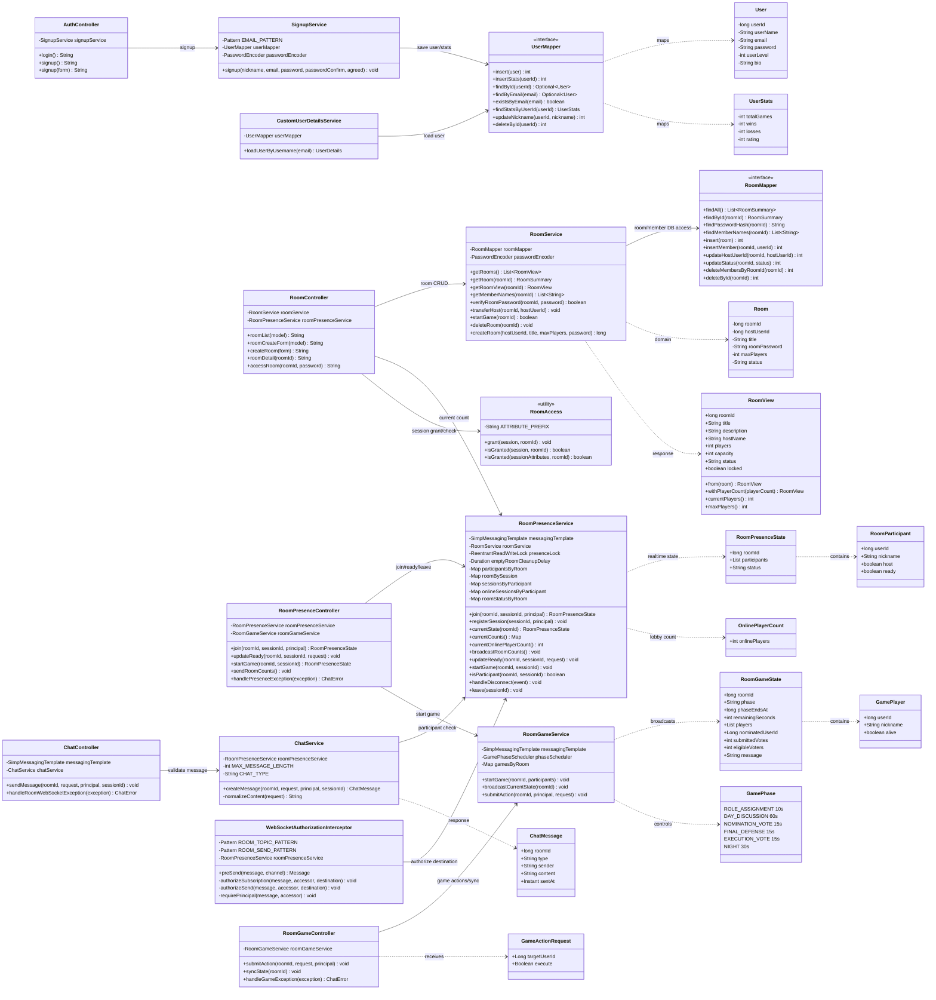

`RoomGameService`는 게임 상태 전담 영역으로 구현되어 있다. `GamePhase` enum 기준으로 `ROLE_ASSIGNMENT`(10초), `DAY_DISCUSSION`(60초), `NOMINATION_VOTE`(15초), `FINAL_DEFENSE`(15초), `EXECUTION_VOTE`(15초), `NIGHT`(30초) 자동 순환과 역할 확인 집계, 지목·처형 투표 집계, 역할 배정, 역할별 밤 행동, 밤 결과 해소와 승패 판정을 서버에서 관리한다. 역할은 공개 `GamePlayer` 상태에 넣지 않고 개인 큐로 전달하며, 역할 확인 상태는 개인 역할 메시지에 반영한다. 경찰 조사 결과도 요청한 경찰의 개인 큐로만 보낸다. 최종 변론 중 전체 채널 발언 권한은 서버가 지목 후보자 기준으로 검증한다.

### 7.2 주요 기능 시퀀스 다이어그램

#### 회원가입·로그인

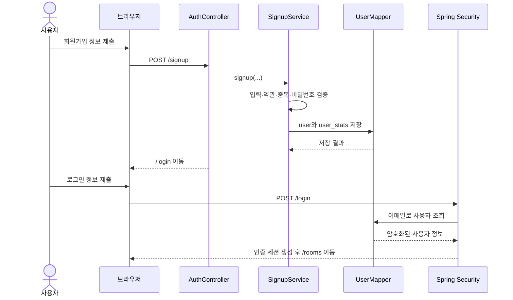

#### 방 생성·잠금 방 입장

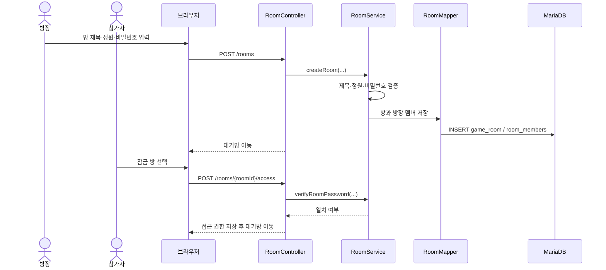

#### 대기방 참가·Ready·채팅

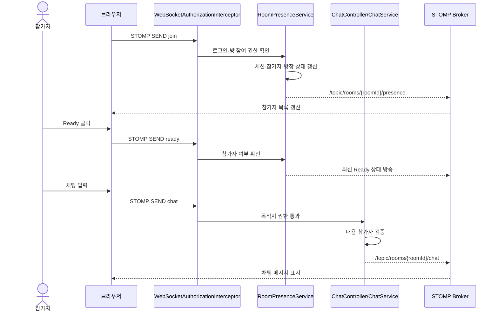

#### 게임 시작 조건 검증·상태 전환

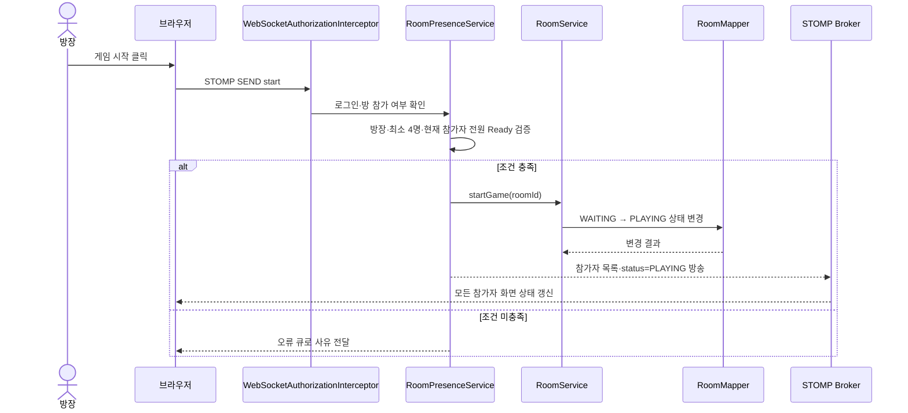

게임 시작 시 서버는 역할을 배정해 각 참가자의 개인 큐로 전달한다. `NIGHT` 행동은 역할·생존·대상·중복 제출을 검증하고, 경찰 조사 결과는 개인 큐로 보낸다. 밤 타이머가 끝나면 마피아 제거와 의사 보호를 해소한 뒤 승패를 판정하고, 종료 시 결과 개인 메시지와 `WAITING` 상태를 방송한다.

---

## 8. DB 구조와 ER 다이어그램

현재 데이터베이스의 핵심 관계와 MVP 게임 상태 확장 지점을 함께 기록한다. 실시간 대기방의 접속·Ready 기준 상태는 현재 `RoomPresenceService`의 메모리 상태이고, 영속 DB의 `room_members`는 방과 사용자 관계 및 게임 상태 저장을 위한 스키마로 사용한다.

게임 시작 요청이 서버 검증을 통과하면 `game_room.status`를 `WAITING`에서 `PLAYING`으로 원자적으로 변경한다. 실시간 참가자 상태에는 이 방 상태를 함께 포함해 현재 방에 있는 모든 화면에 방송한다. 게임이 결과 단계에 도달하면 방을 삭제하지 않고 완료 결과를 방송한 뒤 `PLAYING`에서 `WAITING`으로 되돌린다. 참가자들은 같은 게임방에 남아 결과를 확인하고 다시 Ready한 뒤, 역할 배정부터 새 게임을 시작할 수 있다.

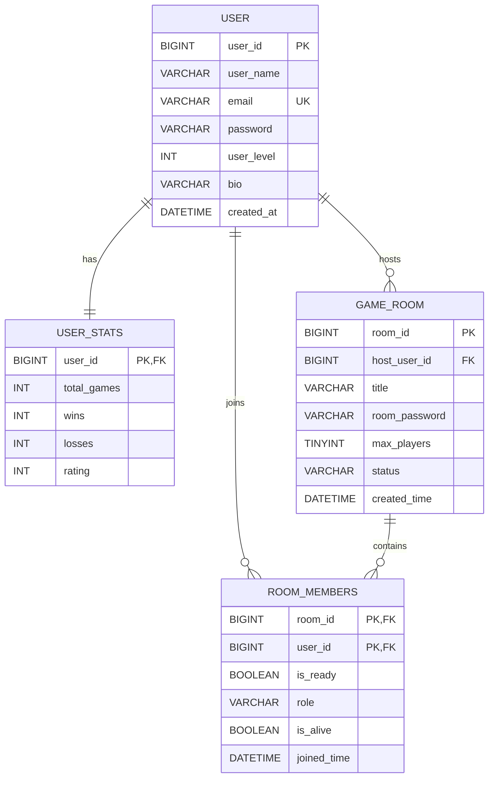

게임 진행 상태는 현재 `RoomGameService`의 메모리에서 관리하며, `FINISHED` 결과를 개인 큐와 공개 게임 상태로 전달한 뒤 `RoomPresenceService`가 방을 `WAITING`으로 되돌린다. 현재 DB에는 `game_history`와 `game_player_log` 기반의 완료 게임 이력 저장 기능이 없고, `UserService`의 게임 이력 조회도 빈 목록을 반환한다. `room_members`의 역할·생존 관련 컬럼은 스키마에 존재하더라도 현재 게임 진행의 기준 저장소로 사용되지 않으므로, 재시작 시 새 메모리 게임 상태를 생성한다.

---

## 9. 기술·운영 제약

- Java 17, Spring Boot, Spring MVC, Thymeleaf, Spring Security, MyBatis, MariaDB, WebSocket/STOMP를 사용한다.
- 비밀번호는 BCrypt로 저장하고, 역할·투표·밤 행동 권한은 서버에서 검증한다.
- 클라이언트의 버튼 비활성화와 입력 검증은 사용성 기능이며 보안 경계가 아니다.
- 서버가 게임 상태와 타이머의 기준이며, 클라이언트 카운트다운은 표시용이다.
- 게임 종료 후 메모리 상태를 정리하고, 다음 게임 시작 시 새 역할·투표·생존 상태를 생성한다. 완료 게임 이력 저장은 후속 기능이다.
- 테스트 로그에는 비밀번호, 역할, 채팅 원문 같은 민감한 값을 남기지 않는다.

---

## 10. 실행 계획

| 단계 | 목표 | 산출물 | 종료 조건 |
| --- | --- | --- | --- |
| 0. 검증 준비 | 대기방 회귀와 게임 시작 조건 검증 시나리오 정리 | 실행 체크리스트 | 완료 |
| 1. 게임 루프 | 한 판 시작·진행·결과·같은 방 재시작 구현 | 게임 상태 모델, 화면, 서버 검증 | 핵심 흐름 구현 완료 |
| 2. 내부 시나리오 테스트 | 4·6·8명 구성과 예외 흐름 확인 | 테스트 결과, 오류 목록 | QA 통합 보고서에 결과 기록 |
| 3. 회귀·예외 검증 | 재접속·중도 이탈·권한·동시성 점검 | 회귀 체크리스트 | Java·JavaScript 테스트 통과, E2E 검증 상태 기록 |
| 4. 문서화 | 구현 상태와 검증 결과 정리 | 완료 보고서 | 현재 문서와 QA 통합 보고서에 반영 |
| 5. 후속 기능 | 낮 건너뛰기·게임 이력 저장 | 추가 기능 설계·구현 | 별도 요구사항과 테스트 정의 후 진행 |

각 단계에서 기능 수보다 요구사항이 실제 코드와 테스트로 증명되었는지를 완료 기준으로 삼는다.

---

## 11. 한 페이지 검증 체크리스트

### MVP 구현 전

- [x] 회원가입·로그인·로그아웃이 동작한다.
- [x] 방 생성·입장·Ready가 동작한다.
- [x] 방장만 게임을 시작할 수 있고, 현재 참가자 전원 Ready 조건이 적용된다.
- [x] 최소 4명 시작 조건이 서버·클라이언트에 적용된다. 4~8명 QA 시나리오 실행은 별도로 기록한다.
- [x] 역할이 개인별로 안전하게 전달된다.
- [x] 토론·투표·밤 행동·승패 판정이 한 사이클 동작한다.
- [x] 역할 확인·낮·지목 투표·최종 변론·처형 투표·밤의 서버 타이머가 화면에 표시된다.
- [x] 지목·처형 투표가 현재 페이즈와 생존 상태에 맞게 처리된다.
- [x] 대기방의 연결 종료·재접속·중도 이탈 처리 로직이 구현·테스트되었다.
- [x] 4명·6명·8명 시나리오 실행 결과를 QA 통합 보고서에 기록했다.
- [x] 대기방 WebSocket 권한과 비정상 요청 검증 테스트가 통과했다.
- [x] 테스트용 H2 스키마와 초기화 절차가 준비되어 있다.

### 기능 시나리오 검증 중

- [x] 방 생성부터 대기방 참가·Ready·채팅까지의 요청·응답 흐름을 확인했다.
- [x] 각 페이즈에서 허용된 행동과 거부되는 행동을 확인했다.
- [x] 서버가 전달한 페이즈 종료 시각을 기준으로 화면 타이머가 동작하는지 확인했다.
- [x] 대기방의 연결 종료·재접속·방장 이탈 시 상태를 확인했다.
- [x] 게임 완료 후 방 상태를 `WAITING`으로 되돌리고 Ready를 해제한다.
- [ ] 완료 게임 이력을 DB에 저장한다. (후속 기능)

### 검증 후

- [x] JavaScript 테스트와 Java 테스트·컴파일 결과를 QA 통합 보고서에 기록했다.
- [x] 4명·6명·8명 시나리오 결과와 발견된 오류·수정 내용을 QA 통합 보고서에 기록했다.
- [x] 핵심 게임 루프의 회귀 결과를 QA 통합 보고서에 기록했다.

---

## 12. 변경 이력

| 일자 | 변경 내용 |
| --- | --- |
| 2026-09-19 | 생존 마피아가 시민 진영 생존자보다 많을 때만 승리하도록 `>` 조건을 적용하고, 전체·마피아·사망자 채널 분리, 10초 재접속 유예, 게임 종료 후 전체 직업 공개, 같은 방 재플레이 초기화를 반영함 |
| 2026-09-20 | `ROLE_ASSIGNMENT`(역할 확인 10초)와 `FINAL_DEFENSE`(최종 변론 15초)를 실제 서버 페이즈·타이머·WebSocket 상태·화면에 반영함. 전원 역할 확인 시 낮으로 조기 전환하고, 최종 변론 중에는 지목 후보자만 전체 채널에 발언할 수 있도록 서버에서 검증함 |
| 2026-09-18 | `NOMINATION_VOTE`에서 단독 최다 득표자만 처형 후보자로 확정하고, 후보자 본인은 `EXECUTION_VOTE`에 참여하지 않도록 명확히 함. 최다 득표자가 동률이면 처형 후보자와 처형 찬반 투표를 모두 생략하고 아무도 처형하지 않은 채 `NIGHT`로 이동하도록 수정함 |
| 2026-09-18 | `NOMINATION_VOTE` 최다 득표자를 `EXECUTION_VOTE` 투표 대상에서 제외하고, 남은 생존자를 대상으로 처형 투표를 진행하도록 규칙을 수정함. 각 투표 단계에서 동률이면 처형 없이 밤으로 이동하도록 정의함 |
| 2026-09-18 | 낮 채팅 후 `NOMINATION_VOTE`에서 처형 후보를 지목하고, 동률이면 `EXECUTION_VOTE`를 건너뛰어 바로 밤으로 이동하도록 투표 흐름을 명확히 함. 승리 조건 성립 시 결과 창을 표시한 뒤 같은 게임방을 `WAITING`으로 전환하고 모든 참가자의 Ready를 해제하도록 정의함 |
| 2026-09-18 | 마피아 진영은 생존 마피아 수가 생존 시민 수보다 많을 때 승리하고, 시민 진영은 모든 마피아가 사망하면 승리하도록 승리 조건을 명확히 함 |
| 2026-09-18 | 마피아 제거·의사 보호·경찰 조사 밤 행동을 역할·생존·대상·중복 제출 기준으로 서버 검증하고, 밤 종료 시 제거·보호 해소 및 경찰 개인 결과 전달을 구현함 |
| 2026-09-18 | 최소 4명 게임 시작 조건을 서버·클라이언트에 복원하고, 4명 미만 시작 거부 테스트를 추가함 |
| 2026-09-18 | 로비 실시간 온라인 인원을 세션 수가 아닌 중복 제거된 사용자 수로 표시하도록 보정하고, 방 목록에 서버 기준 인원을 반영함 |
| 2026-09-18 | 방장 전용 게임 시작 버튼 추가, 전원 Ready·방장 권한을 서버에서 검증하고 `WAITING` → `PLAYING` 상태를 저장·방송함. 최소 4명 조건은 테스트를 위해 일시 제거했으며 추후 복원 예정 |
| 2026-09-18 | 낮 60초 → 지목 투표 15초 → 처형 투표 15초 → 밤 30초 순환, 서버 타이머와 지목·처형 투표 UI를 구현함 |
| 2026-09-18 | 낮 건너뛰기 투표를 MVP 필수 기능이 아닌 추가 기능으로 분류하고, 구현 시 생존자 과반에 따른 조기 지목 투표 전환으로 정의함 |
| 2026-09-18 | 프로젝트에서 확인된 임시 작업 디렉터리(`.docx_work`, `.gradle-test`, `.npm-cache`, `.codex`, `tmp`) 정리 |
| 2026-09-18 | MVP 계획 문서를 현재 구현 상태를 반영하는 `MAFIAGAME_MVP.md` 문서로 변경 |
| 2026-09-18 | 소스코드 기준으로 MVP 문서 내용 수정: `GamePhase` 실제 4단계·타이머 반영, `ROLE_ASSIGNMENT`·`FINAL_DEFENSE` 미구현 명시, `GamePlayer` role 필드 미존재, `game_history` 테이블 미생성, `UserService` 이력 빈 목록 반환, DB `room_members` role·is_alive 컬럼 활용 계획 추가 |
| 2026-09-18 | 당시 소스 기준으로 문서 최신화: 게임 루프·투표·밤 행동·승패·결과 후 `WAITING` 복귀를 구현 완료로 정리하고, 공개 채팅만 지원하며 마피아 비밀채팅·게임 이력 저장은 후속 기능으로 구분함 |
